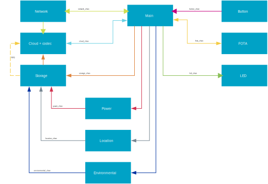

# Asset Tracker Template

**Oncommit**

[](https://github.com/nrfconnect/Asset-Tracker-Template/actions/workflows/build-and-target-test.yml)

**Nightly**

[](https://github.com/nrfconnect/Asset-Tracker-Template/actions/workflows/build-and-target-test.yml?query=branch%3Amain+event%3Aschedule)
[](https://nrfconnect.github.io/Asset-Tracker-Template/power_measurements_plot.html)

[](https://nrfconnect.github.io/Asset-Tracker-Template/ram_memory_view.html)
[](https://nrfconnect.github.io/Asset-Tracker-Template/flash_memory_view.html)

## Overview

The Asset Tracker Template is a modular framework for developing IoT applications on nRF91-based devices. Built on [nRF Connect SDK](https://www.nordicsemi.com/Products/Development-software/nRF-Connect-SDK) and [Zephyr RTOS](https://docs.zephyrproject.org/latest/), it provides an event-driven architecture for battery-powered IoT use cases with cloud connectivity, location tracking, and sensor data collection.

The system uses modules that communicate through [zbus](https://docs.nordicsemi.com/bundle/ncs-latest/page/zephyr/services/zbus/index.html) channels for loose coupling and maintainability. It's suitable for asset tracking, environmental monitoring, and other IoT applications requiring modularity and power efficiency.

**Supported hardware**: [Thingy:91 X](https://www.nordicsemi.com/Products/Development-hardware/Nordic-Thingy-91-X), [nRF9151 DK](https://www.nordicsemi.com/Products/Development-hardware/nRF9151-DK)

> **Note**: If you're new to nRF91 series and cellular IoT, consider taking the [Nordic Developer Academy Cellular Fundamentals Course](https://academy.nordicsemi.com/courses/cellular-iot-fundamentals).

## Quick Start

For detailed setup instructions using the [nRF Connect for VS Code extension](https://docs.nordicsemi.com/bundle/nrf-connect-vscode/page/index.html) and advanced configuration options, see the [Getting Started Guide](docs/common/getting_started.md).

### Prerequisites

* nRF Connect SDK development environment ([setup guide](https://docs.nordicsemi.com/bundle/ncs-latest/page/nrf/installation.html))

### Build and Run

<details>
<summary>1. <strong>Initialize workspace:</strong></summary>

```shell
# Install nRF Util
pip install nrfutil

# or follow install [documentation](https://docs.nordicsemi.com/bundle/nrfutil/page/guides/installing.html)

# Install toolchain
nrfutil toolchain-manager install --ncs-version v3.1.0

# Launch toolchain
nrfutil toolchain-manager launch --ncs-version v3.1.0 --shell

# Initialize workspace
west init -m https://github.com/nrfconnect/Asset-Tracker-Template.git --mr main asset-tracker-template
cd asset-tracker-template/project/app
west update
```
</details>

<details>
<summary>2. <strong>Build and flash:</strong></summary>

**For Thingy:91 X:**
```shell
west build --pristine --board thingy91x/nrf9151/ns
west thingy91x-dfu  # For Thingy:91 X serial bootloader
# Or with external debugger:
west flash --erase
```

**For nRF9151 DK:**
```shell
west build --pristine --board nrf9151dk/nrf9151/ns
west flash --erase
```
</details>

<details>
<summary>3. <strong>Provision device:</strong></summary>

1. Get the device attestation token over terminal shell:

   ```bash
   at at%attesttoken
   ```

   *Note: Token is printed automatically on first boot of unprovisioned devices.*

2. In nRF Cloud: **Security Services** → **Claimed Devices** → **Claim Device**
3. Paste token, set rule to "nRF Cloud Onboarding", click **Claim Device**
4. Wait for the device to provision credentials and connect to nRF Cloud over CoAP.

See [Provisioning](docs/common/provisioning.md) for more details.
</details>

## System Architecture

Core modules include:

* **[Main](docs/modules/main.md)**: Central coordinator implementing business logic
* **[Network](docs/modules/network.md)**: LTE connectivity management
* **[Cloud](docs/modules/cloud.md)**: nRF Cloud CoAP communication
* **[Location](docs/modules/location.md)**: GNSS, Wi-Fi, and cellular positioning
* **[LED](docs/modules/led.md)**: RGB LED control for Thingy:91 X
* **[Button](docs/modules/button.md)**: User input handling
* **[FOTA](docs/modules/fota.md)**: Firmware over-the-air updates
* **[Environmental](docs/modules/environmental.md)**: Sensor data collection
* **[Power](docs/modules/power.md)**: Battery monitoring and power management



### Key Features

* **State Machine Framework (SMF)**: Predictable behavior with run-to-completion model
* **Message-Based Communication**: Loose coupling via [zbus](https://docs.nordicsemi.com/bundle/ncs-latest/page/zephyr/services/zbus/index.html) channels
* **Modular Architecture**: Separation of concerns with dedicated threads for blocking operations
* **Power Optimization**: LTE PSM enabled by default with configurable power-saving features

The architecture is detailed in the [Architecture documentation](docs/common/architecture.md).

## Table of Content

* [Getting Started](docs/common/getting_started.md)
* [Architecture](docs/common/architecture.md)
  * [System Overview](docs/common/architecture.md#system-overview)
  * [Zbus](docs/common/architecture.md#zbus)
  * [State Machine Framework](docs/common/architecture.md#state-machine-framework)
* [Configurability](docs/common/configuration.md)
  * [Set sampling interval and logic from cloud](docs/common/configuration.md#set-sampling-interval-and-logic-from-cloud)
  * [Set location method priorities](docs/common/configuration.md#set-location-method-priorities)
  * [Network configuration](docs/common/configuration.md#network-configuration)
  * [LED Status Indicators](docs/common/configuration.md#led-status-indicators)
* [Customization](docs/common/customization.md)
  * [Add a new zbus event](docs/common/customization.md#add-a-new-zbus-event)
  * [Add environmental sensor](docs/common/customization.md#add-environmental-sensor)
  * [Add your own module](docs/common/customization.md#add-your-own-module)
  * [Enable support for MQTT](docs/common/customization.md#enable-support-for-mqtt)
* [Location Services](docs/common/location_services.md)
* [Test and CI Setup](docs/common/test_and_ci_setup.md)
* [nRF Cloud FOTA](docs/common/nrfcloud_fota.md)
* [Tooling and Troubleshooting](docs/common/tooling_troubleshooting.md)
  * [Shell Commands](docs/common/tooling_troubleshooting.md#shell-commands)
  * [Debugging Tools](docs/common/tooling_troubleshooting.md#debugging-tools)
  * [Memfault Remote Debugging](docs/common/tooling_troubleshooting.md#memfault-remote-debugging)
  * [Modem Tracing](docs/common/tooling_troubleshooting.md#modem-tracing)
  * [Common Issues and Solutions](docs/common/tooling_troubleshooting.md#common-issues-and-solutions)

### Module Documentation

* [Button](docs/modules/button.md)
* [Cloud](docs/modules/cloud.md)
* [Environmental](docs/modules/environmental.md)
* [FOTA](docs/modules/fota.md)
* [LED](docs/modules/led.md)
* [Location](docs/modules/location.md)
* [Main](docs/modules/main.md)
* [Network](docs/modules/network.md)
* [Power](docs/modules/power.md)
