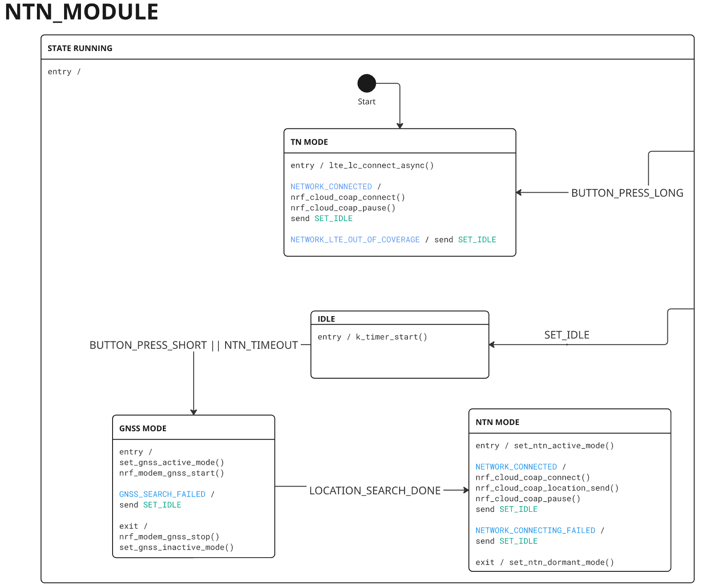

# Asset Tracker Template - NTN Use Case

Overview of the NTN use case:

1. GNSS cold start to get a location fix.
2. Switch to NTN system mode and perform NTN connection establishment using the acquired location.
3. Once NTN connection established, send data to cloud endpoint.
4. Repeat the process, triggered by button press or by timeout `CONFIG_APP_NTN_TIMER_TIMEOUT_MINUTES`.

Configure the UDP endpoint's IP address and port in `prj.conf`:

```shell
CONFIG_APP_NTN_SERVER_ADDR=""
CONFIG_APP_NTN_SERVER_PORT=
```

## NTN Skylo (Monogoto SIM) - nRF9151 DK

```shell
cd app
west build -b nrf9151dk/nrf9151/ns -- -DEXTRA_CONF_FILE=overlay-ntn-skylo-monogoto.conf
```

## NTN Skylo (Deutsche Telekom SIM) - nRF9151 DK

```shell
cd app
west build -b nrf9151dk/nrf9151/ns -- -DEXTRA_CONF_FILE=overlay-ntn-skylo-dt.conf
```

## NTN Skylo (Soracom SIM) - nRF9151 DK

```shell
cd app
west build -b nrf9151dk/nrf9151/ns -- -DEXTRA_CONF_FILE=overlay-ntn-skylo-soracom.conf
```

## NTN Amarisoft Callbox - nRF9151 DK

```shell
cd app
west build -b nrf9151dk/nrf9151/ns -- -DEXTRA_CONF_FILE=overlay-ntn-amari.conf
```

## Flash and run

The device reports temperature data to the UDP endpoint. The last four digits of the device IMEI are used for identification.

```shell
Device: *xxxx, temp: xx
```

If `CONFIG_APP_NTN_SEND_GNSS_DATA` is enabled, the GNSS data will be sent instead of temperature:

```shell
Device: *xxxx, temp: xx, lat=xx.xx, lon=xx.xx, alt=xx.xx, time=xxxx-xx-xx xx:xx:xx
```

## State machine

