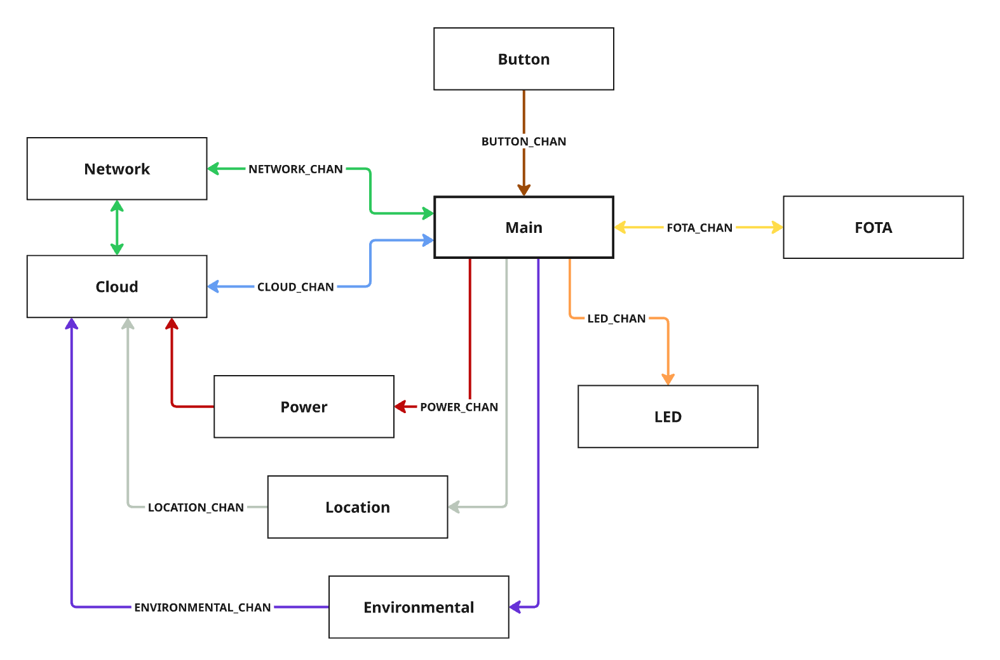

# Asset Tracker Template

**Oncommit**

[](https://github.com/nrfconnect/Asset-Tracker-Template/actions/workflows/build-and-target-test.yml)

**Nightly**

[](https://github.com/nrfconnect/Asset-Tracker-Template/actions/workflows/build-and-target-test.yml?query=branch%3Amain+event%3Aschedule)
[](https://nrfconnect.github.io/Asset-Tracker-Template/power_measurements_plot.html)

[](https://nrfconnect.github.io/Asset-Tracker-Template/ram_history_plot.html)
[](https://nrfconnect.github.io/Asset-Tracker-Template/flash_history_plot.html)

## Overview

The Asset Tracker Template is a framework for developing IoT applications on nRF91-based devices. Built on the [nRF Connect SDK](https://www.nordicsemi.com/Products/Development-software/nRF-Connect-SDK) and [Zephyr RTOS](https://docs.zephyrproject.org/latest/), it provides a modular, event-driven architecture suitable for battery-powered IoT use cases. The framework supports features such as cloud connectivity, location tracking, and sensor data collection.

The system is organized into independent modules, each responsible for a specific functionality, such as managing network connectivity, handling cloud communication, or collecting environmental data. Modules communicate through zbus channels, ensuring loose coupling and maintainability.

This template is suitable for applications like asset tracking, environmental monitoring, and other IoT use cases requiring modularity, configurability, and efficient power management. It includes a testing infrastructure with GitHub Actions for automated testing and continuous integration.

The framework is designed for customization, allowing developers to:

* Modify the central business logic in the `main.c` file.
* Enable, disable and configure modules via Kconfig options.
* Add new modules following the established patterns.
* Modify existing modules to suit specific requirements.
* Contribute to the open-source project by submitting improvements, bug fixes, or new features.

**Supported and verified hardware**:

* [Thingy:91 X](https://www.nordicsemi.com/Products/Development-hardware/Nordic-Thingy-91-X)
* [nRF9151 DK](https://www.nordicsemi.com/Products/Development-hardware/nRF9151-DK)

If you are not familiar with the nRF91 series SiPs and cellular in general, it's recommended to go through the [Nordic Developer Academy Cellular Fundamentals Course](https://academy.nordicsemi.com/courses/cellular-iot-fundamentals) to get a better understanding of the technology and how to customize the template for your needs.

## System Architecture

The template consists of the following modules:

* **Main Module**: Central coordinator implementing business logic and control flow
* **Network Module**: Manages LTE connectivity and tracks network status
* **Cloud Module**: Handles communication with nRF Cloud using CoAP
* **Location Module**: Provides location services using GNSS, Wi-Fi and cellular positioning
* **LED Module**: Controls RGB LED for visual feedback on Thingy:91 X
* **Button Module**: Handles button input for user interaction
* **FOTA Module**: Manages firmware over-the-air updates
* **Environmental Module**: Collects environmental sensor data
* **Power Module**: Monitors battery status and provides power management

The image below illustrates the system architecture and the interaction between the modules.
The zbus channels are indicated with colored arrows showing the direction of communication, with the arrows pointing in to the module that is subscribing to the respective channel.



### Key Technical Features

1. **State Machine Framework (SMF)**
   * Each module implements its own state machine using Zephyr's [State Machine Framework](https://docs.nordicsemi.com/bundle/ncs-latest/page/zephyr/services/smf/index.html)
   * Run-to-completion model ensures predictable behavior

2. **Message-Based Communication (zbus)**
   * Modules communicate through dedicated [zbus](https://docs.nordicsemi.com/bundle/ncs-latest/page/zephyr/services/zbus/index.html) channels

3. **Modular Architecture**
   * Separation of concerns between modules
   * Each module that performs blocking operations runs in its own thread and use zbus message subscribers to queue messages
   * Non-blocking modules use zbus listeners for immediate processing

4. **Power Optimization**
   * LTE Power Saving Mode (PSM) enabled by default
   * Configurable power-saving features

### Customization and Extension

The template is customizable and extensible, enabling developers to adapt it to specific requirements. Key points for customization include:

* The `main.c` file contains the central business logic and is the primary customization point
* Modules can be enabled/disabled via Kconfig options
* New modules can be added following the established patterns
* Existing modules can be modified to suit specific requirements

While designed for asset tracking applications, the template's modular architecture makes it adaptable for various IoT use cases. The template is open-source, and we encourage contributions of improvements, bug fixes, or new features.

## Quick Start

### Prerequisites

* nRF Connect SDK development environment ([Getting started guide](https://docs.nordicsemi.com/bundle/ncs-latest/page/nrf/installation.html))

### Build and Run

1. Initialize workspace:

```shell
# Launch toolchain
nrfutil toolchain-manager launch --

# Initialize workspace
west init -m https://github.com/nrfconnect/Asset-Tracker-Template.git --mr main asset-tracker-template
cd asset-tracker-template/app
west update
```

2. Build and flash:

```shell
west build -p -b thingy91x/nrf9151/ns
west thingy91x-dfu  # For Thingy:91 X serial bootloader
# Or if you use an external debugger (ensure that nRF9151 is selected with the switch on the Thingy:91 X)
west flash --erase
```

For detailed setup including nRF Cloud provisioning and advanced build configurations, see [Getting Started](docs/common/getting_started.md).

## Further reading

* [Getting Started](docs/common/getting_started.md)
* [Architecture](docs/common/architecture.md)
* [Configurability](docs/common/configurability.md)
* [Customization](docs/common/customization.md)
* [Location Services](docs/common/location_services.md)
* [Test and CI Setup](docs/common/test_and_ci_setup.md)
* [nRFCloud FOTA](docs/common/nrfcloud_fota.md)
* [Tooling and Troubleshooting](docs/common/tooling_troubleshooting.md)

### Modules

* [Button](docs/modules/button.md)
* [Cloud](docs/modules/cloud.md)
* [Environmental](docs/modules/environmental.md)
* [FOTA](docs/modules/fota.md)
* [LED](docs/modules/led.md)
* [Location](docs/modules/location.md)
* [Main](docs/modules/main.md)
* [Network](docs/modules/network.md)
* [Power](docs/modules/power.md)
