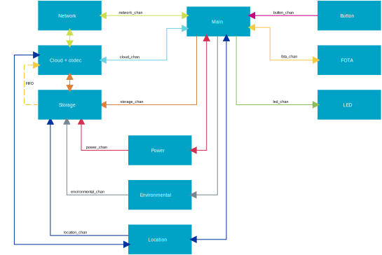

# Asset Tracker Template

[](https://github.com/nrfconnect/Asset-Tracker-Template/releases)
[](https://sonarcloud.io/dashboard?id=nrfconnect-asset-tracker-template)
[](https://sonarcloud.io/dashboard?id=nrfconnect-asset-tracker-template)
[](https://github.com/nrfconnect/Asset-Tracker-Template/actions/workflows/build-and-target-test.yml?query=branch%3Amain+event%3Apush)
[](https://github.com/nrfconnect/Asset-Tracker-Template/actions/workflows/build-and-target-test.yml?query=branch%3Amain+event%3Aschedule)
[](https://nrfconnect.github.io/Asset-Tracker-Template/power_measurements_plot.html)
[](https://nrfconnect.github.io/Asset-Tracker-Template/ram_memory_view.html)
[](https://nrfconnect.github.io/Asset-Tracker-Template/flash_memory_view.html)

## Overview

The Asset Tracker Template is a modular framework for developing IoT applications on nRF91-based devices.
It is built on the [nRF Connect SDK](https://www.nordicsemi.com/Products/Development-software/nRF-Connect-SDK) and [Zephyr RTOS](https://docs.zephyrproject.org/latest/), and provides a modular, event-driven architecture suitable for battery-powered IoT use cases.
The framework supports features such as cloud connectivity, location tracking, and sensor data collection.

The system is organized into modules, each responsible for a specific functionality, such as managing network connectivity, handling cloud communication, or collecting environmental data.
Modules communicate through [zbus](https://docs.zephyrproject.org/latest/services/zbus/index.html) channels, ensuring loose coupling and maintainability.

**Supported hardware**:

* [Thingy:91 X](https://www.nordicsemi.com/Products/Development-hardware/Nordic-Thingy-91-X)
* [nRF9151 DK](https://www.nordicsemi.com/Products/Development-hardware/nRF9151-DK)

If you are new to nRF91 series and cellular IoT, consider taking the [Nordic Developer Academy Cellular Fundamentals Course](https://academy.nordicsemi.com/courses/cellular-iot-fundamentals).

<p align="center">
  
  <br>
  <em>Thingy:91 X reporting its location to nRF Cloud running the Asset Tracker Template</em>
</p>

---

## Quick Start

> [!TIP]
> The fastest way to get started is to download and run the [Quick Start app](https://docs.nordicsemi.com/bundle/nrf-connect-quickstart/page/index.html) in [nRF Connect for Desktop](https://www.nordicsemi.com/Software-and-Tools/Development-Tools/nRF-Connect-for-desktop). It provides a guided setup and provisioning process that gets your device connected to [nRF Cloud](https://nrfcloud.com) in minutes.

Alternatively, you can download pre-built firmware binaries from the [latest release](https://github.com/nrfconnect/Asset-Tracker-Template/releases) and flash them directly to your device. See the [release artifacts](docs/common/release.md) documentation for details.

## Setting up the development environment

There are two options for setting up and building the project.

### Option 1: nRF Connect for VS Code (Recommended)

Use the [nRF Connect for VS Code](https://docs.nordicsemi.com/bundle/nrf-connect-vscode/page/index.html) for an integrated development experience:

1. To install the nRF Connect SDK and its toolchain using nRF Connect for VS Code, follow [extension documentation](https://docs.nordicsemi.com/bundle/nrf-connect-vscode/page/get_started/quick_setup.html) or [Installing nRF Connect SDK and VS Code exercise](https://academy.nordicsemi.com/courses/nrf-connect-sdk-fundamentals/lessons/lesson-1-nrf-connect-sdk-introduction/topic/exercise-1-1/) on Nordic Developer Academy.
2. Open VS Code and go to the **nRF Connect** extension.
3. Select **Create New Application**.
4. Select **Browse nRF Connect SDK add-on Index**.
5. Search for **Asset Tracker Template** and create the project.
6. In the **Applications** side panel, click **Add build configuration** under **app**.
7. In the **Add Build Configuration (app)** dialog, set **Board target** to one of the supported build targets — `thingy91x/nrf9151/ns` (Thingy:91 X) or `nrf9151dk/nrf9151/ns` (nRF9151 DK). With the **Compatible** filter selected, only the supported targets are listed.
8. Click **Generate and Build**, then use the **Actions** panel to flash and debug the application.

### Option 2: Command line

<details>
<summary><strong>1. Initialize workspace</strong></summary>

1. Install nRF Util. Follow the <a href="https://docs.nordicsemi.com/bundle/nrfutil/page/guides/installing.html">nRF Util documentation</a> for installation instructions.

2. Install sdk-manager:

   ```bash
   nrfutil install sdk-manager
   ```

3. Install toolchain:

   ```bash
   nrfutil sdk-manager install v3.1.0
   ```

4. Launch toolchain:

   ```bash
   nrfutil sdk-manager toolchain launch --ncs-version v3.1.0 --terminal
   ```

   This launches a new terminal window with the specified toolchain activated. Use this terminal in the coming steps.

5. Initialize workspace:

   ```bash
   west init -m https://github.com/nrfconnect/Asset-Tracker-Template.git --mr main asset-tracker-template
   cd asset-tracker-template/project/app
   west update
   ```
</details>

<details>
<summary><strong>2. Build and flash</strong></summary>

**For Thingy:91 X:**
```shell
west build --pristine --board thingy91x/nrf9151/ns
west thingy91x-dfu  # For Thingy:91 X serial bootloader
# Or with external debugger:
west flash --erase
```

**For nRF9151 DK:**
```shell
west build --pristine --board nrf9151dk/nrf9151/ns
west flash --erase
```
</details>

For more details, see the [Getting Started Guide](docs/common/getting_started.md).

### Connect device to nRF Cloud

After building and flashing (using either option above), connect the device to [nRF Cloud](https://nrfcloud.com). This involves three steps:

- **Claiming** — registering the device with your nRF Cloud account using the attestation token.
- **Provisioning** — the device securely receives cloud credentials from the nRF Provisioning Service.
- **Cloud connection** — the device establishes a CoAP connection to nRF Cloud using the provisioned credentials.

<details>
<summary><strong>Connecting</strong></summary>

1. Get the device attestation token. Open a serial terminal connected to the device (115200 baud) and run the following AT command in the device shell:

   ```bash
   at at%attesttoken
   ```

   *Note: The token is also printed automatically to the serial log on first boot of unprovisioned devices, labelled `Attestation token:`.*

2. Log in to the [nRF Cloud](https://nrfcloud.com) portal.
3. Navigate to **Security Services** → **Claimed Devices** → **Claim Device**.
4. Paste the attestation token, set **Provisioning rule** to **nRF Cloud Onboarding**, and click **Claim Device**.

    > **Important:** The **nRF Cloud Onboarding** rule is the named set of provisioning commands that tells nRF Cloud which credentials to deliver to the device. Selecting the correct rule is required.

    <details>
    <summary><strong>If "nRF Cloud Onboarding" rule is not showing:</strong></summary>

    Create a new rule using the following configuration:

    
    </details>

5. Press and hold **Button 1** on the device for a couple of seconds to trigger provisioning. On **Thingy:91 X**, pressing on the top of the case pushes Button 1.

   Once provisioning completes, the device appears under **Device Management** → **Devices**.

See [Connecting to nRF Cloud](docs/common/connecting.md) for more details.
</details>

---

## Documentation

<table>
  <tr>
    <td><a href="docs/common/getting_started.md">Getting Started</a></td>
    <td><a href="docs/common/architecture.md">Architecture</a></td>
    <td><a href="docs/common/configuration.md">Configuration</a></td>
  </tr>
  <tr>
    <td><a href="docs/common/extending.md">Extending</a></td>
    <td><a href="docs/modules/overview_modules.md">Modules</a></td>
    <td><a href="docs/common/connecting.md">Connecting</a></td>
  </tr>
  <tr>
    <td><a href="docs/common/location_services.md">Location Services</a></td>
    <td><a href="docs/common/low_power.md">Achieving Low Power</a></td>
    <td><a href="docs/common/fota.md">Firmware Updates (FOTA)</a></td>
  </tr>
  <tr>
    <td><a href="docs/common/test_and_ci_setup.md">Testing and CI Setup</a></td>
    <td><a href="docs/common/tooling_troubleshooting.md">Tooling and Troubleshooting</a></td>
    <td><a href="docs/common/known_issues.md">Known Issues</a></td>
  </tr>
  <tr>
    <td><a href="docs/common/release.md">Release Artifacts</a></td>
    <td><a href="docs/common/release_notes.md">Release Notes</a></td>
    <td></td>
  </tr>
</table>

---

## System Overview



Core modules include:

* **[Main](docs/modules/main.md)**: Central coordinator implementing business logic
* **[Storage](docs/modules/storage.md)**: Data collection and buffering management
* **[Network](docs/modules/network.md)**: LTE connectivity management
* **[Cloud](docs/modules/cloud.md)**: nRF Cloud CoAP communication
* **[Location](docs/modules/location.md)**: GNSS, Wi-Fi, and cellular positioning
* **[LED](docs/modules/led.md)**: RGB LED control for Thingy:91 X
* **[Button](docs/modules/button.md)**: User input handling
* **[FOTA](docs/modules/fota_module.md)**: Firmware over-the-air updates
* **[Environmental](docs/modules/environmental.md)**: Sensor data collection
* **[Power](docs/modules/power.md)**: Battery monitoring and power management

### Key Features

* **State Machine Framework (SMF)**: Predictable behavior with run-to-completion model
* **Message-Based Communication**: Loose coupling via [zbus](https://docs.nordicsemi.com/bundle/ncs-latest/page/zephyr/services/zbus/index.html) channels
* **Modular Architecture**: Separation of concerns with dedicated threads for blocking operations
* **Power Optimization**: LTE PSM enabled by default with configurable power-saving features
