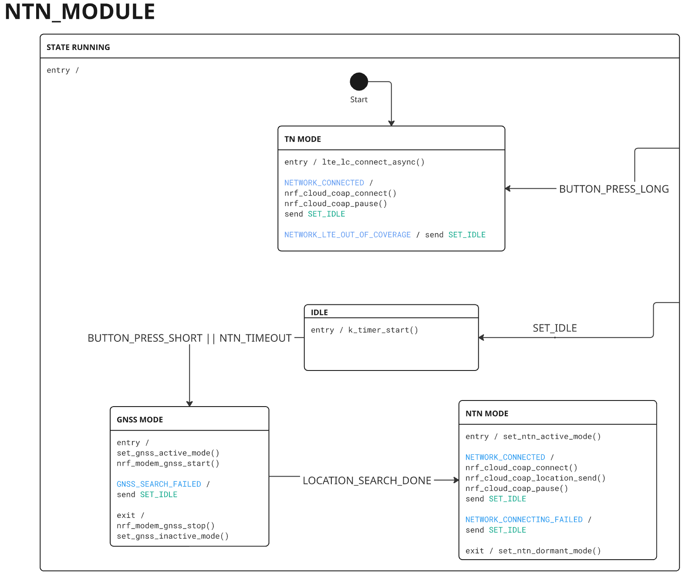

# Asset Tracker Template - TN NTN nRFCloud usecase

Note: you need device provisioned with nRFCloud. If not already, follow docs on ATT main or Quickstart app.

## NTN Skylo (DTAG) - t91x

```shell
west build -b thingy91x/nrf9151/ns app -- -DEXTRA_CONF_FILE=overlay-ntn-skylo-DT.conf
```

## NTN Skylo (Soracom) - t91x

```shell
west build -b thingy91x/nrf9151/ns app -- -DEXTRA_CONF_FILE=overlay-ntn-skylo-soracom.conf
```

## NTN amarisoft - nrf9151dk

```shell
west build -b nrf9151dk/nrf9151/ns app -- -DEXTRA_CONF_FILE=overlay-ntn-amari.conf
```

## State machine


## LED patterns

/* Blue pattern for Network connected */
/* Green pattern for cloud connection */
/* Yellow yellow for TN network search */
/* Orange pattern during NTN network search */
/* Purple pattern during GNNS search */
/* White pattern when idle */
