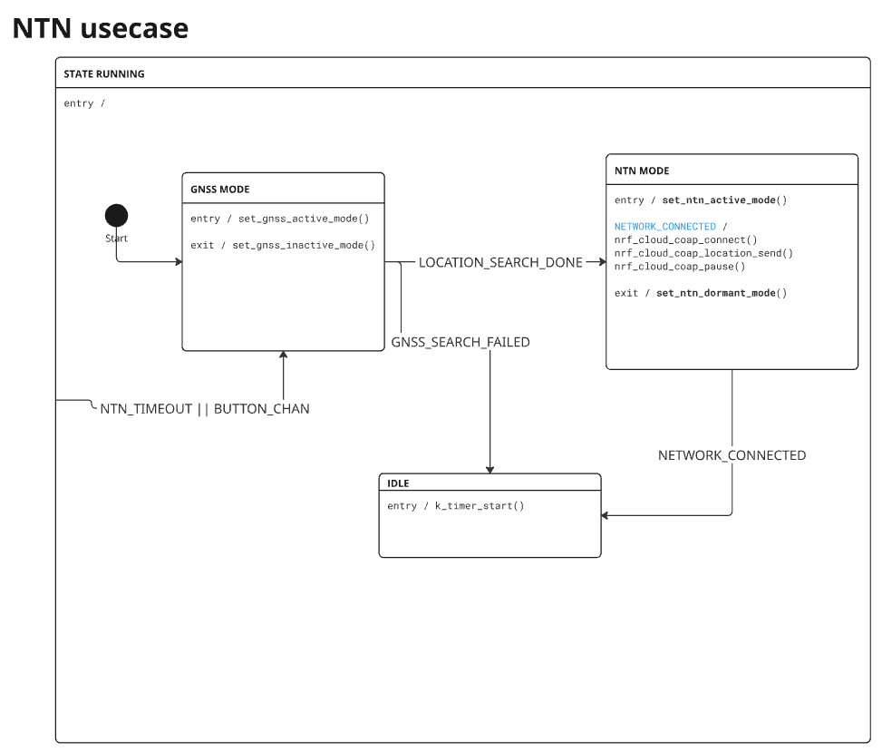

# Asset Tracker Template - NTN Use Case

Overview of the NTN use case:

1. GNSS cold start to get a location fix.
2. Switch to NTN system mode and perform NTN connection establishment using the acquired location.
3. Once NTN connection established, send data to cloud endpoint.
4. Repeat the process, triggered by button press or by timeout `CONFIG_APP_NTN_TIMER_TIMEOUT_MINUTES`.

Configure the UDP endpoint's IP address and port in `prj.conf`:

```shell
CONFIG_APP_NTN_SERVER_ADDR=""
CONFIG_APP_NTN_SERVER_PORT=
```

## NTN Skylo (Monogoto SIM) - nRF9151 DK

```shell
west build app -b nrf9151dk/nrf9151/ns -- -DEXTRA_CONF_FILE=overlay-ntn-skylo-monogoto.conf
```

## NTN Skylo (Deutsche Telekom SIM) - nRF9151 DK

```shell
west build app -b nrf9151dk/nrf9151/ns -- -DEXTRA_CONF_FILE=overlay-ntn-skylo-dt.conf
```

## NTN Skylo (Soracom SIM) - nRF9151 DK

```shell
west build app -b nrf9151dk/nrf9151/ns -- -DEXTRA_CONF_FILE=overlay-ntn-skylo-soracom.conf
```

## NTN Amarisoft Callbox - nRF9151 DK

```shell
west build app -b nrf9151dk/nrf9151/ns -- -DEXTRA_CONF_FILE=overlay-ntn-amari.conf
```

## Flash and run

The device reports temperature data to the UDP endpoint. The last four digits of the device IMEI are used for identification.

```shell
Device: *xxxx, temp: xx
```

If `CONFIG_APP_NTN_SEND_GNSS_DATA` is enabled, the GNSS data will be sent instead of temperature:

```shell
Device: *xxxx, temp: xx, lat=xx.xx, lon=xx.xx, alt=xx.xx, time=xxxx-xx-xx xx:xx:xx
```

## State machine



## Application Behaviour Considerations

The application makes use of the [NTN library](https://docs.nordicsemi.com/bundle/ncs-latest/page/nrf/libraries/modem/ntn.html)
The library uses the AT%LOCATION AT command to subscribe to location update requests from the modem and to provide location updates.

The application makes use of [PDN_LTE_LC](https://docs.nordicsemi.com/bundle/ncs-latest/page/nrf/libraries/modem/lte_lc.html#pdn_management), together with `lte_lc_cellular_profile_configure` from managing different PDN contexts and cellular profiles.
The application uses the new PDN events LTE_LC_EVT_PDN_SUSPENDED and LTE_LC_EVT_PDN_RESUMED. These events supported by modem firmware mfw_nrf9151_1.0.0-1.alpha are used with cellular profiles to indicate when PDNs are active, but temporarily not usable.

## NTN Considerations

Operating in NTN networks can be complex due the limited data rates and long latencies. This may dictate changes in how your application uses the cellular link while on NTN, as well as change the way your end to end connection is set up, to achieve the best performance from your NTN connection.

In addition to the aspect of using positioning fixes to achieve and maintain synchronization with satellites, situations with discontinuous coverage are new when adopting NTN.

Network registration is retained using functional mode 45. Modem goes offline while keeping network registration tied to the PDN profile active at the time.
Switch betwen different operating modes is performed without the need for re-attaching --> save cost, power and time.
The application uses the new PDN events LTE_LC_EVT_PDN_SUSPENDED and LTE_LC_EVT_PDN_RESUMED from [PDN_LTE_LC](https://docs.nordicsemi.com/bundle/ncs-latest/page/nrf/libraries/modem/lte_lc.html#pdn_management). These events are used together with cellular profiles to indicate when PDNs are active, but temporarily not usable and to store the context.

Band and channel can be locked via Kconfig to narrow down search for available cell. 
Note that NTN modem will only search NTN bands if bandlock/channellock are disabled, that is it will search B23, B255, B256.
Available Kconfig options for band and channel lock:
 - CONFIG_APP_NTN_BANDLOCK_ENABLE
 - CONFIG_APP_NTN_BANDLOCK
 - CONFIG_APP_NTN_CHANNEL_SELECT_ENABLE
 - CONFIG_APP_NTN_CHANNEL_SELECT

ePCO needs to be disabled for Skylo: LTE_LC_PDN_LEGACY_PCO=y


### Location
AT%LOCATION sintax:
 - Enable notifications: ```AT%LOCATION=1```
 - Response format: ```%LOCATION: <requested_accuracy>[,<next_requested_accuracy>,<next requested
location needed in s>]```
 - NOTE: Only <requested_accuracy> currently implemented!!
 - Set location:```%LOCATION=2,[,<latitude>,<longitude>,<altitude>,<accuracy>,<validity>]```


**Location requirements depend on use case. How fast, if at all, is the device moving?**

The application now gets notifications from the modem [NTN library](https://docs.nordicsemi.com/bundle/ncs-latest/page/nrf/libraries/modem/ntn.html) about location accuracy needed.
The modem only sends the %LOCATION notification when the requested accuracy changes.
It’s the responsibility of the application to keep the location up to date with the requested accuracy.

Location is set via the [NTN library](https://docs.nordicsemi.com/bundle/ncs-latest/page/nrf/libraries/modem/ntn.html):
`int ntn_location_set(double latitude, double longitude, float altitude, uint32_t validity)`.


When the location is set, the validity parameter tells how long the modem considers the location valid to be valid. If no update is provided in time, the modem can not continue signaling with the network.


Basically, the location update interval should be chosen based on how fast the device can travel and the accuracy requested by the modem.
For instance, the required update interval for a device which can move up to 120 km/h and requested accuracy of 200 meters is 6 seconds. A device moving at 120 km/h (33.3 ms/s) travels 200 meters in 6 seconds, so updates with longer intervals will not be enough to meet the modem requirement.

After having selected the appropriate update interval, the validity parameter should be long enough for the location to remain valid until the next update.
It doesn’t really matter, as long as it’s long enough so that location stays valid between updates.

The accuracy parameter has to be less or equal to the request from the modem. The [NTN library](https://docs.nordicsemi.com/bundle/ncs-latest/page/nrf/libraries/modem/ntn.html) simply echoes back the requested accuracy from the modem notification.  If location is from GNSS, the accuracy is anyway always good enough.

More comments:

The validity duration tells the modem how long the Application given GPS position is valid. The UE also signals this to network. Based on 3GPP spec both UE and NW will put the UE into IDLE immediately & drop the cell when validity expires.

If the Application requested unsolicites notifications (as in this application) then one thing should be known: currently there is basically two “accuracy” levels. One needed during IDLE mode and another needed when initiating transition to/during CONNECTED mode. And there is no connection to validity time concerning accuracy here.

`requested_accuracy` modem figures this out “somehow”. Basically based on the mode modem is in.
`next_requested_accuracy` modem figures this out based on the future knowledge it has. For example, if the modem is in IDLE and the modem knows it will transition to CONNECTED mode in `next_requested_time` time, the `next_requested_accuracy` would reflect the position accuracy the modem needs at time initiating the connection. It is the Application responsibility to provide a new GPS position if the previously given position does not meet the requested accuracy.
`next_requested_time` when the modem needs a GPS position with `next_requested_accuracy`. The modem figures this, for example, when it wakes up from sleep or has to do TAU.. similar understanding of time, for example, what %XMODEMSLEEP has.
 
Summarizing.. too short `validilty` causes frequent transitions to IDLE and drops from cell. This would cause unsolicited notification for `next_requested_accuracy` as the modem would in a normal use want to initiate the connection i.e. modem is flipping between IDLE and going to CONNECTED and again dropping to IDLE.

