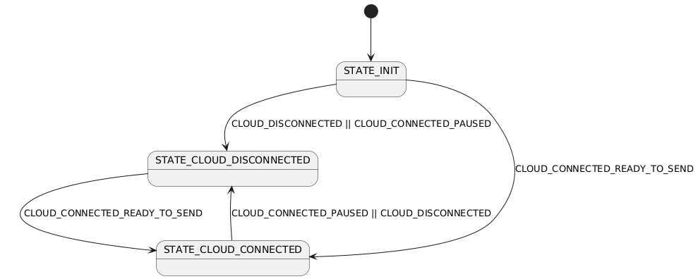
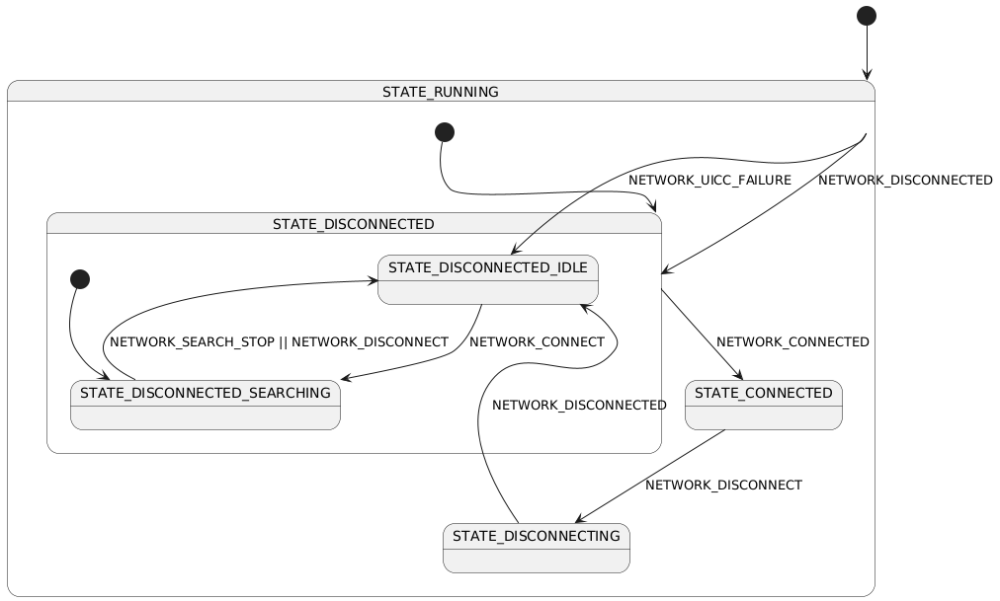
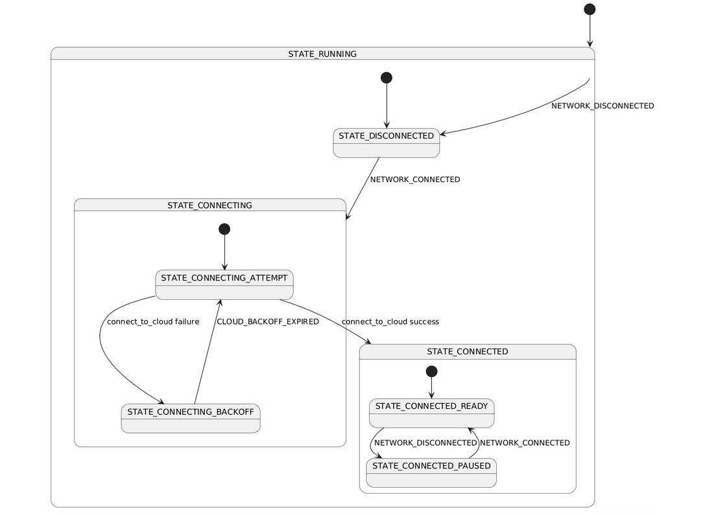
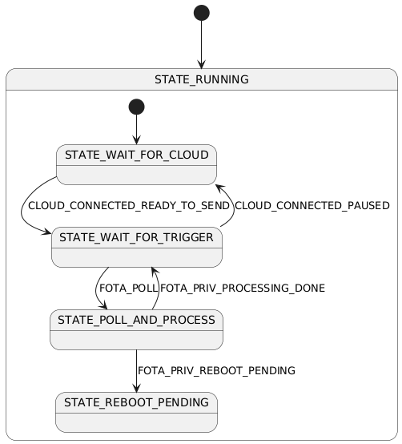

Welcome to the Asset Tracker Template github pages. This documentation provides information about the architecture and interactive visualization of the system.

## Contents

1. [Interactive State Machine](interactive_state_machine.html) - IN_PROGRESS

## State Machines

### app

### network

### cloud

### fota

