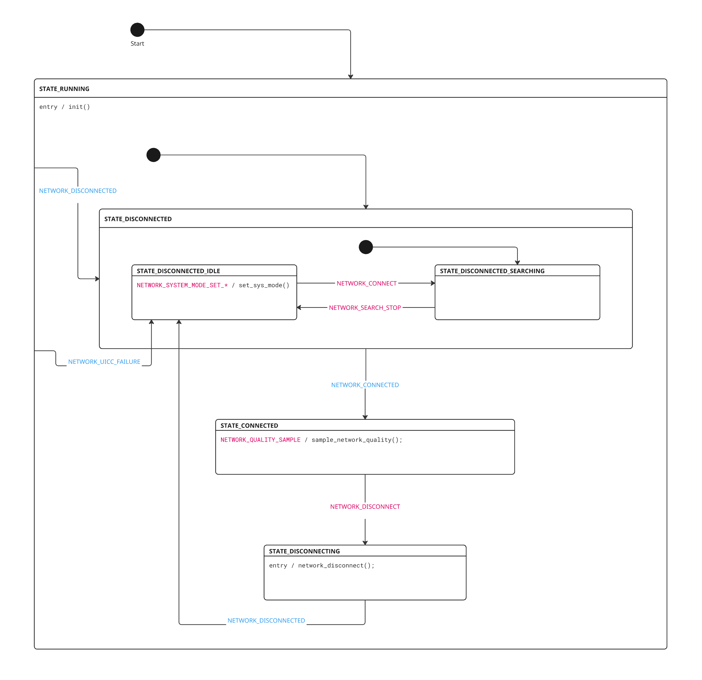

# Architecture

The Asset Tracker Template leverages Zephyr features to create a modular, event-driven system. The key to the template architecture are [Zephyr bus (zbus)](https://docs.nordicsemi.com/bundle/ncs-latest/page/zephyr/services/zbus/index.html) for inter-module communication and the [State Machine Framework](https://docs.nordicsemi.com/bundle/ncs-latest/page/zephyr/services/smf/index.html) (SMF) for managing module behavior.

This document provides an overview of the architecture and explains how the different modules interact with each other, with a focus on the zbus messaging and the State Machine Framework.

- [System overview](#system-overview)
- [Zbus](#zbus)
- [State Machine Framework](#state-machine-framework)

## System Overview

The Asset Tracker Template is built around a modular architecture where each module is responsible for a specific functionality. The template consists of the following modules:

- **[Main module](../modules/main.md)**: The central coordinator that implements the business logic and controls the overall application flow.
- **[Network module](../modules/network.md)**: Manages LTE connectivity and tracks network status.
- **[Cloud module](../modules/cloud.md)**: Handles communication with nRF Cloud using CoAP.
- **[Location module](../modules/location.md)**: Provides location services using GNSS, Wi-Fi, and cellular positioning.
- **[LED module](../modules/led.md)**: Controls RGB LED for visual feedback.
- **[Button module](../modules/button.md)**: Handles button input for user interaction.
- **[FOTA module](../modules/fota.md)**: Manages firmware over-the-air updates.
- **[Environmental module](../modules/environmental.md)**: Collects environmental sensor data (temperature, humidity, pressure).
- **[Power module](../modules/power.md)**: Monitors battery status and provides power management.

The following diagram below shows the system architecture and how the modules interact with each other. The modules are connected through a zbus messaging bus, which allows them to communicate with each other without being directly aware of each other. This decouples the modules and allows for easier maintenance and extensibility.


The following steps show the simplified flow of a typical operation:

1. The Main module schedules periodic triggers or responds to button presses reported on the `BUTTON_CHAN` channel.
2. When triggered either by timeout or button press, it requests location data from the Location module on the `LOCATION_CHAN` channel.
3. After the location search is completed and reported on the `LOCATION_CHAN`, the Main module requests sensor data from the Environmental module on the `ENVIRONMENTAL_CHAN` channel.
4. Throughout the operation, the Main module controls the LED module over the `LED_CHAN` channel to provide visual feedback about the system state.

### Module Architecture

Each module follows a similar pattern:

- **State machine**: Most modules implement a state machine using SMF to manage their internal state and behavior.
- **Message channels**: Each module defines its own zbus channels and message types for communication.
- **Thread**: Modules that need to perform blocking operations have their own thread.
- **Initialization**: Modules are initialized at system startup, either through `SYS_INIT()` or in its dedicated thread.

Modules in the Asset Tracker Template must be independent of each other whenever possible. This decoupling improves maintainability and extensibility. However, some exceptions exist, such as the Main module, which must interact with other modules to implement the application's business logic.
Another example is the cloud module that needs to be aware of the network module to know when it is connected to the network and when it is not.

## Zbus

The [zbus documentation](https://docs.nordicsemi.com/bundle/ncs-latest/page/zephyr/services/zbus/index.html) provides a good introduction to the zbus library, and this section only covers the parts that are relevant for the Asset Tracker Template:

- Channels and messages
- Channel observers: Message subscribers and listeners
- Message sending and receiving

### Channels and messages

In the Asset Tracker Template, each module defines channels and message types in their own header file. For example, in the `modules/network/network.h` file, the network module defines the `NETWORK_CHAN` channel and the `struct network_msg` message type.
Channels are defined using `ZBUS_CHAN_DEFINE`, specifying the channel name, message type and more. For example:

```c
ZBUS_CHAN_DEFINE(NETWORK_CHAN,                          /* Channel name */
        struct network_msg,                             /* Message type */
        NULL,                                           /* Optional validator function */
        NULL,                                           /* Optional pointer to user data */
        ZBUS_OBSERVERS_EMPTY,                           /* Initial observers */
        ZBUS_MSG_INIT(.type = NETWORK_DISCONNECTED)     /* Message initialization */
);
```

In the above example, initial observers are set to `ZBUS_OBSERVERS_EMPTY` to indicate that no observers are initially listening on the channel. However, observers can still be added at compile time using `ZBUS_CHAN_ADD_OBS`. It is also possible to add observers at runtime using `ZBUS_CHAN_ADD_OBS`. The reason that you need to set the initial observers to `ZBUS_OBSERVERS_EMPTY` is that the network module is not aware of any other modules in the system, and this avoids coupling between modules.

Message data types may be any valid C type, and their content is specific to the needs of the module. For example, from the network module header file:

```c
struct network_msg {
        enum network_msg_type type;
        union {
                enum lte_lc_system_mode system_mode;
                /* Other message-specific fields */
        };
};
```

The following are a few key points from the above example regarding how message types are defined in the Asset Tracker Template:

- The message type is an enumerator that is specific to the network module. The message type is typically used within a switch-case statement by the subscriber to determine what action to take and what, if any, additional fields in the message to use.

- When there are multiple message types in a message, it is a good practice to use a union to save memory. This is because the message will be allocated on the stack when it is sent, and it is good to keep the message size as small as possible. In the Asset Tracker Template, anonymous unions are used to avoid the need to specify the union name when accessing its members.

### Observers

A zbus observer is an entity that can receive messages on one or more zbus channel. There are multiple types of observers, including message subscribers and listeners, which are the only ones used in the Asset Tracker template. These observer types offer message delivery guarantees and are used in different scenarios.

#### Message subscribers

The message subscribers are used by modules that have their own thread and that perform actions that may block in response to messages.
For example, the network module subscribes to its own `NETWORK_CHAN` channel to receive messages about network events. The module may react to a message by sending some AT command to the modem, which may block until some signalling with the network is done and a response is received. This is why the module has its own thread and needs to be a message subscriber.

A message subscriber will queue up messages that are received while the module is busy processing another message. The module can then process the messages in the order they were received. An incoming message can never interrupt the processing of another message.

A message subscriber is defined using `ZBUS_MSG_SUBSCRIBER_DEFINE`, and the subscriber is added to a channel using `ZBUS_CHAN_ADD_OBS`. For example, in the Network module it subscribes to its own channel like this:

```c
ZBUS_MSG_SUBSCRIBER_DEFINE(network_subscriber);
ZBUS_CHAN_ADD_OBS(NETWORK_CHAN, network_subscriber, 0);
```

#### Listeners

The listeners are used by modules that do not have their own thread and that do not block when processing messages. A listener receives a message synchronously in the sender's context. For example, the LED module listens for messages on the `LED_CHAN` channel. When it receives an `LED_RGB_SET` message from the Main module, it immediately sets the RGB LED color without blocking. This happens in the Main module's context. The LED module does not have its own thread and does not block when processing messages, so it can be a listener.

A listener is defined using `ZBUS_LISTENER_DEFINE`, and the listener is added to a channel using `ZBUS_CHAN_ADD_LISTENER`. For example, in the LED module it listens for messages on its own channel like this:

```c
ZBUS_LISTENER_DEFINE(led, led_callback);
ZBUS_CHAN_ADD_LISTENER(LED_CHAN, led, 0);
```

### Message sending

Messages are sent on a channel using `zbus_chan_pub()`. For example, to send a message to the `LED_CHAN` channel:

```c
struct led_msg msg = {
        .type = LED_RGB_SET,
        .red = 255,
        .green = 0,
        .blue = 0,
        .duration_on_msec = 1000,
        .duration_off_msec = 1000,
        .repetitions = 10,
};

err = zbus_chan_pub(LED_CHAN, &msg);

```

The LED module receives the message and call the `led_callback` function with the message data, as described in [Listeners](#listeners).
If the LED module observer were a message subscriber, the message would be queued up until the module is ready to process it.

## State Machine Framework

The State Machine Framework (SMF) is a Zephyr library that provides a way to implement hierarchical state machines in a structured manner. The Asset Tracker Template uses SMF extensively to manage module behavior and state transitions. Several key modules including Network, Cloud, FOTA, and the Main module implement state machines using SMF.

The [documentation on SMF](https://docs.nordicsemi.com/bundle/ncs-latest/page/zephyr/services/smf/index.html) provides a good introduction, and this section will only cover the parts that are relevant for the Asset Tracker Template.

### Run-to-completion

The state machine implementation follows a run-to-completion model where:

- Message processing and state machine execution, including transitions, complete fully before processing new messages.
- Entry and exit functions are called in the correct order when transitioning states.
- Parent state transitions are handled automatically when transitioning between child states.

This ensures predictable behavior and proper state cleanup during transitions, as there is no mechanism for interrupting or changing the state machine execution from the outside.

### State definition

States are defined using the `SMF_CREATE_STATE` macro, which allows specifying:

- **Entry function:** Called when entering the state.
- **Run function:** Called while in the state.
- **Exit function:** Called when leaving the state.
- **Parent state:** For hierarchical state machines.
- **Initial transition:** A state may transition to a sub-state upon entry.

Example from the Cloud module:

```c
[STATE_CONNECTED] =
    SMF_CREATE_STATE(state_connected_entry,             /* Entry function */
                     NULL,                              /* Run function */
                     state_connected_exit,              /* Exit function */
                     &states[STATE_RUNNING],            /* Parent state */
                     &states[STATE_CONNECTED_READY]),   /* Initial transition */
```

### Hierarchical state machine

The framework supports parent-child state relationships, allowing common behavior to be implemented in parent states. For example, in the Network module:

- `STATE_RUNNING` is the top-level state.
- `STATE_DISCONNECTED` and `STATE_CONNECTED` are child states of `STATE_RUNNING`.
- `STATE_DISCONNECTED_IDLE` is a child state of `STATE_DISCONNECTED`.

This hierarchy allows for shared behavior and clean state organization.

Here is the full state machine of the network module, both graphically and SMF implementation:



```c
static const struct smf_state states[] = {
        [STATE_RUNNING] =
                SMF_CREATE_STATE(state_running_entry, state_running_run, NULL,
                                 NULL,	/* No parent state */
                                 &states[STATE_DISCONNECTED]),
        [STATE_DISCONNECTED] =
                SMF_CREATE_STATE(state_disconnected_entry, state_disconnected_run, NULL,
                                 &states[STATE_RUNNING],
                                 &states[STATE_DISCONNECTED_SEARCHING]),
        [STATE_DISCONNECTED_IDLE] =
                SMF_CREATE_STATE(NULL, state_disconnected_idle_run, NULL,
                                 &states[STATE_DISCONNECTED],
                                 NULL), /* No initial transition */
        [STATE_DISCONNECTED_SEARCHING] =
                SMF_CREATE_STATE(state_disconnected_searching_entry,
                                 state_disconnected_searching_run, NULL,
                                 &states[STATE_DISCONNECTED],
                                 NULL), /* No initial transition */
        [STATE_CONNECTED] =
                SMF_CREATE_STATE(state_connected_entry, state_connected_run, NULL,
                                 &states[STATE_RUNNING],
                                 NULL), /* No initial transition */
        [STATE_DISCONNECTING] =
                SMF_CREATE_STATE(state_disconnecting_entry, state_disconnecting_run, NULL,
                                 &states[STATE_RUNNING],
                                 NULL), /* No initial transition */
};
```

In the image, the black dots and arrow indicate initial transitions.
In this case, the initial state is set to `STATE_RUNNING`. In the state machine definition, initial transitions are configured, such that the state machine ends up in `STATE_DISCONNECTED_SEARCHING` when first initialized.
From there, transitions follows the arrows according to the messages received and the state machine logic.

!!! important "important" In a hierarchical state machine, the run function of the current state is executed first, and then the run function of the parent state is executed, unless a state transition happens, or the child state marks the message as handled using `smf_state_handled()`.

### State machine context

Each module that uses SMF maintains a context structure, which is usually embedded within a state structure for the module that contains other relevant data for the module's operation.
Example from the cloud module:

```c
struct cloud_state {
        /* This must be first */
        struct smf_ctx ctx;

        /* Last channel type that a message was received on */
        const struct zbus_channel *chan;

        /* Last received message */
        uint8_t msg_buf[MAX_MSG_SIZE];

        /* Network status */
        enum network_msg_type nw_status;

        /* Connection attempt counter. Reset when entering STATE_CONNECTING */
        uint32_t connection_attempts;

        /* Connection backoff time */
        uint32_t backoff_time;
};
```

The SMF context struct member is used to track the current state and manage state transitions. It is passed to all SMF function calls.

### State machine initialization

State machines are initialized to an initial state using `smf_set_initial()`:

```c
smf_set_initial(SMF_CTX(&module_state), &states[STATE_RUNNING]);
```

This has to be done before the state machine is executed the first time.

### State machine execution

The state machine is run using `smf_run_state()`, which:

- Executes the run function of the current state if it is defined.
- Executes the run function of parent states unless:
  - A state transition happens.
  - A child state marks the message as handled using `smf_state_handled()`.
- Executes the exit function of the current and parent states when leaving a state.

### State transitions

Transitions between states are handled using `smf_set_state()`:

```c
smf_set_state(SMF_CTX(state_object), &states[NEW_STATE]);
```

A transition to another state has to be the last thing happening in a state handler. This is to ensure correct order of execution of parent state handlers.
SMF automatically handles the execution of exit and entry functions for all states along the path to the new state.
