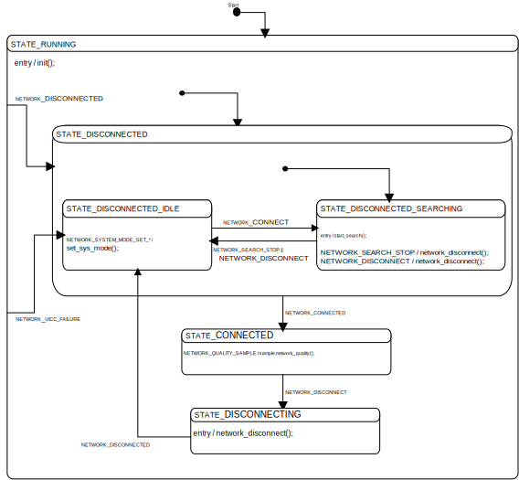
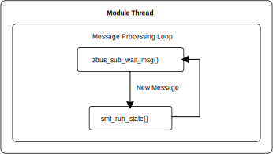

# Architecture

The Asset Tracker Template is built on a modular, event-driven architecture. The modules interact via messages that are processed as events by the modules' state machines.

The architecture is implemented using [Zephyr bus (zbus)](https://docs.nordicsemi.com/bundle/ncs-latest/page/zephyr/services/zbus/index.html) for inter-module communication and the [State Machine Framework](https://docs.nordicsemi.com/bundle/ncs-latest/page/zephyr/services/smf/index.html) (SMF) for managing module behavior.

This document provides an overview of the architecture, with a focus on the zbus message passing and the modules' state machines.

## System overview

The template consists of the following modules:

- **[Main module](../modules/main.md)**: Implements the business logic and controls the overall application behaviour. Uniquely, it is not in the `modules` folder.
- **[Storage module](../modules/storage.md)**: Stores data from enabled modules.
- **[Network module](../modules/network.md)**: Manages LTE connectivity and tracks network status.
- **[Cloud module](../modules/cloud.md)**: Handles communication with nRF Cloud using CoAP.
- **[Location module](../modules/location.md)**: Provides location services using GNSS, Wi-Fi, and cellular positioning.
- **[LED module](../modules/led.md)**: Controls an RGB LED for visual indication.
- **[Button module](../modules/button.md)**: Reports button press events for user input.
- **[FOTA module](../modules/fota_module.md)**: Manages firmware over-the-air updates.
- **[Environmental module](../modules/environmental.md)**: Collects environmental sensor data (temperature, humidity, pressure).
- **[Power module](../modules/power.md)**: Monitors battery status and provides power management.

The following diagram shows the system architecture and how the modules interact with each other. The modules communicate through zbus channels.


The following steps show the simplified flow of a typical operation:

1. The Main module schedules periodic triggers or responds to a short button press reported on the `BUTTON_CHAN` channel.
2. When triggered either by timeout or button press, it requests location data from the Location module on the `LOCATION_CHAN` channel.
3. After the location search is completed and reported on the `LOCATION_CHAN` channel, the Main module requests sensor data from the Environmental module on the `ENVIRONMENTAL_CHAN` channel.
4. Throughout the operation, the Main module controls the LED module over the `LED_CHAN` channel to provide visual feedback about the system state.

## Module design

Each module follows a similar design:

- **State machine**: Most modules implement a state machine using SMF to manage their internal state and behavior.
- **Message channel**: Each module defines its own zbus channel. With some exceptions, a single channel is used for all messages that are specific to a module.
- **Message types**: Each module exposes a set of input and output message types. These can be considered events in the state machine sense, and may have associated data.
- **Thread**: Each module that needs to perform blocking operations has its own thread.
- **Watchdog**: Each module thread is monitored by a task watchdog. Each thread periodically calls `task_wdt_feed()` to feed the watchdog. If a thread fails to feed its watchdog within its configured timeout, the system will reset.
- **Initialization**: Modules are initialized at system startup, either through `SYS_INIT()` or in their dedicated thread.

Modules in the Asset Tracker Template are designed as loosely coupled units with well-defined message-based interfaces.
Modules communicate exclusively through their defined zbus interfaces, without reference to other modules' internals. This design ensures that modules are self-contained and can be developed, tested, and maintained independently. Most modules except the Main module can also be reused in other applications.

Modules often handle state transitions based on messages they themselves publish. For example, when the Network module publishes a `NETWORK_CONNECTED` message, it also receives this message in its own state machine, allowing it to transition to the connected state with consistent handling.

Most modules in the Asset Tracker Template have their own threads. If a module uses blocking calls while processing messages, this is a requirement. For example, the Network module may react to a message by sending some AT command to the modem, which may block until some signaling with the network is done and a response is received. Separate threads also help to keep the required stack size for each module more predictable.

## Message passing with zbus

Zbus is part of Zephyr and implements channel-based message-passing between threads. This section covers how zbus is used in the Asset Tracker Template. See the [zbus documentation](https://docs.nordicsemi.com/bundle/ncs-latest/page/zephyr/services/zbus/index.html) for a more comprehensive introduction to zbus.

### Channels

In the Asset Tracker Template, each module declares and defines a channel using zbus macros. For example, in the `app/src/modules/network/network.h` file, the Network module declares the `NETWORK_CHAN` channel:

```c
/* Channels provided by this module */
ZBUS_CHAN_DECLARE(
	NETWORK_CHAN
);
```

The channel is defined in `app/src/modules/network/network.c`:

```c
/* Define channels provided by this module */
ZBUS_CHAN_DEFINE(NETWORK_CHAN, /* Channel name, derived from module name */
        struct network_msg,    /* Message data type */
        NULL,                  /* Optional validator function */
        NULL,                  /* Optional pointer to user data */
        ZBUS_OBSERVERS_EMPTY,  /* Initial observers */
        ZBUS_MSG_INIT(0)       /* Message initialization */
);
```

In the Asset Tracker Template, the fields of the `ZBUS_CHAN_DEFINE` macro are populated in a similar way across modules:
- **Channel name**: the name of the channel, derived from the module name.
- **Message data type**: the data type used to hold message data. The name comes from the channel name.
- **Validator function** and **User data**: Not used
- **Initial observers**: The initial observer list is empty. Observers are added in the relevant modules later.
- **Message initialization**: The initial value stored in the channel. Not used, and therefore set to `ZBUS_MSG_INIT(0)`.

> [!IMPORTANT]
> In the context of zbus, the term "message type" can be used to refer to the data type or structure containing the message data for a given channel, in this case `struct network_msg`. In the Asset Tracker Template architecture, "message type" is used to mean the enumerated value that distinguishes different kinds of messages sent on the same channel, in this case the `type` field of `struct network_msg`.

### Message types and the message structure

Each module exposes a set of message types through an enumeration. The message types can be considered events in the state machine sense. The message type is typically used within a switch-case statement by the subscriber to determine what actions to take and whether to trigger a state transition.

The message types can be divided into two categories:

- **Input message types**: Commands or requests sent by other modules to the defining module to trigger actions (e.g., `NETWORK_CONNECT` to request the network module to establish a network connection).
- **Output message types**: Responses or notifications sent by the defining module to other modules to report status, data, or events (e.g., `NETWORK_CONNECTED` when a network connection has been established).

Each module's message types are defined in its public header file located at `app/src/modules/<module_name>/<module_name>.h`. For example, the network module's messages are defined in `app/src/modules/network/network.h` in the `enum network_msg_type` enumeration:

```c
enum network_msg_type {
        /* Output message types */
        NETWORK_DISCONNECTED = 0x1,

        /* The device is connected to the network and has an IP address */
        NETWORK_CONNECTED,

        /* ... */

        /* Response message to a request for the current system mode. The current system mode is
         * found in the .system_mode field of the message.
         */
        NETWORK_SYSTEM_MODE_RESPONSE,

        /* ... */

        /* Input message types */

        /* Request to connect to the network, which includes searching for a suitable network
         * and attempting to attach to it if a usable cell is found.
         */
        NETWORK_CONNECT,

        /* Request to disconnect from the network */
        NETWORK_DISCONNECT,

        /* ... */

        /* Request to retrieve the current system mode. The response is sent as a
         * NETWORK_SYSTEM_MODE_RESPONSE message.
         */
        NETWORK_SYSTEM_MODE_REQUEST,
};
```

The message type forms the first part of the message structure. For some message types, associated data is present in the message. When the associated data varies based on the message type, a union is used to save memory. The message type determines which fields are valid. For optional features, `IF_ENABLED` macros are used to optionally include the fields.
The complete message structure for the network module is also defined in `app/src/modules/network/network.h`:

```c
struct network_msg {
        enum network_msg_type type;
        union {
                /** Contains the currently configured system mode.
                 *  system_mode is set for NETWORK_SYSTEM_MODE_RESPONSE events
                 */
                enum lte_lc_system_mode system_mode;

                /** Contains the current PSM configuration.
                 *  psm_cfg is valid for NETWORK_PSM_PARAMS events.
                 */
                IF_ENABLED(CONFIG_LTE_LC_PSM_MODULE, (struct lte_lc_psm_cfg psm_cfg));

                /* ... */
        };
        /** Timestamp when the sample was taken in milliseconds.
         *  This is either:
         * - Unix time in milliseconds if the system clock was synchronized at sampling time, or
         * - Uptime in milliseconds if the system clock was not synchronized at sampling time.
         */
        int64_t timestamp;
};
```

In the above example, a module receiving a `NETWORK_SYSTEM_MODE_RESPONSE` message can read the current system mode from the `system_mode` field in the message.

### Sending messages

Messages are sent on a channel using `zbus_chan_pub()`. For example, to send a message to the `NETWORK` channel:

```c
        struct network_msg msg = {
                .type = NETWORK_DISCONNECT
        };

        err = zbus_chan_pub(&NETWORK_CHAN, &msg, PUB_TIMEOUT);
```

Zbus will copy the message, so the original message struct is no longer needed after calling `zbus_chan_pub()`.

### Receiving messages

In zbus, structures called _observers_ are used to receive messages on one or more zbus channels. There are multiple types of observers, but the Asset Tracker Template only uses two: message subscribers and listeners.

#### Message subscribers

The message subscriber is the most common observer in the Asset Tracker Template. A message subscriber will receive messages asynchronously. It is used by any module that has its own thread.

A message subscriber will queue up messages that are received while the module is busy processing another message. The module will then process the messages in the order they were received. An incoming message can never interrupt the processing of another message.

A message subscriber is defined using `ZBUS_MSG_SUBSCRIBER_DEFINE`, and the subscriber is added to a channel using `ZBUS_CHAN_ADD_OBS`. For example, in the Network module:

```c
ZBUS_MSG_SUBSCRIBER_DEFINE(network);
ZBUS_CHAN_ADD_OBS(NETWORK_CHAN, network, 0);
```

The messages are received in the module's thread loop by calling `zbus_sub_wait_msg()`:

```c
err = zbus_sub_wait_msg(&network, &network_state.chan,
                        network_state.msg_buf, zbus_wait_ms);
```

As with all the modules in the Asset Tracker Template with a state machine, the channel and the message contents are stored in the module's [state machine context](#state-machine-context) in preparation to run the state handler, where the message will be processed.

#### Listeners

The listener is the simplest kind of observer. A listener receives a message synchronously and executes a callback in the sender's context. Listeners are only used by modules that do not have their own thread and that do not block when processing messages. When using a listener, care should also be taken to ensure that any callback does not add significantly to the stack size by using large local variables.

For example, the LED module will react to a message by setting the RGB LED color immediately. No function call during the handling of the message can block, so the LED module uses a listener.

A listener is defined using `ZBUS_LISTENER_DEFINE`, and the listener is added to a channel using `ZBUS_CHAN_ADD_OBS`. For example, the LED module sets up a listener in `app/src/modules/led/led.c`:

```c
ZBUS_LISTENER_DEFINE(led, led_callback);
ZBUS_CHAN_ADD_OBS(LED_CHAN, led, 0);
```

When a message is available, the callback function will process the message:

```c
static void led_callback(const struct zbus_channel *chan)
{
	if (&LED_CHAN == chan) {
		int err;
		const struct led_msg *led_msg = zbus_chan_const_msg(chan);
		/* ... */
	}
}
```

### Private channels
When a module needs internal state handling that should not be exposed to other modules, it uses a **private channel**. Private channels are reserved exclusively for the respective module and are not intended for external use. Otherwise, they are defined, published to and subscribed to just like public channels. For example, the Location module uses the `PRIV_LOCATION_CHAN` channel for internal messaging.

## State machine framework

The State Machine Framework (SMF) is a Zephyr library that provides a way to implement hierarchical state machines in a structured manner. The Asset Tracker Template uses SMF extensively to manage module behavior and state transitions. Most modules, including Network, Cloud, FOTA, and the Main module, implement state machines using SMF.

The [documentation on SMF](https://docs.nordicsemi.com/bundle/ncs-latest/page/zephyr/services/smf/index.html) provides a good introduction, and this section will only cover the parts that are relevant for the Asset Tracker Template.

### Run-to-completion

The state machine implementation follows a run-to-completion model where:

- Message processing and state machine execution, including transitions, are completed fully before processing new messages.
- Entry and exit functions are called in the correct order when transitioning states.
- Parent state transitions are handled automatically when transitioning between child states.

This ensures predictable behavior and proper state cleanup during transitions, as there is no mechanism for interrupting or changing the state machine execution from the outside.

### State definition

States are defined using the `SMF_CREATE_STATE` macro, which allows specifying:

- **Entry function:** Called when entering the state.
- **Run function:** Called when processing a message while in the state.
- **Exit function:** Called when leaving the state.
- **Parent state:** For hierarchical state machines.
- **Initial transition:** A state may transition to a sub-state upon entry.

Example from the Cloud module:

```c
[STATE_CONNECTED] =
    SMF_CREATE_STATE(state_connected_entry,             /* Entry function */
                     NULL,                              /* Run function */
                     state_connected_exit,              /* Exit function */
                     &states[STATE_RUNNING],            /* Parent state */
                     &states[STATE_CONNECTED_READY]),   /* Initial transition */
```

### Hierarchical state machine

The framework supports parent-child state relationships, allowing common behavior to be implemented in parent states. For example, in the Network module:

- `STATE_RUNNING` is the top-level state.
- `STATE_DISCONNECTED` and `STATE_CONNECTED` are child states of `STATE_RUNNING`.
- `STATE_DISCONNECTED_IDLE` is a child state of `STATE_DISCONNECTED`.

This hierarchy allows for shared behavior and clean state organization.

The following shows the full state machine of the Network module, both graphically and in SMF implementation:



```c
static const struct smf_state states[] = {
        [STATE_RUNNING] =
                SMF_CREATE_STATE(state_running_entry, state_running_run, NULL,
                                 NULL,	/* No parent state */
                                 &states[STATE_DISCONNECTED]),
        [STATE_DISCONNECTED] =
                SMF_CREATE_STATE(state_disconnected_entry, state_disconnected_run, NULL,
                                 &states[STATE_RUNNING],
                                 &states[STATE_DISCONNECTED_SEARCHING]),
        [STATE_DISCONNECTED_IDLE] =
                SMF_CREATE_STATE(NULL, state_disconnected_idle_run, NULL,
                                 &states[STATE_DISCONNECTED],
                                 NULL), /* No initial transition */
        [STATE_DISCONNECTED_SEARCHING] =
                SMF_CREATE_STATE(state_disconnected_searching_entry,
                                 state_disconnected_searching_run, NULL,
                                 &states[STATE_DISCONNECTED],
                                 NULL), /* No initial transition */
        [STATE_CONNECTED] =
                SMF_CREATE_STATE(state_connected_entry, state_connected_run, NULL,
                                 &states[STATE_RUNNING],
                                 NULL), /* No initial transition */
        [STATE_DISCONNECTING] =
                SMF_CREATE_STATE(state_disconnecting_entry, state_disconnecting_run, NULL,
                                 &states[STATE_RUNNING],
                                 NULL), /* No initial transition */
};
```

In the image, the black dots and arrow indicate initial transitions.
In this case, the initial state is set to `STATE_RUNNING`. In the state machine definition, initial transitions are configured such that the state machine ends up in `STATE_DISCONNECTED_SEARCHING` when first initialized.
From there, transitions follow the arrows according to the messages received and the state machine logic.

> [!IMPORTANT]
> In SMF, the run function of the current state is executed first, and then the run function of the parent state is executed, unless a state transition happens, or the child state returns `SMF_EVENT_HANDLED` to indicate the event has been fully processed. Run functions return `SMF_EVENT_PROPAGATE` to allow the event to propagate to parent states, or `SMF_EVENT_HANDLED` to stop propagation.

### State machine context

Each module that uses SMF maintains a context structure, which is usually embedded within a state structure for the module that contains other relevant data for the module's operation.
Example from the cloud module:

```c
struct cloud_state {
        /* This must be first */
        struct smf_ctx ctx;

        /* Last channel type that a message was received on */
        const struct zbus_channel *chan;

        /* Last received message */
        uint8_t msg_buf[MAX_MSG_SIZE];

        /* Network status */
        enum network_msg_type nw_status;

        /* Connection attempt counter. Reset when entering STATE_CONNECTING */
        uint32_t connection_attempts;

        /* Connection backoff time */
        uint32_t backoff_time;
};
```

The SMF context struct member is used to track the current state and manage state transitions. It is passed to all SMF function calls.

### State machine initialization

State machines are initialized to an initial state using `smf_set_initial()`:

```c
smf_set_initial(SMF_CTX(&module_state), &states[STATE_RUNNING]);
```

This has to be done before the state machine is executed the first time.

### State machine execution

The state machine is run using `smf_run_state()`, which:

- Executes the run function of the current state if it is defined.
- Executes the run function of parent states unless:

    - A state transition happens.
    - The run function returns `SMF_EVENT_HANDLED` to indicate the event was fully processed.

- Executes the exit function of the current and parent states when leaving a state.

Run functions must return either `SMF_EVENT_HANDLED` or `SMF_EVENT_PROPAGATE`:

- `SMF_EVENT_HANDLED`: The event has been processed and should not propagate to parent states.
- `SMF_EVENT_PROPAGATE`: The event should propagate to parent states for further processing.

### State transitions

Transitions between states are handled using `smf_set_state()`:

```c
smf_set_state(SMF_CTX(state_object), &states[NEW_STATE]);
```

A transition to another state has to be the last thing happening in a state handler. This is to ensure the correct order of execution of parent state handlers.
SMF automatically handles the execution of exit and entry functions for all states along the path to the new state.

### Module thread and message processing

Modules with state machines typically have a dedicated thread that waits for zbus messages and drives the state machine execution. The following diagram illustrates the relationship between the module thread, zbus, and SMF:



The following example shows a typical module thread function:

```c
static void network_module_thread(void)
{
        int err;
        static struct network_state_object network_state;

        /* Initialize the state machine to the initial state */
        smf_set_initial(SMF_CTX(&network_state), &states[STATE_RUNNING]);

        while (true) {
                /* Wait for a message on any subscribed channel */
                err = zbus_sub_wait_msg(&network, &network_state.chan,
                                        network_state.msg_buf, K_FOREVER);
                if (err == -ENOMSG) {
                        continue;
                } else if (err) {
                        LOG_ERR("zbus_sub_wait_msg, error: %d", err);
                        return;
                }

                /* Run the state machine with the received message */
                err = smf_run_state(SMF_CTX(&network_state));
                if (err) {
                        LOG_ERR("smf_run_state(), error: %d", err);
                        return;
                }
        }
}
```

In this pattern:

1. The thread waits for a message using `zbus_sub_wait_msg()`, which blocks until a message is received.
2. When a message arrives, it is stored in the state object's buffer along with the channel it was received on.
3. The state machine is then executed with `smf_run_state()`, which calls the appropriate run handler for the current state.
4. The run handler processes the message based on its type and the current state, potentially triggering state transitions.
5. The loop continues, waiting for the next message.
