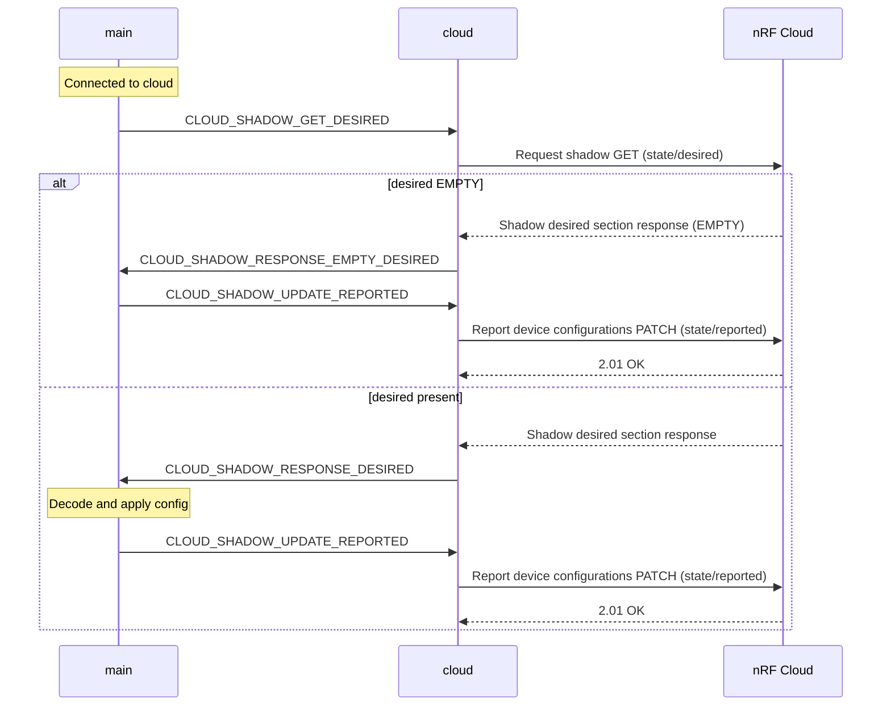
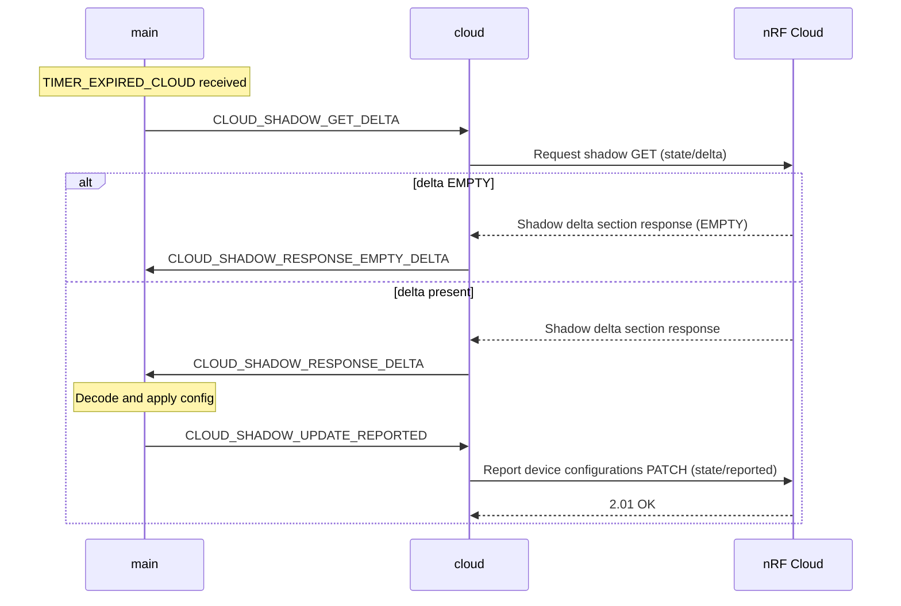
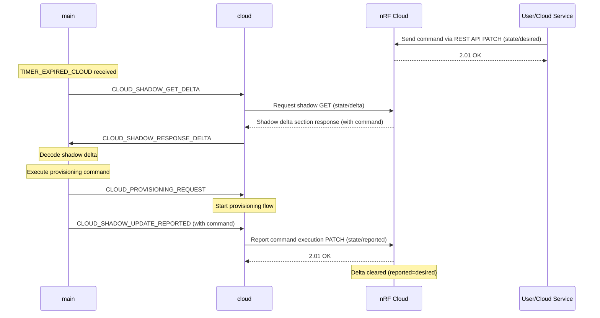

# Configuration

This section describes the available compile-time and runtime configuration options for customizing the template's behavior.

<div class="hidden-content">

## Table of Contents

- [Runtime Configurations](#runtime-configurations)
  - [Operation Modes](#operation-modes)
    - [Passthrough Mode](#passthrough-mode)
    - [Buffer Mode](#buffer-mode)
- [Remote Configuration from Cloud](#remote-configuration-from-cloud)
  - [Configuration through nRF Cloud UI](#configuration-through-nrf-cloud-ui)
  - [Configuration through REST API](#configuration-through-rest-api)
  - [Sending Commands through REST API](#sending-commands-through-rest-api)
  - [Configuration Flow](#configuration-flow)
- [Set Location Method Priorities](#set-location-method-priorities)
  - [Available Location Methods](#available-location-methods)
  - [Configuration Examples](#configuration-examples)
- [Storage Mode Configuration](#storage-mode-configuration)
- [Network Configuration](#network-configuration)
  - [NB-IoT vs LTE-M](#nb-iot-vs-lte-m)
  - [Power Saving Mode (PSM)](#power-saving-mode-psm)
  - [Access Point Name (APN)](#access-point-name-apn)
- [LED Status Indicators](#led-status-indicators)
  - [Example: Setting LED Colors](#example-setting-led-colors)

</div>

## Runtime Configurations

The device supports runtime configurations that allow you to modify the template's behavior without firmware updates.

The template uses separate parameters to control:
- **Cloud updates**: When the device sends data and checks for updates
- **Data sampling**: When the device collects sensor and location data

Cloud updates include sending data, checking for FOTA jobs, and retrieving configuration/command updates. For implementation details, see [Configuration Flow](#configuration-flow).

| Parameter | Description | Unit | Valid Range | Static Configuration
|-----------|-------------|------|-------------|---------------------
| **`update_interval`** | <ul><li>**In passthrough mode**: Sampling and cloud update interval.</li><li>**In buffer mode**: Cloud update interval</li></ul> | Seconds | 1 to 4294967295 | `CONFIG_APP_CLOUD_UPDATE_INTERVAL_SECONDS` (default: 600)
| **`sample_interval`** | <ul><li>**In passthrough mode**: Not valid.</li><li>**In buffer mode**: Sample interval.</li></ul> | Seconds | 1 to 4294967295 | `CONFIG_APP_BUFFER_MODE_SAMPLING_INTERVAL_SECONDS` (default: 150)
| **`buffer_mode`** | Storage mode control. Set to `true` for buffer mode or `false` for passthrough mode. | Boolean | true or false | `CONFIG_APP_STORAGE_INITIAL_MODE_PASSTHROUGH` (default) / `CONFIG_APP_STORAGE_INITIAL_MODE_BUFFER`

The complete device shadow structure is defined in the [CDDL](https://datatracker.ietf.org/doc/html/rfc8610) schema at `Asset-Tracker-Template/app/src/cbor/device_shadow.cddl`. This schema specifies all supported configuration parameters, commands, and their valid value ranges.

### Operation Modes

The device operates in one of two modes based on which parameters are configured:

#### Passthrough Mode

**Activated when**: `buffer_mode` is set to `false` (or not configured)

**Configuration**: Uses `update_interval` parameter only (ignores `sample_interval`)

**Behavior**:

- Samples sensors and location at `update_interval`
- Sends data immediately to cloud
- Polls shadow and checks FOTA at `update_interval`

**Use case**: Real-time data transmission, lower latency

#### Buffer Mode

**Activated when**: `buffer_mode` is set to `true`

**Configuration**: Uses both `sample_interval` and `update_interval` parameters

**Behavior**:

- Samples sensors and location at `sample_interval`
- Buffers data locally
- Sends buffered data at `update_interval`
- Polls shadow and checks FOTA at `update_interval`

**Use case**: Reduced power consumption, batch data transmission

## Remote configuration from cloud

The Asset Tracker can be configured remotely through nRF Cloud's device shadow mechanism.

### Configuration through nRF Cloud UI

> [!WARNING]
> The order of the configuration JSON structure matters.

1. Log in to [nRF Cloud](https://nrfcloud.com/).
1. Navigate to **Devices** and select your device.
1. Click on **View Config** on the top bar.
1. Select **Edit Configuration**.
1. Enter the desired configuration:

    **Example 1: Buffer mode with 5-minute sampling and 15-minute cloud updates**

    ```json
    {
    "update_interval": 900,
    "sample_interval": 300,
    "buffer_mode": true
    }
    ```

    **Example 2: Passthrough mode with 60-second interval**

    ```json
    {
    "update_interval": 60,
    "buffer_mode": false
    }
    ```


> [!WARNING]
> To remove a configuration entry you need to explicitly `null` the parameter.

1. Click **Commit** to apply the changes.

The device receives the new configuration through its shadow and adjusts its intervals and storage mode accordingly.

### Configuration through REST API

You can update the intervals using [nRF Cloud REST API](https://api.nrfcloud.com/#tag/IP-Devices/operation/UpdateDeviceState).

**Buffer mode example:**

```bash
curl -X PATCH "https://api.nrfcloud.com/v1/devices/$DEVICE_ID/state" \
  -H "Authorization: Bearer $API_KEY" \
  -H "Content-Type: application/json" \
  -d '{ "desired": { "config": { "update_interval": 900, "sample_interval": 300, "buffer_mode": true } } }'
```

**Passthrough mode example:**

```bash
curl -X PATCH "https://api.nrfcloud.com/v1/devices/$DEVICE_ID/state" \
  -H "Authorization: Bearer $API_KEY" \
  -H "Content-Type: application/json" \
  -d '{ "desired": { "config": { "update_interval": 60, "buffer_mode": false } } }'
```

### Sending commands through REST API

Send device commands using the [nRF Cloud REST API](https://api.nrfcloud.com/#tag/IP-Devices/operation/UpdateDeviceState):

```bash
curl -X PATCH "https://api.nrfcloud.com/v1/devices/$DEVICE_ID/state" \
-H "Authorization: Bearer $API_KEY" \
-H "Content-Type: application/json" \
-d '{"desired": {"command": [1, 1]}}'
```

**Command format**: `"command": [type, id]`

- **type**: Command type (1=Provision)
  - **Valid range**: 1 to 1
- **id**: Unique identifier (increment for successive commands)
  - **Valid range**: 1 to 4294967294 (excludes 0 and UINT32_MAX)

*For shadow structure details, see `Asset-Tracker-Template/app/src/cbor/device_shadow.cddl`*

### Configuration Flow

The device starts in **passthrough mode** by default (configured via `CONFIG_APP_STORAGE_INITIAL_MODE_PASSTHROUGH`). To start in buffer mode instead, use `CONFIG_APP_STORAGE_INITIAL_MODE_BUFFER`. Default intervals are set from `CONFIG_APP_BUFFER_MODE_SAMPLING_INTERVAL_SECONDS` and `CONFIG_APP_CLOUD_UPDATE_INTERVAL_SECONDS`.

The following diagrams illustrates what happens in the various scenarios where the device polls the shadow:

<details open>
<summary><b>Shadow Desired Section Poll Flow</b></summary>



</details>

<details>
<summary><b>Shadow Delta Section Poll Flow</b></summary>



</details>

<details>
<summary><b>Shadow Delta Section Poll Flow - Command Execution</b></summary>



</details>

## Set location method priorities

The Asset Tracker supports multiple location methods that can be prioritized based on your needs. Configuration is done through board-specific configuration files.

### Available location methods

The following are the available location methods:

- GNSS (GPS)
- Wi-Fi® positioning
- Cellular positioning

### Configuration Examples

- **Thingy91x configuration** (Wi-Fi available):

    ```kconfig
    CONFIG_LOCATION_REQUEST_DEFAULT_METHOD_FIRST_WIFI=y
    CONFIG_LOCATION_REQUEST_DEFAULT_METHOD_SECOND_GNSS=y
    CONFIG_LOCATION_REQUEST_DEFAULT_METHOD_THIRD_CELLULAR=y
    CONFIG_LOCATION_REQUEST_DEFAULT_WIFI_TIMEOUT=10000
    ```

- **nRF9151 DK configuration** (Wi-Fi unavailable):

    ```kconfig
    CONFIG_LOCATION_REQUEST_DEFAULT_METHOD_FIRST_GNSS=y
    CONFIG_LOCATION_REQUEST_DEFAULT_METHOD_SECOND_CELLULAR=y
    ```

## Storage Mode Configuration

The storage module handles collected data in two modes: **Passthrough** (forward immediately, default) or **Buffer** (store and transmit in batches for lower power consumption). See [Storage Module Documentation](../modules/storage.md) for details.

**Basic configuration** in `prj.conf`:

Passthrough mode is the default mode. To enable buffer mode use:

```bash
CONFIG_APP_STORAGE_INITIAL_MODE_BUFFER=y
```

To configure buffer size and records per stored data type:

```bash
CONFIG_APP_STORAGE_MAX_RECORDS_PER_TYPE=8      # Records per data type
CONFIG_APP_STORAGE_BATCH_BUFFER_SIZE=256       # Batch buffer size
```

For minimal use, include the `overlay-storage-minimal.conf` overlay.

**Runtime control** (shell commands when `CONFIG_APP_STORAGE_SHELL=y`):

```bash
att_storage mode passthrough   # Switch to passthrough
att_storage mode buffer        # Switch to buffer
att_storage flush              # Flush stored data
att_storage clear              # Clear all data
att_storage stats              # Show statistics (if enabled)
```

See [Storage Module Configurations](../modules/storage.md#configurations) for all options.

## Network Configuration

### NB-IoT vs. LTE-M

The Asset Tracker supports both LTE Cat NB1 (NB-IoT) and LTE Cat M1 (LTE-M) cellular connectivity:

- **NB-IoT**: Optimized for:
  - Low data rate applications.
  - Better coverage.
  - Stationary or low-mobility devices.

- **LTE-M**: Better suited for:
  - Higher data rates.
  - Mobile applications.
  - Lower latency requirements.

#### Network mode selection

The following network modes are available (`LTE_NETWORK_MODE`):

- **Default**: Use the system mode currently set in the modem.
- **LTE-M**: LTE Cat M1 only.
- **LTE-M and GPS**: LTE Cat M1 with GPS enabled.
- **NB-IoT**: NB-IoT only.
- **NB-IoT and GPS**: NB-IoT with GPS enabled.
- **LTE-M and NB-IoT**: Both LTE-M and NB-IoT enabled.
- **LTE-M, NB-IoT and GPS**: Both LTE modes with GPS.

#### Network mode preference

When multiple network modes are enabled (LTE-M and NB-IoT), you can set preferences (`LTE_MODE_PREFERENCE`):

- **No preference**: Automatically selected by the modem.
- **LTE-M**: Prioritize LTE-M over PLMN selection.
- **NB-IoT**: Prioritize NB-IoT over PLMN selection.
- **LTE-M, PLMN prioritized**: Prefer LTE-M but prioritize staying on home network.
- **NB-IoT, PLMN prioritized**: Prefer NB-IoT but prioritize staying on home network.

Example configuration in `prj.conf`:

```kconfig
# Enable both LTE-M and NB-IoT with GPS
CONFIG_LTE_NETWORK_MODE_LTE_M_NBIOT_GPS=y

# Prefer LTE-M while prioritizing home network
CONFIG_LTE_MODE_PREFERENCE_LTE_M_PLMN_PRIO=y
```

### Power Saving Mode (PSM)

PSM allows the device to enter deep sleep while maintaining network registration. Configuration is done through Kconfig options:

#### PSM Parameters

- **Periodic TAU (Tracking Area Update)**
  - Controls how often the device updates its location with the network
  - Configuration options:

    ```kconfig
    # Configure TAU in seconds
    CONFIG_LTE_PSM_REQ_RPTAU_SECONDS=1800  # 30 minutes
    ```

- **Active Time (RAT)**
  - Defines how long the device stays active after a wake-up
  - Configuration options:

    ```kconfig
    # Configure RAT in seconds
    CONFIG_LTE_PSM_REQ_RAT_SECONDS=60  # 1 minute
    ```

Key aspects:

- Device negotiates PSM parameters with the network.
- Helps achieve longer battery life.
- Device remains registered but unreachable during sleep.
- Wakes up periodically based on TAU setting.
- Stays active for the duration specified by RAT.

For more information on power configuration, see the [Application power configuration](low_power.md#application-power-configuration) section in the **Achieving Low Power** guide.

### Access Point Name (APN)

The Access Point Name (APN) is a network identifier used by the device to connect to the cellular network's packet data network. Configuration options:

- **Default APN**: Most carriers automatically configure the correct APN.
- **Manual Configuration**: If needed, APN can be configured through Kconfig:

    ```kconfig
    CONFIG_PDN_DEFAULT_APN="Access point name"
    ```

Common scenarios for APN configuration:

- Using a custom/private APN.
- Connecting to specific network services.
- Working with MVNOs (Mobile Virtual Network Operators).

> [!NOTE]
> In most cases, the default APN provided by the carrier should work without additional configuration.

## LED Status Indicators

The Asset Tracker Template uses LED colors to indicate different device states:

- **Yellow** (Blinking, 10 repetitions): Device is idle and disconnected from cloud.
- **Green** (Blinking, 10 repetitions): Device is connected to cloud and actively sampling data.
- **Blue** (Blinking, 10 repetitions): Device is in lower power mode state between samples.
- **Purple** (Blinking, 10 repetitions): FOTA download in progress.

### Example: Setting LED Colors

You can control the LED colors through the LED module using zbus messages. The following is an example of how to set different LED patterns:

```c
/* Set yellow blinking pattern for idle state */
struct led_msg led_msg = {
    .type = LED_RGB_SET,
    .red = 255,
    .green = 255,
    .blue = 0,
    .duration_on_msec = 250,
    .duration_off_msec = 2000,
    .repetitions = 10,
};

/* Publish the message to LED_CHAN */
int err = zbus_chan_pub(&LED_CHAN, &led_msg, K_SECONDS(1));
if (err) {
    LOG_ERR("zbus_chan_pub, error: %d", err);
    return;
}
```

The LED message structure allows you to:

- Set RGB values for color (`0-255` for each component).
- Define on/off durations in milliseconds.
- Specify number of repetitions (`-1` for continuous blinking).
