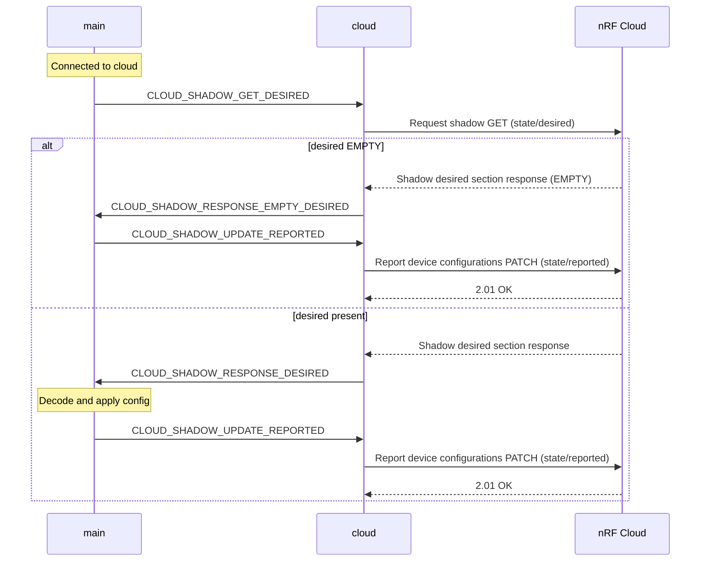
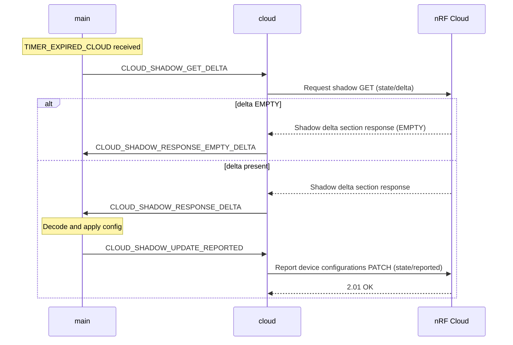
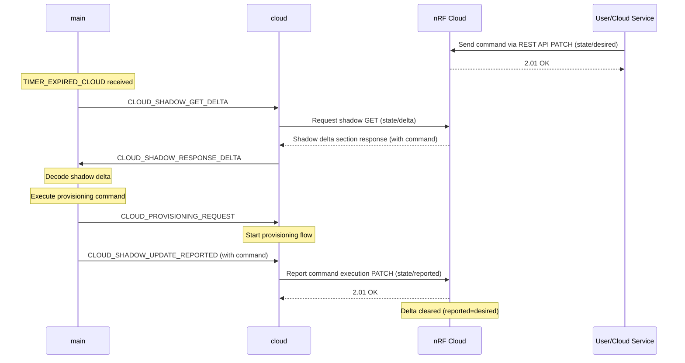

# Configuration

The following section explains how the template can be configured compile and run-time to change its behavior.

## Remote configuration from cloud

The Asset Tracker can be configured remotely through nRF Cloud's device shadow mechanism, enabling dynamic adjustment of device behavior without firmware updates.

> [!NOTE]
> The complete device shadow structure is defined in the CDDL schema at `Asset-Tracker-Template/app/src/cbor/device_shadow.cddl`. This schema specifies all supported configuration parameters, commands, and their valid value ranges.

### Configuration parameters

The device uses two interval parameters that determine both operation mode and timing:

| Parameter | Description | Unit | Valid Range |
|-----------|-------------|------|-------------|
| **`update_interval`** | **Passthrough mode**: Sampling and cloud send interval. **Buffer mode**: Cloud synchronization interval (polls shadow, checks FOTA, sends buffered data). | Seconds | 1 to 4294967294 |
| **`sample_interval`** | **Buffer mode only**: Sensor sampling interval. Ignored in passthrough mode. | Seconds | 1 to 4294967294 |
| **`buffer_mode`** | Storage mode control. Set to `true` for buffer mode or `false` for passthrough mode. | Boolean | true or false |

> [!WARNING]
> While very low intervals are supported, they can cause network congestion and connectivity issues, especially in poor network conditions. Choose intervals appropriate for your network quality, use case and device mode.
> Location searches can take prolonged time to complete, especially with GNSS. Actual intervals may be longer than configured values when location acquisition is slow.

### Operation modes

The device operates in one of two modes based on which parameters are configured:

#### Passthrough mode (default)
**Activated when**: `buffer_mode` is set to `false` (or not configured)

**Configuration**: Uses `update_interval` parameter only (ignores `sample_interval`)

**Behavior**:
- Samples sensors and location at `update_interval`
- Sends data immediately to cloud
- Polls shadow and checks FOTA at `update_interval`

**Use case**: Real-time data transmission, lower latency

#### Buffer mode
**Activated when**: `buffer_mode` is set to `true`

**Configuration**: Uses both `sample_interval` and `update_interval` parameters

**Behavior**:
- Samples sensors and location at `sample_interval`
- Buffers data locally
- Sends buffered data at `update_interval`
- Polls shadow and checks FOTA at `update_interval`

**Use case**: Reduced power consumption, batch data transmission

### Configuration through nRF Cloud UI

> [!WARNING]
> The order of the configuration JSON structure matters.

1. Log in to [nRF Cloud](https://nrfcloud.com/).
1. Navigate to **Devices** and select your device.
1. Click on **View Config** on the top bar.
1. Select **Edit Configuration**.
1. Enter the desired configuration:

    **Example 1: Buffer mode with 5-minute sampling and 15-minute cloud updates**

    ```json
    {
    "update_interval": 900,
    "sample_interval": 300,
    "buffer_mode": true
    }
    ```

    **Example 2: Passthrough mode with 60-second interval**

    ```json
    {
    "update_interval": 60,
    "buffer_mode": false
    }
    ```

> [!WARNING]
> To remove a configuration entry you need to explicitly `null` the parameter.

1. Click **Commit** to apply the changes.

The device receives the new configuration through its shadow and adjusts its intervals and storage mode accordingly.

### Configuration through REST API

You can update the intervals using [nRF Cloud REST API](https://api.nrfcloud.com/#tag/IP-Devices/operation/UpdateDeviceState).

**Buffer mode example:**
```bash
curl -X PATCH "https://api.nrfcloud.com/v1/devices/$DEVICE_ID/state" \
  -H "Authorization: Bearer $API_KEY" \
  -H "Content-Type: application/json" \
  -d '{ "desired": { "config": { "update_interval": 900, "sample_interval": 300, "buffer_mode": true } } }'
```

**Passthrough mode example:**
```bash
curl -X PATCH "https://api.nrfcloud.com/v1/devices/$DEVICE_ID/state" \
  -H "Authorization: Bearer $API_KEY" \
  -H "Content-Type: application/json" \
  -d '{ "desired": { "config": { "update_interval": 60, "buffer_mode": false } } }'
```

### Sending commands through REST API

Send device commands using the [nRF Cloud REST API](https://api.nrfcloud.com/#tag/IP-Devices/operation/UpdateDeviceState):

```bash
curl -X PATCH "https://api.nrfcloud.com/v1/devices/$DEVICE_ID/state" \
-H "Authorization: Bearer $API_KEY" \
-H "Content-Type: application/json" \
-d '{"desired": {"command": [1, 1]}}'
```

**Command format**: `"command": [type, id]`

- **type**: Command type (1=Provision)
  - **Valid range**: 1 to 1
- **id**: Unique identifier (increment for successive commands)
  - **Valid range**: 1 to 4294967294 (excludes 0 and UINT32_MAX)

*For shadow structure details, see `Asset-Tracker-Template/app/src/cbor/device_shadow.cddl`*

### Configuration flow

* **Initial setup**

    - The device starts with default intervals from `CONFIG_APP_BUFFER_MODE_SAMPLING_INTERVAL_SECONDS` (sample_interval) and `CONFIG_APP_CLOUD_SYNC_INTERVAL_SECONDS` (update_interval).
    - Upon cloud connection, the device automatically requests shadow configuration.

* **Runtime configuration**

    - Cloud module receives and processes shadow updates.
    - Device switches storage mode based on the `buffer_mode` parameter.
    - Device maintains last known configuration during offline periods.

* **Impact on device behavior**

    **Passthrough mode** (`buffer_mode` = `false`):

    - **`update_interval`** controls: Sampling frequency, immediate data transmission, FOTA checks, shadow polling
    - **`sample_interval`** is ignored

    **Buffer mode** (`buffer_mode` = `true`):
    - **`sample_interval`** controls: Location updates, sensor sampling (environmental, battery, network quality)
    - **`update_interval`** controls: Buffered data transmission, FOTA checks, shadow polling

The following diagrams illustrate different shadow configuration scenarios:

<details open>
<summary><b>Shadow Desired Section Poll Flow</b></summary>



</details>

<details>
<summary><b>Shadow Delta Section Poll Flow</b></summary>



</details>

<details>
<summary><b>Command Execution Flow</b></summary>



</details>

## Set location method priorities

The Asset Tracker supports multiple location methods that can be prioritized based on your needs. Configuration is done through board-specific configuration files.

### Available location methods

The following are the available location methods:

- GNSS (GPS)
- Wi-Fi® positioning
- Cellular positioning

### Configuration examples

* **Thingy91x configuration** (Wi-Fi available):

    ```
    CONFIG_LOCATION_REQUEST_DEFAULT_METHOD_FIRST_WIFI=y
    CONFIG_LOCATION_REQUEST_DEFAULT_METHOD_SECOND_GNSS=y
    CONFIG_LOCATION_REQUEST_DEFAULT_METHOD_THIRD_CELLULAR=y
    CONFIG_LOCATION_REQUEST_DEFAULT_WIFI_TIMEOUT=10000
    ```

* **nRF9151 DK configuration** (Wi-Fi unavailable):

    ```
    CONFIG_LOCATION_REQUEST_DEFAULT_METHOD_FIRST_GNSS=y
    CONFIG_LOCATION_REQUEST_DEFAULT_METHOD_SECOND_CELLULAR=y
    ```

## Storage mode configuration

The storage module handles collected data in two modes: **Passthrough** (forward immediately, default) or **Buffer** (store and transmit in batches for lower power consumption).
See [Storage Module Documentation](../modules/storage.md) for details.

**Basic configuration** in `prj.conf`:

Passthrough mode is the default mode. To enable buffer mode use:

```bash
CONFIG_APP_STORAGE_INITIAL_MODE_BUFFER=y
```

To configure buffer size and records per stored data type:

```bash
CONFIG_APP_STORAGE_MAX_RECORDS_PER_TYPE=8      # Records per data type
CONFIG_APP_STORAGE_BATCH_BUFFER_SIZE=256       # Batch buffer size
```

For minimal use, include the `overlay-storage-minimal.conf` overlay.

**Runtime control** (shell commands when `CONFIG_APP_STORAGE_SHELL=y`):

```bash
att_storage mode passthrough   # Switch to passthrough
att_storage mode buffer        # Switch to buffer
att_storage flush              # Flush stored data
att_storage clear              # Clear all data
att_storage stats              # Show statistics (if enabled)
```

See [Storage Module Configurations](../modules/storage.md#configurations) for all options.

## Network configuration

### NB-IoT vs LTE-M

The Asset Tracker supports both LTE Cat NB1 (NB-IoT) and LTE Cat M1 (LTE-M) cellular connectivity:

- **NB-IoT**: Optimized for:

    - Low data rate applications.
    - Better coverage.
    - Stationary or low-mobility devices.

- **LTE-M**: Better suited for:

    - Higher data rates.
    - Mobile applications.
    - Lower latency requirements.

#### Network mode selection

The following network modes are available (`LTE_NETWORK_MODE`):

- **Default**: Use the system mode currently set in the modem.
- **LTE-M**: LTE Cat M1 only.
- **LTE-M and GPS**: LTE Cat M1 with GPS enabled.
- **NB-IoT**: NB-IoT only.
- **NB-IoT and GPS**: NB-IoT with GPS enabled.
- **LTE-M and NB-IoT**: Both LTE-M and NB-IoT enabled.
- **LTE-M, NB-IoT and GPS**: Both LTE modes with GPS.

#### Network mode preference

When multiple network modes are enabled (LTE-M and NB-IoT), you can set preferences (`LTE_MODE_PREFERENCE`):

- **No preference**: Automatically selected by the modem.
- **LTE-M**: Prioritize LTE-M over PLMN selection.
- **NB-IoT**: Prioritize NB-IoT over PLMN selection.
- **LTE-M, PLMN prioritized**: Prefer LTE-M but prioritize staying on home network.
- **NB-IoT, PLMN prioritized**: Prefer NB-IoT but prioritize staying on home network.

Example configuration in `prj.conf`:

```
# Enable both LTE-M and NB-IoT with GPS
CONFIG_LTE_NETWORK_MODE_LTE_M_NBIOT_GPS=y

# Prefer LTE-M while prioritizing home network
CONFIG_LTE_MODE_PREFERENCE_LTE_M_PLMN_PRIO=y
```

### Power Saving Mode (PSM)

PSM allows the device to enter deep sleep while maintaining network registration. Configuration is done through Kconfig options:

#### PSM parameters

* **Periodic TAU (Tracking Area Update)**

    - Controls how often the device updates its location with the network
    - Configuration options:

        ```
        # Configure TAU in seconds
        CONFIG_LTE_PSM_REQ_RPTAU_SECONDS=1800  # 30 minutes
        ```

* **Active Time (RAT)**

    - Defines how long the device stays active after a wake-up
    - Configuration options:

        ```
        # Configure RAT in seconds
        CONFIG_LTE_PSM_REQ_RAT_SECONDS=60  # 1 minute
        ```

Key aspects:

- Device negotiates PSM parameters with the network.
- Helps achieve longer battery life.
- Device remains registered but unreachable during sleep.
- Wakes up periodically based on TAU setting.
- Stays active for the duration specified by RAT.


### Access Point Name (APN)

The Access Point Name (APN) is a network identifier used by the device to connect to the cellular network's packet data network. Configuration options:

- **Default APN**: Most carriers automatically configure the correct APN.
- **Manual Configuration**: If needed, APN can be configured through Kconfig:

    ```
    CONFIG_PDN_DEFAULT_APN="Access point name"
    ```

Common scenarios for APN configuration:

- Using a custom/private APN.
- Connecting to specific network services.
- Working with MVNOs (Mobile Virtual Network Operators).

> [!NOTE]
> In most cases, the default APN provided by the carrier should work without additional configuration.

## LED status indicators

The Asset Tracker Template uses LED colors to indicate different device states:

- **Yellow** (Blinking, 10 repetitions): Device is idle and disconnected from cloud.
- **Green** (Blinking, 10 repetitions): Device is connected to cloud and actively sampling data.
- **Blue** (Blinking, 10 repetitions): Device is in lower power mode state between samples.
- **Purple** (Blinking, 10 repetitions): FOTA download in progress.

### Example: Setting LED colors

You can control the LED colors through the LED module using zbus messages. The following is an example of how to set different LED patterns:

```c
/* Set yellow blinking pattern for idle state */
struct led_msg led_msg = {
    .type = LED_RGB_SET,
    .red = 255,
    .green = 255,
    .blue = 0,
    .duration_on_msec = 250,
    .duration_off_msec = 2000,
    .repetitions = 10,
};

/* Publish the message to LED_CHAN */
int err = zbus_chan_pub(&LED_CHAN, &led_msg, K_SECONDS(1));
if (err) {
    LOG_ERR("zbus_chan_pub, error: %d", err);
    return;
}
```

The LED message structure allows you to:

- Set RGB values for color (`0-255` for each component).
- Define on/off durations in milliseconds.
- Specify number of repetitions (`-1` for continuous blinking).
