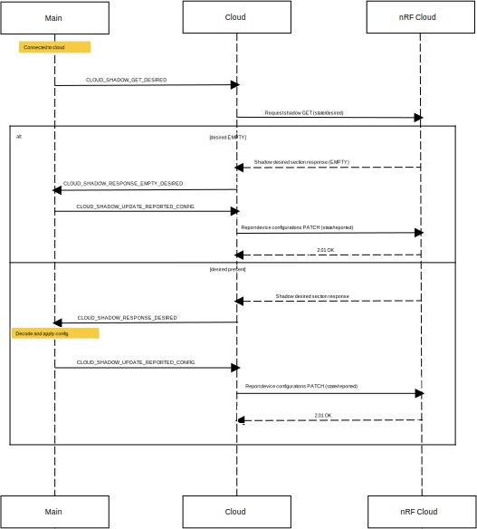
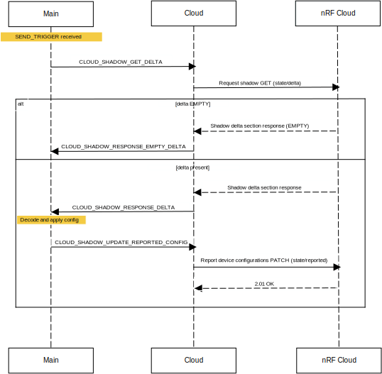
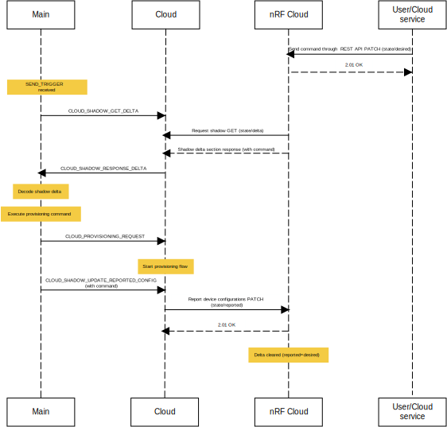

# Configuration

This section describes the available compile-time and runtime configuration options for customizing the template's behavior.

<div class="hidden-content">

## Table of Contents

- [Runtime configurations](#runtime-configurations)
  - [Behavior:](#behavior)
- [Remote configuration from cloud](#remote-configuration-from-cloud)
  - [Configuration through nRF Cloud UI](#configuration-through-nrf-cloud-ui)
  - [Configuration through REST API](#configuration-through-rest-api)
  - [Sending commands through REST API](#sending-commands-through-rest-api)
  - [Configuration Flow](#configuration-flow)
- [Set location method priorities](#set-location-method-priorities)
  - [Available location methods](#available-location-methods)
  - [Configuration examples](#configuration-examples)
- [Storage configuration](#storage-configuration)
  - [Basic configuration in `prj.conf`:](#basic-configuration-in-prjconf)
- [Network configuration](#network-configuration)
  - [NB-IoT vs. LTE-M](#nb-iot-vs-lte-m)
    - [Network mode selection](#network-mode-selection)
    - [Network mode preference](#network-mode-preference)
  - [Power Saving Mode (PSM)](#power-saving-mode-psm)
    - [PSM parameters](#psm-parameters)
  - [Access Point Name (APN)](#access-point-name-apn)
- [LED status indicators](#led-status-indicators)
  - [Example: Setting LED colors](#example-setting-led-colors)

</div>

## Runtime configurations

The device supports runtime configurations that allow you to modify the template's behavior without firmware updates.

The template uses separate parameters to control:

- **Cloud updates**: When the device sends data and checks for updates.
- **Data sampling**: When the device collects sensor and location data.

Cloud updates include sending data, checking for FOTA jobs, and retrieving configuration/command updates. For implementation details, see [Configuration Flow](#configuration-flow).

| Parameter | Description | Unit | Valid Range | Static Configuration
|-----------|-------------|------|-------------|---------------------
| **`update_interval`** | Cloud update interval | Seconds | 1 to 4294967295 | `CONFIG_APP_CLOUD_UPDATE_INTERVAL_SECONDS` (default: 600)
| **`sample_interval`** | Sample interval | Seconds | 1 to 4294967295 | `CONFIG_APP_SAMPLING_INTERVAL_SECONDS` (default: 150)
| **`storage_threshold`** | Number of records to store before triggering a cloud update | Records | 0 (disabled) to `CONFIG_APP_STORAGE_MAX_RECORDS_PER_TYPE` | `CONFIG_APP_STORAGE_THRESHOLD_RECORDS` (default: 1)

You can set the runtime configurations through the cloud device shadow and they will override the compile-time Kconfig defaults shown in the Static Configuration column.

The complete device shadow structure is defined in the [CDDL](https://datatracker.ietf.org/doc/html/rfc8610) schema at `Asset-Tracker-Template/app/src/cbor/device_shadow.cddl`. This schema specifies all supported configuration parameters, commands, and their valid value ranges.

### Behavior:

- Samples sensors and location at `sample_interval`.
- Buffers data locally.
- Sends buffered data at `update_interval` or when `storage_threshold` is reached.
- Polls shadow and checks FOTA at `update_interval`.

> [!NOTE]
> Setting `storage_threshold` to 0 disables the threshold, meaning data will only be sent based on the `update_interval`.
> Setting `storage_threshold` to 1 means data will be sent immediately after each sample.

> [!CAUTION]
> While low intervals are supported, they can cause network congestion and connectivity issues, especially in poor network conditions. Choose intervals appropriate for your network quality, use case, and device mode.

## Remote configuration from cloud

The Asset Tracker can be configured remotely through nRF Cloud's device shadow mechanism.

### Configuration through nRF Cloud UI

> [!IMPORTANT]
> The order of the configuration JSON structure matters.

1. Log in to [nRF Cloud](https://nrfcloud.com/).
1. Navigate to **Devices** and select your device.
1. Click on **View Config** on the top bar.
1. Select **Edit Configuration**.
1. Enter the desired configuration:

    **Example 1: 5-minute sampling and 15-minute cloud updates, storage threshold disabled**

    ```json
    {
    "update_interval": 900,
    "sample_interval": 300,
    "storage_threshold": 0
    }
    ```

    **Example 2: 1-minute sampling and cloud updates, send data immediately after each sample**

    ```json
    {
    "update_interval": 60,
    "storage_threshold": 1
    }
    ```

> [!IMPORTANT]
> To remove a configuration entry you need to explicitly `null` the parameter.

1. Click **Commit** to apply the changes.

The device receives the new configuration through its shadow and adjusts its intervals and storage mode accordingly.

### Configuration through REST API

You can update the intervals using [nRF Cloud REST API](https://api.nrfcloud.com/#tag/IP-Devices/operation/UpdateDeviceState).

**Example 1:**

```bash
curl -X PATCH "https://api.nrfcloud.com/v1/devices/$DEVICE_ID/state" \
  -H "Authorization: Bearer $API_KEY" \
  -H "Content-Type: application/json" \
  -d '{ "desired": { "config": { "update_interval": 900, "sample_interval": 300, "storage_threshold": 0 } } }'
```

**Example 2:**

```bash
curl -X PATCH "https://api.nrfcloud.com/v1/devices/$DEVICE_ID/state" \
  -H "Authorization: Bearer $API_KEY" \
  -H "Content-Type: application/json" \
  -d '{ "desired": { "config": { "update_interval": 60, "storage_threshold": 1 } } }'
```

### Sending commands through REST API

Send device commands using the [nRF Cloud REST API](https://api.nrfcloud.com/#tag/IP-Devices/operation/UpdateDeviceState):

```bash
curl -X PATCH "https://api.nrfcloud.com/v1/devices/$DEVICE_ID/state" \
-H "Authorization: Bearer $API_KEY" \
-H "Content-Type: application/json" \
-d '{"desired": {"command": [1, 1]}}'
```

**Command format**: `"command": [type, id]`

- **type**: Command type (1=Provision)
    - **Valid range**: 1 to 1
- **ID**: Unique identifier (increment for successive commands)
    - **Valid range**: 1 to 4294967294 (excludes `0` and `UINT32_MAX`)

For shadow structure details, see `Asset-Tracker-Template/app/src/cbor/device_shadow.cddl`.

### Configuration Flow

Default intervals are set from the `CONFIG_APP_SAMPLING_INTERVAL_SECONDS` and `CONFIG_APP_CLOUD_UPDATE_INTERVAL_SECONDS` Kconfig options,
and the threshold is set from `CONFIG_APP_STORAGE_THRESHOLD`. When the device polls the shadow, it checks for any updates to these parameters and applies them at runtime. If a parameter is not set in the shadow, the device continues using the existing value (either from Kconfig or a previous shadow update).

To trigger an immediate configuration poll, press and hold **Button 1** on the device to trigger a cloud update cycle that includes fetching the latest shadow delta.

The following diagrams illustrate what happens in the various scenarios where the device polls the shadow:

<details open>
<summary><b>Shadow Desired Section Poll Flow</b></summary>



</details>

<details>
<summary><b>Shadow Delta Section Poll Flow</b></summary>



</details>

<details>
<summary><b>Shadow Delta Section Poll Flow - Command Execution</b></summary>



</details>

## Set location method priorities

The Asset Tracker supports multiple location methods that can be prioritized based on your needs. Configuration is done through board-specific configuration files.

### Available location methods

The following are the available location methods:

- GNSS (GPS)
- Wi-Fi® positioning
- Cellular positioning

### Configuration examples

- **Thingy91x configuration** (Wi-Fi available):

    ```kconfig
    CONFIG_LOCATION_REQUEST_DEFAULT_METHOD_FIRST_WIFI=y
    CONFIG_LOCATION_REQUEST_DEFAULT_METHOD_SECOND_GNSS=y
    CONFIG_LOCATION_REQUEST_DEFAULT_METHOD_THIRD_CELLULAR=y
    CONFIG_LOCATION_REQUEST_DEFAULT_WIFI_TIMEOUT=10000
    ```

- **nRF9151 DK configuration** (Wi-Fi unavailable):

    ```kconfig
    CONFIG_LOCATION_REQUEST_DEFAULT_METHOD_FIRST_GNSS=y
    CONFIG_LOCATION_REQUEST_DEFAULT_METHOD_SECOND_CELLULAR=y
    ```

## Storage configuration

The storage module buffers collected data locally and sends it to the cloud based on the configured intervals and thresholds. See [Storage Module Documentation](../modules/storage.md) for details.

### Basic configuration in `prj.conf`:

To configure buffer size and records per stored data type:

```bash
CONFIG_APP_STORAGE_MAX_RECORDS_PER_TYPE=8      # Records per data type
CONFIG_APP_STORAGE_BATCH_BUFFER_SIZE=256       # Batch buffer size
CONFIG_APP_STORAGE_THRESHOLD=4                 # Number of records to trigger cloud update
```

The `storage_threshold` runtime parameter controls when buffered data is sent to the cloud. Setting it to `0` means data will only be sent based on the `update_interval`, while setting it to `1` means data will be sent immediately after each sample.

For minimal use, include the `overlay-storage-minimal.conf` overlay.

**Runtime control** (shell commands when `CONFIG_APP_STORAGE_SHELL=y`):

```bash
att_storage flush              # Flush stored data
att_storage clear              # Clear all data
att_storage stats              # Show statistics (if enabled)
```

See [Storage Module Configurations](../modules/storage.md#configurations) for all options.

## Network configuration

### NB-IoT vs. LTE-M

The Asset Tracker supports both LTE Cat NB1 (NB-IoT) and LTE Cat M1 (LTE-M) cellular connectivity:

- **NB-IoT**: Optimized for:

    - Low data rate applications.
    - Better coverage.
    - Stationary or low-mobility devices.

- **LTE-M**: Better suited for:

    - Higher data rates.
    - Mobile applications.
    - Lower latency requirements.

#### Network mode selection

The following network modes are available (`LTE_NETWORK_MODE`):

- **Default**: Use the system mode currently set in the modem.
- **LTE-M**: LTE Cat M1 only.
- **LTE-M and GPS**: LTE Cat M1 with GPS enabled.
- **NB-IoT**: NB-IoT only.
- **NB-IoT and GPS**: NB-IoT with GPS enabled.
- **LTE-M and NB-IoT**: Both LTE-M and NB-IoT enabled.
- **LTE-M, NB-IoT and GPS**: Both LTE modes with GPS.

#### Network mode preference

When multiple network modes are enabled (LTE-M and NB-IoT), you can set preferences (`LTE_MODE_PREFERENCE`):

- **No preference**: Automatically selected by the modem.
- **LTE-M**: Prioritize LTE-M over PLMN selection.
- **NB-IoT**: Prioritize NB-IoT over PLMN selection.
- **LTE-M, PLMN prioritized**: Prefer LTE-M but prioritize staying on home network.
- **NB-IoT, PLMN prioritized**: Prefer NB-IoT but prioritize staying on home network.

Example configuration in `prj.conf`:

```kconfig
# Enable both LTE-M and NB-IoT with GPS
CONFIG_LTE_NETWORK_MODE_LTE_M_NBIOT_GPS=y

# Prefer LTE-M while prioritizing home network
CONFIG_LTE_MODE_PREFERENCE_LTE_M_PLMN_PRIO=y
```

### Power Saving Mode (PSM)

PSM allows the device to enter deep sleep while maintaining network registration. Configuration is done through Kconfig options:

#### PSM parameters

- **Periodic TAU (Tracking Area Update)**

    - Controls how often the device updates its location with the network
    - Configuration options:

    ```kconfig
    # Configure TAU in seconds
    CONFIG_LTE_PSM_REQ_RPTAU_SECONDS=1800  # 30 minutes
    ```

- **Active Time (RAT)**

    - Defines how long the device stays active after a wake-up
    - Configuration options:

    ```kconfig
    # Configure RAT in seconds
    CONFIG_LTE_PSM_REQ_RAT_SECONDS=60  # 1 minute
    ```

Key aspects:

- Device negotiates PSM parameters with the network.
- Helps achieve longer battery life.
- Device remains registered but unreachable during sleep.
- Wakes up periodically based on TAU setting.
- Stays active for the duration specified by RAT.

For more information on power configuration, see the [Application power configuration](low_power.md#application-power-configuration) section in the **Achieving Low Power** guide.

### Access Point Name (APN)

The Access Point Name (APN) is a network identifier used by the device to connect to the cellular network's packet data network. Configuration options:

- **Default APN**: Most carriers automatically configure the correct APN.
- **Manual Configuration**: If needed, APN can be configured through Kconfig:

    ```kconfig
    CONFIG_PDN_DEFAULT_APN="Access point name"
    ```

Common scenarios for APN configuration:

- Using a custom/private APN.
- Connecting to specific network services.
- Working with MVNOs (Mobile Virtual Network Operators).

> [!NOTE]
> In most cases, the default APN provided by the carrier should work without additional configuration.
