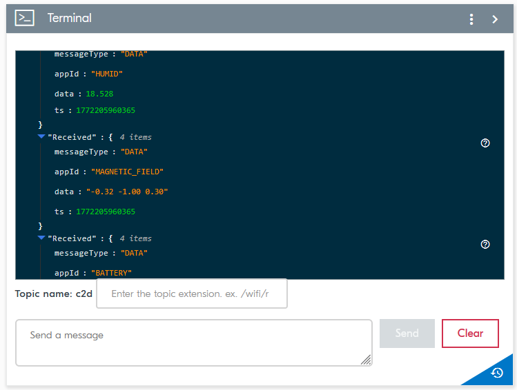
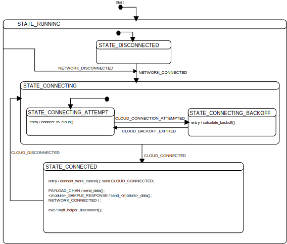

# Customization

This guide explains how to modify certain aspects of the template.

- [Add a new zbus event](#add-a-new-zbus-event)
- [Add a new environmental sensor](#add-a-new-environmental-sensor)
- [Add your own module](#add-your-own-module)
- [Enable support for MQTT](#enable-support-for-mqtt)

## Add a new zbus event

This section demonstrates how to add a new event to a module and utilize it in another module within the system. In this example, you can add events to the power module to notify the system when VBUS is connected or disconnected on the Thingy:91 X.
The main module subscribes to these events and requests specific LED patterns from the LED module in response.

When VBUS is connected, the LED will toggle white rapidly.
When VBUS is disconnected, the LED will toggle purple more slowly.

### Instructions

To add a new zbus event, complete the following procedure:

1. Define the new events in your module's header file (for example, `power.h`):

    ```c
    enum power_msg_type {
       /* ... existing message types ... */

       /* VBUS power supply is connected. */
       POWER_VBUS_CONNECTED,

       /* VBUS power supply is disconnected. */
       POWER_VBUS_DISCONNECTED,
    };
    ```

1. Implement publishing of VBUS connected and disconnected events by modifying the existing `event_callback()` function in `power.c`:
    ```c
    if (pins & BIT(NPM13XX_EVENT_VBUS_DETECTED)) {
        LOG_DBG("VBUS detected");

        struct power_msg msg = {
            .type = POWER_VBUS_CONNECTED
        };

        err = zbus_chan_pub(&POWER_CHAN, &msg, PUB_TIMEOUT);
        if (err) {
            LOG_ERR("zbus_chan_pub, error: %d", err);
            SEND_FATAL_ERROR();
            return;
        }

        // ... existing code ...
    }

    if (pins & BIT(NPM13XX_EVENT_VBUS_REMOVED)) {
        LOG_DBG("VBUS removed");

        struct power_msg msg = {
            .type = POWER_VBUS_DISCONNECTED
        };

        err = zbus_chan_pub(&POWER_CHAN, &msg, PUB_TIMEOUT);
        if (err) {
            LOG_ERR("zbus_chan_pub, error: %d", err);
            SEND_FATAL_ERROR();
            return;
        }

        // ... existing code ...
    }
    ```

1. Make sure the channel is included in the subscriber module (for example, `main.c`). Add the channel to the channel list:

    ```c
    #define CHANNEL_LIST(X)      \
    X(CLOUD_CHAN,  struct cloud_msg)  \
    X(BUTTON_CHAN,  struct button_msg)  \
    X(FOTA_CHAN,  enum fota_msg_type)  \
    X(NETWORK_CHAN,  struct network_msg)  \
    X(LOCATION_CHAN, struct location_msg)  \
    X(STORAGE_CHAN,  struct storage_msg)  \
    X(TIMER_CHAN,  enum timer_msg_type) \
    X(POWER_CHAN,  struct power_msg) \
    ```

1. Implement a handler for the new events in the subscriber module (for example, in the main module's state machine in `running_run`):

    ```c
    if (state_object->chan == &POWER_CHAN) {
        struct power_msg msg = MSG_TO_POWER_MSG(state_object->msg_buf);

        if (msg.type == POWER_VBUS_CONNECTED) {
            LOG_DBG("VBUS connected, request white LED blinking rapidly for 10 seconds");

            struct led_msg led_msg = {
                .type = LED_RGB_SET,
                .red = 255,
                .green = 255,
                .blue = 255,
                .duration_on_msec = 300,
                .duration_off_msec = 300,
                .repetitions = 10,
            };

            int err = zbus_chan_pub(&LED_CHAN, &led_msg, PUB_TIMEOUT);

            if (err) {
                LOG_ERR("zbus_chan_pub, error: %d", err);
                SEND_FATAL_ERROR();
            }

            return SMF_EVENT_HANDLED;
        } else if (msg.type == POWER_VBUS_DISCONNECTED) {
            LOG_DBG("VBUS disconnected, request purple LED blinking slowly for 10 seconds");

            struct led_msg led_msg = {
                .type = LED_RGB_SET,
                .red = 255,
                .green = 0,
                .blue = 255,
                .duration_on_msec = 1000,
                .duration_off_msec = 700,
                .repetitions = 10,
            };

            int err = zbus_chan_pub(&LED_CHAN, &led_msg, PUB_TIMEOUT);

            if (err) {
                LOG_ERR("zbus_chan_pub, error: %d", err);
                SEND_FATAL_ERROR();
            }

            return SMF_EVENT_HANDLED;
        }
    }
    ```

1. Test the implementation by connecting and disconnecting VBUS to verify the LED patterns change as expected.

## Add a new environmental sensor

This section demonstrates how to add support for a new sensor to the environmental module.
The environmental module will be updated to sample data from the sensor through the [Zephyr Sensor API](https://docs.zephyrproject.org/latest/hardware/peripherals/sensor/index.html).
The data is forwarded to nRF Cloud along with the other environmental data.

In this example, support for the Bosch BMM350 magnetometer sensor is added.
A similar procedure can be used for any sensor that supports the Zephyr Sensor API.

Thingy:91 X is used as the example board, as it is a supported board in the template with defined board files in the nRF Connect SDK.

### Instructions

Before adding a new sensor to the environmental module, ensure that the sensor's driver is available in the Zephyr RTOS and that the driver uses the Zephyr Sensor API. Zephyr includes such a driver for the Bosch BMM350 magnetometer.

1. Add the sensor to the devicetree and enable it. This will perform the following:

    - Instantiate a devicetree node for the sensor.
    - Initialize the driver and the sensor during boot.

    In the case of the Bosch BMM350 magnetometer, the device is already added to the devicetree. The node can be found in the nRF Connect SDK in the `nrf/boards/nordic/thingy91x/thingy91x_common.dtsi` file.

    To enable the sensor, add the following to the Asset Tracker Template's board-specific devicetree overlay file `app/boards/thingy91x_nrf9151_ns.overlay`:

    ```c
    &magnetometer {
        status = "okay";
    };
    ```

1. Update the environmental module's state structure in the `app/src/modules/environmental/environmental.c` file to include the magnetometer device reference and data fields:

    ```c
    struct environmental_state_object {
        /* ... existing fields ... */

        /* BMM350 sensor device reference */
        const struct device *const bmm350;

        /* Magnetic field measurements (X, Y, Z) in Gauss */
        double magnetic_field[3];
    };
    ```

1. In the module's thread function `env_module_thread()` in the same file, find the initialization of the `environmental_state` structure and add the reference to the device using the devicetree label:

    ```c
    struct environmental_state_object environmental_state = {
        .bme680 = DEVICE_DT_GET(DT_NODELABEL(bme680)),
        .bmm350 = DEVICE_DT_GET(DT_NODELABEL(magnetometer)), /* Add this line */
    };
    ```

1. In the same file, update the sensor sampling function signature to include the magnetometer device:

     ```c
     static void sample_sensors(const struct device *const bme680, const struct device *const bmm350)
    ```

1.  In the `state_running_run()` function in the same file, update the function call to `sample_sensors()`:

    ```c
     sample_sensors(state_object->bme680, state_object->bmm350);
    ```

1. Update the `sample_sensors()` function in the same file to sample from the new sensor and add the data to the outgoing message (we will extend the message struct in the next step):

    ```c
    static void sample_sensors(const struct device *const bme680, const struct device *const bmm350)
    {
        /* ... existing code, calls to sensor_sample_fetch() and sensor_channel_get() ... */

        struct sensor_value magnetic_field[3] = { {0}, {0}, {0} };

        err = sensor_sample_fetch(bmm350);
        if (err) {
            LOG_ERR("Failed to fetch magnetometer sample: %d", err);
            SEND_FATAL_ERROR();
            return;
        }

        err = sensor_channel_get(bmm350, SENSOR_CHAN_MAGN_XYZ, magnetic_field);
        if (err) {
            LOG_ERR("Failed to get magnetometer data: %d", err);
            SEND_FATAL_ERROR();
            return;
        }

        LOG_DBG("Magnetic field: X: %.2f G, Y: %.2f G, Z: %.2f G",
        sensor_value_to_double(&magnetic_field[0]),
        sensor_value_to_double(&magnetic_field[1]),
        sensor_value_to_double(&magnetic_field[2]));

        struct environmental_msg msg = {
            /* ... existing fields ... */
            .magnetic_field[0] = sensor_value_to_double(&magnetic_field[0]),
            .magnetic_field[1] = sensor_value_to_double(&magnetic_field[1]),
            .magnetic_field[2] = sensor_value_to_double(&magnetic_field[2]),
        };

        /* ... existing code to timestamp and publish the message ... */
    }
    ```

1. Update the `environmental_msg` structure in `app/src/modules/environmental/environmental.h` to include the magnetic field data:

    ```c
    struct environmental_msg {
        /* ... existing fields ... */

        /** Magnetic field measurements (X, Y, Z) in Gauss */
        double magnetic_field[3];
    };
    ```

1. Add cloud integration in the `cloud_environmental_send()` function in `app/src/modules/cloud/cloud_environmental.c` to send magnetometer data to nRF Cloud. There is no existing application ID for magnetometer data, so we use a custom message with the `"MAGNETIC_FIELD"` ID. Update the function as follows:

    ```c
    int cloud_environmental_send(const struct environmental_msg *env,
                                int64_t timestamp_ms,
                                bool confirmable)
    {
        /* ... existing code to send temperature, pressure and humidity ... */

        char mag_message[64];

        /* Format magnetometer data as a string with three values */
        snprintk(mag_message, sizeof(mag_message),
                 "%.2f %.2f %.2f",
                 env->magnetic_field[0],
                 env->magnetic_field[1],
                 env->magnetic_field[2]);

        /* Send as a message with a custom app ID*/
        err = nrf_cloud_coap_message_send("MAGNETIC_FIELD",
                                            mag_message,
                                            false,
                                            timestamp_ms,
                                            confirmable);
        if (err) {
            LOG_ERR("Failed to send magnetometer data to cloud, error: %d", err);
            return err;
        }

        LOG_DBG("Magnetometer data sent to cloud: %s", mag_message);

        return 0;
    }
    ```

1. Build and run the modified application

1. Confirm that the custom messages appear in the Terminal card in [nRF Cloud](https://nrfcloud.com), as shown below:

    

## Add your own module

The dummy module serves as a template for understanding the module architecture and can be used as a foundation for custom modules.

### Instructions

To add your own module, complete the following steps:

1. Create the module directory structure:

    ```bash
    mkdir -p app/src/modules/dummy
    ```

1. Create the following files in the `app/src/modules/dummy` directory:

    - `app/src/modules/dummy/dummy.h` - Module interface definitions.
    - `app/src/modules/dummy/dummy.c` - Module implementation.
    - `app/src/modules/dummy/Kconfig.dummy` - Module configuration options.
    - `app/src/modules/dummy/CMakeLists.txt` - Build system configuration.

1. In `app/src/modules/dummy/dummy.h`, define the module's interface:

    ```c
    #ifndef _DUMMY_H_
    #define _DUMMY_H_

    #include <zephyr/kernel.h>
    #include <zephyr/zbus/zbus.h>

    #ifdef __cplusplus
    extern "C" {
    #endif

    /* Module's zbus channel */
    ZBUS_CHAN_DECLARE(DUMMY_CHAN);

    /* Module message types */
    enum dummy_msg_type {
        /* Output message types */
        DUMMY_SAMPLE_RESPONSE = 0x1,

        /* Input message types */
        DUMMY_SAMPLE_REQUEST,
    };

    /* Module message structure */
    struct dummy_msg {
        enum dummy_msg_type type;
        int32_t value;
    };

    #define MSG_TO_DUMMY_MSG(_msg) (*(const struct dummy_msg *)_msg)

    #ifdef __cplusplus
    }
    #endif

    #endif /* _DUMMY_H_ */
    ```

1. In `app/src/modules/dummy/dummy.c`, implement the module's functionality:

    ```c
    #include <zephyr/kernel.h>
    #include <zephyr/logging/log.h>
    #include <zephyr/zbus/zbus.h>
    #include <zephyr/task_wdt/task_wdt.h>
    #include <zephyr/smf.h>

    #include "app_common.h"
    #include "dummy.h"

    /* Register log module */
    LOG_MODULE_REGISTER(dummy_module, CONFIG_APP_DUMMY_LOG_LEVEL);

    /* Define module's zbus channel */
    ZBUS_CHAN_DEFINE(DUMMY_CHAN,
                     struct dummy_msg,
                     NULL,
                     NULL,
                     ZBUS_OBSERVERS_EMPTY,
                     ZBUS_MSG_INIT(0)
    );

    /* Register zbus subscriber */
    ZBUS_MSG_SUBSCRIBER_DEFINE(dummy);

    /* Add subscriber to channel */
    ZBUS_CHAN_ADD_OBS(DUMMY_CHAN, dummy, 0);

    #define MAX_MSG_SIZE sizeof(struct dummy_msg)

    BUILD_ASSERT(CONFIG_APP_DUMMY_WATCHDOG_TIMEOUT_SECONDS >
                 CONFIG_APP_DUMMY_MSG_PROCESSING_TIMEOUT_SECONDS,
                 "Watchdog timeout must be greater than maximum message processing time");

    /* State machine states */
    enum dummy_module_state {
        STATE_RUNNING,
    };

    /* Module state structure */
    struct dummy_state {
        /* State machine context (must be first) */
        struct smf_ctx ctx;

        /* Last received zbus channel */
        const struct zbus_channel *chan;

        /* Message buffer */
        uint8_t msg_buf[MAX_MSG_SIZE];

        /* Current counter value */
        int32_t current_value;
    };

    /* Forward declarations */
    static enum smf_state_result state_running_run(void *o);

    /* State machine definition */
    static const struct smf_state states[] = {
        [STATE_RUNNING] = SMF_CREATE_STATE(NULL, state_running_run, NULL, NULL, NULL),
    };

    /* Watchdog callback */
    static void task_wdt_callback(int channel_id, void *user_data)
    {
        LOG_ERR("Watchdog expired, Channel: %d, Thread: %s",
                channel_id, k_thread_name_get((k_tid_t)user_data));

        SEND_FATAL_ERROR_WATCHDOG_TIMEOUT();
    }

    /* State machine handlers */
    static enum smf_state_result state_running_run(void *obj)
    {
        struct dummy_state *state_object = obj;

        if (&DUMMY_CHAN == state_object->chan) {
            struct dummy_msg msg = MSG_TO_DUMMY_MSG(state_object->msg_buf);

            if (msg.type == DUMMY_SAMPLE_REQUEST) {
                LOG_DBG("Received sample request");
                state_object->current_value++;

                struct dummy_msg response = {
                    .type = DUMMY_SAMPLE_RESPONSE,
                    .value = state_object->current_value
                };

                int err = zbus_chan_pub(&DUMMY_CHAN, &response, K_NO_WAIT);
                if (err) {
                    LOG_ERR("Failed to publish response: %d", err);
                    SEND_FATAL_ERROR();
                    return;
                }
            }
        }

        return SMF_EVENT_PROPAGATE;
    }

    /* Module task function */
    static void dummy_task(void)
    {
        int err;
        int task_wdt_id;
        const uint32_t wdt_timeout_ms =
            (CONFIG_APP_DUMMY_WATCHDOG_TIMEOUT_SECONDS * MSEC_PER_SEC);
        const uint32_t execution_time_ms =
            (CONFIG_APP_DUMMY_MSG_PROCESSING_TIMEOUT_SECONDS * MSEC_PER_SEC);
        const k_timeout_t zbus_wait_ms = K_MSEC(wdt_timeout_ms - execution_time_ms);
        struct dummy_state dummy_state = {
            .current_value = 0
        };

        LOG_DBG("Starting dummy module task");

        task_wdt_id = task_wdt_add(wdt_timeout_ms, task_wdt_callback, (void *)k_current_get());

        smf_set_initial(SMF_CTX(&dummy_state), &states[STATE_RUNNING]);

        while (true) {
            err = task_wdt_feed(task_wdt_id);
            if (err) {
                LOG_ERR("Failed to feed watchdog: %d", err);
                SEND_FATAL_ERROR();
                return;
            }

            err = zbus_sub_wait_msg(&dummy,
                                   &dummy_state.chan,
                                   dummy_state.msg_buf,
                                   zbus_wait_ms);
            if (err == -ENOMSG) {
                continue;
            } else if (err) {
                LOG_ERR("Failed to wait for message: %d", err);
                SEND_FATAL_ERROR();
                return;
            }

            err = smf_run_state(SMF_CTX(&dummy_state));
            if (err) {
                LOG_ERR("Failed to run state machine: %d", err);
                SEND_FATAL_ERROR();
                return;
            }
        }
    }

    /* Define module thread */
    K_THREAD_DEFINE(dummy_task_id,
                    CONFIG_APP_DUMMY_THREAD_STACK_SIZE,
                    dummy_task, NULL, NULL, NULL,
                    K_LOWEST_APPLICATION_THREAD_PRIO, 0, 0);
    ```

1. In `app/src/modules/dummy/Kconfig.dummy`, define module configuration options:

    ```kconfig
    menuconfig APP_DUMMY
        bool "Dummy module"
        default y
        help
            Enable the dummy module.

    if APP_DUMMY

    config APP_DUMMY_THREAD_STACK_SIZE
        int "Dummy module thread stack size"
        default 2048
        help
            Stack size for the dummy module thread.

    config APP_DUMMY_WATCHDOG_TIMEOUT_SECONDS
        int "Dummy module watchdog timeout in seconds"
        default 30
        help
            Watchdog timeout for the dummy module.

    config APP_DUMMY_MSG_PROCESSING_TIMEOUT_SECONDS
        int "Dummy module message processing timeout in seconds"
        default 5
        help
            Maximum time allowed for processing a single message in the dummy module.

    module = APP_DUMMY
    module-str = DUMMY
    source "subsys/logging/Kconfig.template.log_config"

    endif # APP_DUMMY
    ```

1. In `app/src/modules/dummy/CMakeLists.txt`, configure the build system to include the source files of the module:

    ```cmake
    target_sources(app PRIVATE ${CMAKE_CURRENT_SOURCE_DIR}/dummy.c)
    target_include_directories(app PRIVATE .)
    ```

1. Add the module directory to the `app/CMakeLists.txt` file:

    ```cmake
    add_subdirectory(src/modules/dummy)
    ```

1. Add the module's Kconfig file to the `app/Kconfig` file:

    ```kconfig
    rsource "src/modules/dummy/Kconfig.dummy"
    ```

1. Increase the value of the `CONFIG_TASK_WDT_CHANNELS` Kconfig option in the `app/prj.conf` file by 1 to accommodate for the new module's task watchdog integration.

The dummy module is now ready to use. It provides the following functionality:

- Initializes with a counter value of `0`.
- Increments the counter on each sample request.
- Responds with the current counter value using zbus.
- Includes error handling and watchdog support.
- Follows the state machine pattern used by other modules.

To test the module, send a `DUMMY_SAMPLE_REQUEST` message to its zbus channel. The module responds with a `DUMMY_SAMPLE_RESPONSE` containing the incremented counter value.

This dummy module serves as a template that you can extend to implement more complex functionality. You can add additional message types, state variables, and processing logic as needed for your specific use case.

## Enable support for MQTT

To connect to a generic MQTT server using the Asset Tracker Template, you can use the example cloud module provided under `examples/modules/cloud`. This module replaces the default nRF Cloud CoAP-based cloud integration with a flexible MQTT client implementation.

- **MQTT module *default* configurations:**

    - **Broker hostname:** [mqtt.nordicsemi.academy](https://mqtt.nordicsemi.academy/)
    - **Device/Client ID:** IMEI (International Mobile Equipment Identity)
    - **Port:** 8883
    - **TLS:** Yes
    - **Authentication:** Server only
    - **CA:** examples/modules/cloud/creds/mqtt.nordicsemi.academy.pem
    - **Subscribed topic:** imei/att-pub-topic
    - **Publishing topic:** imei/att-sub-topic

### Configuration

Configurations for the MQTT stack can be set in the `overlay-mqtt.conf` file and Kconfig options defined in `examples/modules/cloud/Kconfig.cloud_mqtt`.
The following are some of the available options for controlling the MQTT module:

- `CONFIG_APP_CLOUD_MQTT`
- `CONFIG_APP_CLOUD_MQTT_PROVISION_CREDENTIALS`
- `CONFIG_APP_CLOUD_MQTT_HOSTNAME`
- `CONFIG_APP_CLOUD_MQTT_CLIENT_ID`
- `CONFIG_APP_CLOUD_MQTT_CLIENT_ID_BUFFER_SIZE`
- `CONFIG_APP_CLOUD_MQTT_TOPIC_SIZE_MAX`
- `CONFIG_APP_CLOUD_MQTT_PUB_TOPIC`
- `CONFIG_APP_CLOUD_MQTT_SUB_TOPIC`
- `CONFIG_APP_CLOUD_MQTT_SHELL`
- `CONFIG_APP_CLOUD_MQTT_PAYLOAD_BUFFER_MAX_SIZE`
- `CONFIG_APP_CLOUD_MQTT_SHADOW_RESPONSE_BUFFER_MAX_SIZE`
- `CONFIG_APP_CLOUD_MQTT_BACKOFF_INITIAL_SECONDS`
- `CONFIG_APP_CLOUD_MQTT_BACKOFF_TYPE_LINEAR`
- `CONFIG_APP_CLOUD_MQTT_BACKOFF_TYPE_EXPONENTIAL`
- `CONFIG_APP_CLOUD_MQTT_BACKOFF_TYPE_NONE`
- `CONFIG_APP_CLOUD_MQTT_BACKOFF_LINEAR_INCREMENT_SECONDS`
- `CONFIG_APP_CLOUD_MQTT_BACKOFF_MAX_SECONDS`
- `CONFIG_APP_CLOUD_MQTT_THREAD_STACK_SIZE`
- `CONFIG_APP_CLOUD_MQTT_MESSAGE_QUEUE_SIZE`
- `CONFIG_APP_CLOUD_MQTT_WATCHDOG_TIMEOUT_SECONDS`
- `CONFIG_APP_CLOUD_MQTT_MSG_PROCESSING_TIMEOUT_SECONDS`

### How to use the MQTT Cloud Example

1. Build and flash with the MQTT overlay.

    In the template's `app` folder, run:

    ```sh
    west build -p -b thingy91x/nrf9151/ns -- -DEXTRA_CONF_FILE="$(pwd)/../examples/modules/cloud/overlay-mqtt.conf" && west flash --erase --skip-rebuild
    ```

1. Observe that the device connects to the broker.

1. Test using shell commands:

    ```bash
    uart:~$ att_cloud_publish_mqtt test-payload
    Sending on payload channel: "data":"test-payload","ts":1746534066186 (40 bytes)
    [00:00:18.607,421] <dbg> cloud: on_cloud_payload_json: MQTT Publish Details:
    [00:00:18.607,482] <dbg> cloud: on_cloud_payload_json:  -Payload: "data":"test-payload","ts":1746534066186
    [00:00:18.607,513] <dbg> cloud: on_cloud_payload_json:  -Payload Length: 40
    [00:00:18.607,543] <dbg> cloud: on_cloud_payload_json:  -Topic: 359404230261381/att-pub-topic
    [00:00:18.607,574] <dbg> cloud: on_cloud_payload_json:  -Topic Size: 29
    [00:00:18.607,635] <dbg> cloud: on_cloud_payload_json:  -QoS: 1
    [00:00:18.607,635] <dbg> cloud: on_cloud_payload_json:  -Message ID: 1
    [00:00:18.607,696] <dbg> mqtt_helper: mqtt_helper_publish: Publishing to topic: 359404230261381/att-pub-topic
    [00:00:19.141,235] <dbg> mqtt_helper: mqtt_evt_handler: MQTT_EVT_PUBACK: id = 1 result = 0
    [00:00:19.141,265] <dbg> cloud: on_mqtt_puback: Publish acknowledgment received, message id: 1
    [00:00:19.141,296] <dbg> mqtt_helper: mqtt_helper_poll_loop: Polling on socket fd: 0
    [00:00:48.653,503] <dbg> mqtt_helper: mqtt_helper_poll_loop: Polling on socket fd: 0
    [00:00:49.587,463] <dbg> mqtt_helper: mqtt_evt_handler: MQTT_EVT_PINGRESP
    [00:00:49.587,493] <dbg> mqtt_helper: mqtt_helper_poll_loop: Polling on socket fd: 0
    [00:01:18.697,692] <dbg> mqtt_helper: mqtt_helper_poll_loop: Polling on socket fd: 0
    [00:01:19.350,921] <dbg> mqtt_helper: mqtt_evt_handler: MQTT_EVT_PINGRESP
    ```

### **Module State Machine**

The cloud MQTT module implements an internal state machine to manage the connection and reconnection logic.



### Limitations

The MQTT cloud module is designed as a demonstration of how to replace the template's default nRF Cloud CoAP-based cloud module with an MQTT-based implementation. It is not intended to be a fully-featured solution and has the following limitations:

- **Sensor and location support**:
  The MQTT module does not implement support for encoding and sending sensor or location data to the MQTT broker.
  You can send test payloads using the `att_cloud_publish_mqtt` shell command.

- **FOTA Support**:
  The example MQTT module does not support firmware over-the-air (FOTA) updates, as these features rely on nRF Cloud CoAP functionality. This is a dependency of the FOTA module.

- **Stub Channel for FOTA**:
  To prevent build errors, the MQTT module includes a placeholder (stub) channel declaration for FOTA. If your application requires these features, you will need to implement a custom module tailored to your chosen cloud/FOTA service.

For production use, it is recommended to utilize the default nRF Cloud CoAP cloud module, which provides comprehensive support for FOTA and other advanced features.
