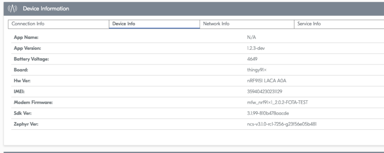

# Firmware updates (FOTA)

This guide covers how to perform Firmware Over The Air (FOTA) updates using nRF Cloud, including both the web UI and REST API methods.

## Firmware versioning

The following sections cover the principles and practices used to define, manage, and maintain firmware versioning.

### Version components

Firmware versions are defined in the `app/VERSION` file:

- **VERSION_MAJOR**: Major version
- **VERSION_MINOR**: Minor version
- **PATCHLEVEL**: Patch level
- **VERSION_TWEAK**: Additional component (typically 0)
- **EXTRAVERSION**: Extra string (for example, "dev", "rc1")

Example resulting in version `1.2.3-dev`:

```plaintext
VERSION_MAJOR = 1
VERSION_MINOR = 2
PATCHLEVEL = 3
VERSION_TWEAK = 0
EXTRAVERSION = dev
```

### Preparing firmware

Complete the following steps for preparing firmware:

1. Update the `app/VERSION` file. Increment the appropriate version component.
1. Build the firmware.

    Using the command line:

    ```bash
    west build -p -b thingy91x/nrf9151/ns # Make sure you build for the appropriate board
    ```

    Or use the nRF Connect for VS Code. See the [Getting Started](getting_started.md) guide for details on building with the extension.

1. Locate update bundles:

    - `build/app/zephyr/dfu_application.zip` - Application firmware update
    - `build/app/zephyr/dfu_mcuboot.zip` - Bootloader update

### Version verification

> [!IMPORTANT]
> **All stored data in the storage module will be automatically cleared when applying firmware updates.** If you need to preserve data across updates, ensure it is sent to the cloud or retrieved before the update completes, or edit the source code to fit your needs.

To verify a successful update:

- **Application updates**: Check that the FOTA job shows `Succeeded` status and the **App Version** field in device information reflects the new version.
- **Modem updates**: Check that the FOTA job shows `Succeeded` status and the **Modem Firmware** field in device information shows the new version.



## Performing FOTA updates

You can perform FOTA updates using the nRF Cloud Web UI or the REST API.

### Option 1: nRF Cloud Web UI

This is the recommended method for manual updates and testing.

1. Navigate to [nRF Cloud](https://nrfcloud.com) and log in to your account.
1. Select **Firmware Updates** in the **Device Management** tab on the left.
1. Create an update bundle:

    1. Click **Add bundle**.
    1. Upload your bundle file:

        - For application updates: `dfu_application.zip`
        - For bootloader updates: `dfu_mcuboot.zip`

    1. Enter a **Name** for the bundle.
    1. Enter a **Version** string (this is only a label for the bundle list and is not used by the device).
    1. Click **Create/Upload Bundle**.

1. Create a FOTA update:

    1. Click **Create FOTA Update**.
    1. Enter a **Name** for the update.
    1. Optionally enter a **Description**.
    1. In the **Bundle** dropdown, select the bundle you uploaded in the previous step. The update type is determined by the bundle, so no separate type selector is required.
    1. Select the target device or devices using one of the following fields:

        - **Group** — deploys to every device in a predefined device group.
        - **Devices** — pick individual devices by clicking their device UUID to add them to the selection.

    1. Check **Deploy now** to start the update immediately after creation. Leave it unchecked to create the job and deploy it manually later.
    1. Click **Create FOTA Update** to create the update.

1. Monitor progress:

    - The **Overall Progress** section transitions from **In Progress** to **Completed**.
    - The individual device **Status** progresses through **Queued → Updating → Succeeded**.
    - The device automatically downloads and applies the update once it comes online.
    - To trigger an immediate FOTA poll, press and hold **Button 1** on the device. On **Thingy:91 X**, pressing on the top of the case pushes Button 1.

1. Verify the update:

    1. Navigate to your device page: click **Devices** under **Device Management** in the navigation pane on the left, then click the device UUID in the list to open the device page.
    1. Click **Device info** under the **Device Information** card.
    1. Check the **App Version** (for app updates) or **Modem Firmware** (for modem updates) field.
    1. Confirm that the version matches your new firmware.

### Option 2: REST API

For automated workflows and CI/CD integration, use the REST API.

#### Setup

```bash
export API_KEY=<your-nrf-cloud-api-key>
export DEVICE_ID=<your-device-id>
```

Find your API key in **User Account** settings in [nRF Cloud](https://nrfcloud.com/). See [nRF Cloud REST API](https://api.nrfcloud.com/) for reference.

#### Complete update workflow

1. Create manifest and upload bundle:

    ```bash
    # Set path to your application binary
    export BIN_FILE="build/app/zephyr/zephyr.signed.bin"
    export FW_VERSION="1.2.3"

    # Create manifest.json with firmware details
    cat > manifest.json << EOF
    {
        "name": "My Firmware",
        "description": "Firmware description",
        "fwversion": "${FW_VERSION}",
        "format-version": 1,
        "files": [
            {
                "file": "$(basename ${BIN_FILE})",
                "type": "application",
                "size": $(stat -f%z ${BIN_FILE})
            }
        ]
    }
    EOF

    # Create zip containing firmware and manifest
    zip -j firmware.zip ${BIN_FILE} manifest.json

    # Upload to nRF Cloud and extract bundle ID
    UPLOAD_RESPONSE=$(curl -X POST "https://api.nrfcloud.com/v1/firmwares" \
      -H "Authorization: Bearer ${API_KEY}" \
      -H "Content-Type: application/zip" \
      --data-binary @firmware.zip)

    # Extract the bundle ID from the response (UUID from the URI path)
    export BUNDLE_ID=$(echo $UPLOAD_RESPONSE | jq -r '.uris[0]' | grep -oE '[0-9a-f]{8}-[0-9a-f]{4}-[0-9a-f]{4}-[0-9a-f]{4}-[0-9a-f]{12}')
    ```

1. Create and apply FOTA job:

    ```bash
    # Create job
    JOB_RESPONSE=$(curl -X POST "https://api.nrfcloud.com/v1/fota-jobs" \
      -H "Authorization: Bearer ${API_KEY}" \
      -H "Content-Type: application/json" \
      -d "{\"deviceIds\": [\"${DEVICE_ID}\"], \"bundleId\": \"${BUNDLE_ID}\"}")

    export JOB_ID=$(echo $JOB_RESPONSE | jq -r '.jobId')

    # Apply job
    curl -X POST "https://api.nrfcloud.com/v1/fota-jobs/${JOB_ID}/apply" \
      -H "Authorization: Bearer ${API_KEY}"
    ```

1. Monitor job status:

    ```bash
    curl -X GET "https://api.nrfcloud.com/v1/fota-jobs/${JOB_ID}" \
      -H "Authorization: Bearer ${API_KEY}" \
      -H "Accept: application/json"
    ```

    Job status values: `QUEUED`, `IN_PROGRESS`, `DOWNLOADING`, `SUCCEEDED`, `FAILED`, `TIMED_OUT`, `CANCELLED`, `REJECTED`

1. Verify the update by checking the device information in [nRF Cloud](https://nrfcloud.com/) (**App Version** or **Modem Firmware** field).

#### API reference

**List FOTA jobs**:

```bash
curl -X GET "https://api.nrfcloud.com/v1/fota-jobs" \
  -H "Authorization: Bearer ${API_KEY}"
```

**Cancel FOTA job**:

```bash
curl -X PUT "https://api.nrfcloud.com/v1/fota-jobs/${JOB_ID}/cancel" \
  -H "Authorization: Bearer ${API_KEY}"
```

**Delete FOTA job**:

```bash
curl -X DELETE "https://api.nrfcloud.com/v1/fota-jobs/${JOB_ID}" \
  -H "Authorization: Bearer ${API_KEY}"
```

**Delete firmware bundle**:

```bash
curl -X DELETE "https://api.nrfcloud.com/v1/firmwares/${BUNDLE_ID}" \
  -H "Authorization: Bearer ${API_KEY}"
```
