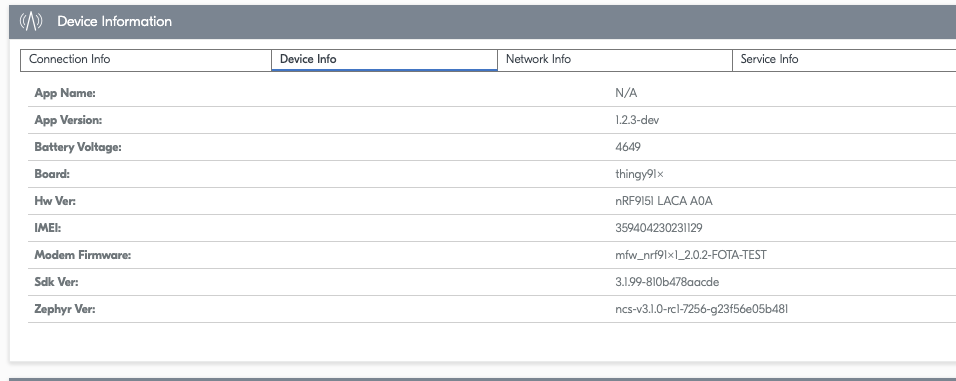

# Firmware Updates (FOTA)

This guide covers how to perform Firmware Over The Air (FOTA) updates using nRF Cloud, including both the web UI and REST API methods.

## Firmware Versioning

### Version Components

Firmware versions are defined in `app/VERSION`:

- **VERSION_MAJOR**: Major version
- **VERSION_MINOR**: Minor version
- **PATCHLEVEL**: Patch level
- **VERSION_TWEAK**: Additional component (typically 0)
- **EXTRAVERSION**: Extra string (e.g., "dev", "rc1")

Example resulting in version `1.2.3-dev`:

```plaintext
VERSION_MAJOR = 1
VERSION_MINOR = 2
PATCHLEVEL = 3
VERSION_TWEAK = 0
EXTRAVERSION = dev
```

### Preparing Firmware

1. **Update `app/VERSION`** - Increment the appropriate version component
2. **Build the firmware**

   Using the command line:

   ```bash
   west build -p -b thingy91x/nrf9151/ns # Make sure you build for the appropriate board
   ```

   Or use the nRF Connect for VS Code extension - see the [Getting Started](getting_started.md) guide for details on building with the extension.

3. **Locate update bundles**:
   - `build/app/zephyr/dfu_application.zip` - Application firmware update
   - `build/app/zephyr/dfu_mcuboot.zip` - Bootloader update

### Version Verification

**Important**: The `fwversion` field in a firmware bundle is independent from the device's reported version.

To verify a successful update:

- **Application updates**: Check that the FOTA job shows **Completed** status AND the **App Version** field in device information reflects the new version
- **Modem updates**: Check that the FOTA job shows **Completed** status AND the **Modem Firmware** field in device information shows the new version



## Performing FOTA Updates

### Option 1: nRF Cloud Web UI

This is the recommended method for manual updates and testing.

1. **Navigate to Firmware Updates** in the nRF Cloud portal under **Device Management**
2. **Create Update Bundle**:
   - Click "Add bundle"
   - Upload your bundle file:
     - For application updates: `dfu_application.zip`
     - For bootloader updates: `dfu_mcuboot.zip`
   - Set **Update Type** (e.g., LTE)
   - Enter a **Name** for the bundle
   - Enter a **Version** string (can be any identifier - this is the `fwversion` shown in the bundle list)
   - Click "Create/Upload Bundle"

3. **Create FOTA Update**:
   - Enter a **Name** and a **Description** of the update
   - Select target device(s) via device or group selection
   - Click on **Deploy now**
   - Click "Create FOTA Update"

4. **Monitor Progress**:
   - View job status in the "Overall Progress" section of the update
   - Status will progress: Queued → In Progress → Downloading → Completed
   - The device will automatically download and apply the update once it becomes online

5. **Verify Update**:
   - Navigate to your device page, **Device Management** → **Devices** and select your device
   - Click on **Device info** under the **Device Information** card
   - Check the **App Version** (for app updates) or **Modem Firmware** (for modem updates) field
   - Confirm the version matches your new firmware

### Option 2: REST API

For automated workflows and CI/CD integration, use the REST API.

#### Setup

```bash
export API_KEY=<your-nrf-cloud-api-key>
export DEVICE_ID=<your-device-id>
```

Find your API key in **User Account** settings in nRF Cloud. See [nRF Cloud REST API](https://api.nrfcloud.com/) for reference.

#### Complete Update Workflow

1. **Create manifest and upload bundle**:

   ```bash
   # Set path to your application binary
   export BIN_FILE="build/app/zephyr/zephyr.signed.bin"
   export FW_VERSION="1.2.3"

   # Create manifest.json with firmware details
   cat > manifest.json << EOF
   {
       "name": "My Firmware",
       "description": "Firmware description",
       "fwversion": "${FW_VERSION}",
       "format-version": 1,
       "files": [
           {
               "file": "$(basename ${BIN_FILE})",
               "type": "application",
               "size": $(stat -f%z ${BIN_FILE})
           }
       ]
   }
   EOF

   # Create zip containing firmware and manifest
   zip -j firmware.zip ${BIN_FILE} manifest.json

   # Upload to nRF Cloud and extract bundle ID
   UPLOAD_RESPONSE=$(curl -X POST "https://api.nrfcloud.com/v1/firmwares" \
     -H "Authorization: Bearer ${API_KEY}" \
     -H "Content-Type: application/zip" \
     --data-binary @firmware.zip)

   # Extract the bundle ID from the response (UUID from the URI path)
   export BUNDLE_ID=$(echo $UPLOAD_RESPONSE | jq -r '.uris[0]' | grep -oE '[0-9a-f]{8}-[0-9a-f]{4}-[0-9a-f]{4}-[0-9a-f]{4}-[0-9a-f]{12}')
   ```

2. **Create and apply FOTA job**:

   ```bash
   # Create job
   JOB_RESPONSE=$(curl -X POST "https://api.nrfcloud.com/v1/fota-jobs" \
     -H "Authorization: Bearer ${API_KEY}" \
     -H "Content-Type: application/json" \
     -d "{\"deviceIds\": [\"${DEVICE_ID}\"], \"bundleId\": \"${BUNDLE_ID}\"}")

   export JOB_ID=$(echo $JOB_RESPONSE | jq -r '.jobId')

   # Apply job
   curl -X POST "https://api.nrfcloud.com/v1/fota-jobs/${JOB_ID}/apply" \
     -H "Authorization: Bearer ${API_KEY}"
   ```

3. **Monitor job status**:

   ```bash
   curl -X GET "https://api.nrfcloud.com/v1/fota-jobs/${JOB_ID}" \
     -H "Authorization: Bearer ${API_KEY}" \
     -H "Accept: application/json"
   ```

   Job status values: `QUEUED`, `IN_PROGRESS`, `DOWNLOADING`, `SUCCEEDED`, `FAILED`, `TIMED_OUT`, `CANCELLED`, `REJECTED`

4. **Verify the update** by checking the device information in nRF Cloud (App Version or Modem Firmware field)

#### API Reference

**List FOTA jobs**:

```bash
curl -X GET "https://api.nrfcloud.com/v1/fota-jobs" \
  -H "Authorization: Bearer ${API_KEY}"
```

**Cancel FOTA job**:

```bash
curl -X PUT "https://api.nrfcloud.com/v1/fota-jobs/${JOB_ID}/cancel" \
  -H "Authorization: Bearer ${API_KEY}"
```

**Delete FOTA job**:

```bash
curl -X DELETE "https://api.nrfcloud.com/v1/fota-jobs/${JOB_ID}" \
  -H "Authorization: Bearer ${API_KEY}"
```

**Delete firmware bundle**:

```bash
curl -X DELETE "https://api.nrfcloud.com/v1/firmwares/${BUNDLE_ID}" \
  -H "Authorization: Bearer ${API_KEY}"
```
