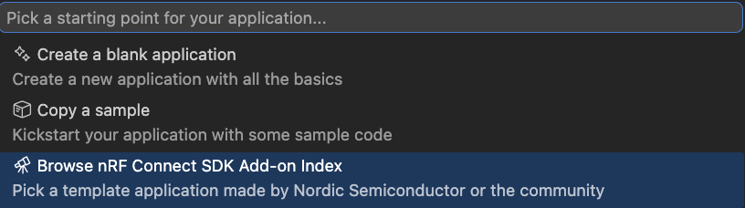
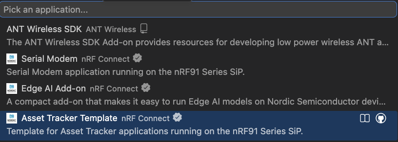
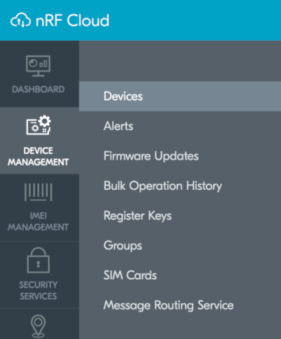
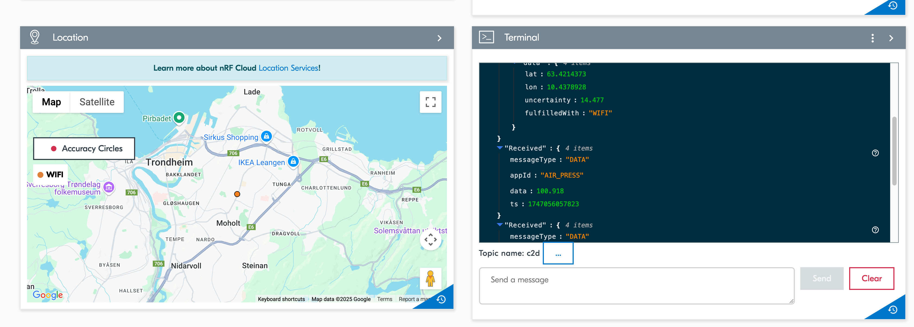

# Getting started

This guide walks you through getting the Asset Tracker Template running end-to-end on supported hardware. It covers:

* Setting up the development environment
* Building the application
* Flashing the application to the device
* Connecting the device to [nRF Cloud](https://nrfcloud.com)

There are two options for setting up the project, depending on your preferred development environment:

* **Option 1**: Using Visual Studio Code and the [nRF Connect for VS Code](https://docs.nordicsemi.com/bundle/nrf-connect-vscode/page/index.html) (recommended).
* **Option 2**: Using the command line and nRF Util.

For pre-built binaries that do not require a build environment, refer to the latest tag and the [release artifacts](release.md) documentation.

## Option 1: nRF Connect for VS Code (Recommended)

1. In nRF Connect for VS Code, the Asset Tracker Template is available as an add-on in the **Create New Application** menu:

    

1. Select the **Browse nRF Connect SDK add-on Index** option and search for **Asset Tracker Template**.

    

1. Once the project is created, it appears under **Applications** in the nRF Connect for VS Code side panel. Click **Add build configuration** under the **app** entry (or use the **Add Build Configuration** button under **Build**) to open the build configuration dialog.

1. In the **Add Build Configuration (app)** dialog, set **Board target**. With the **Compatible** filter selected (the default), only the supported build targets are listed:

    | Board        | Board target            |
    | ------------ | ----------------------- |
    | Thingy:91 X  | `thingy91x/nrf9151/ns`  |
    | nRF9151 DK   | `nrf9151dk/nrf9151/ns`  |

    Leave the other fields at their defaults and click **Generate and Build** to build the application.

1. After the build completes, the **Actions** panel is populated with options such as **Build**, **Flash**, **Debug**, **nRF Kconfig GUI**, and **Memory report**. Use these to flash, debug, and reconfigure the application.

> [!NOTE]
> The built-in **Flash** action programs the device through an external debugger. **Thingy:91 X** does not have an on-board debugger, so without an external J-Link attached you need to flash it over the serial bootloader instead. From a terminal in the toolchain environment, use one of the following alternatives:
>
> **Alternative 1 (recommended) — `west thingy91x-dfu`:** auto-discovers the Thingy:91 X and flashes `build/dfu_application.zip`.
>
> ```shell
> west thingy91x-dfu
> ```
>
> **Alternative 2 — `nrfutil device program`:** requires the Thingy:91 X serial number. Find it with `nrfutil device list` by locating the entry with **Product: `Thingy:91 X UART`** and the **`mcuBoot`** trait:
>
> ```shell
> nrfutil device list
> ```
>
> ```
> 851006699
> Product         J-Link
> Traits          usb, jlink, seggerUsb
>
> THINGY91X_ED0E7655C09       <-- this is the Thingy:91 X serial number
> Product         Thingy:91 X UART
> Ports           /dev/tty.usbmodem142102, vcom: 0
>                 /dev/tty.usbmodem142105, vcom: 1
> Traits          mcuBoot, modem, serialPorts, nordicUsb, usb
> ```
>
> Then flash, replacing `<serial-number>` with the identifier from the previous command (for example `THINGY91X_ED0E7655C09`):
>
> ```shell
> nrfutil device program --firmware build/dfu_application.zip \
>     --serial-number <serial-number> --traits mcuboot \
>     --x-family nrf91 --core Application
> ```

> [!NOTE]
> When flashing through an external debugger (nRF9151 DK, or Thingy:91 X with a J-Link attached), use the **Erase and Flash to Board** icon next to **Flash** in the **Actions** panel, not the default **Flash** action. The default action does not erase UICR and fails with a UICR error when the new firmware writes different UICR contents.

For more details on how to use the nRF Connect for VS Code, refer to the [nRF Connect for VS Code documentation](https://docs.nordicsemi.com/bundle/nrf-connect-vscode/page/index.html).

## Option 2: Command line

### Prerequisites

1. Install nRF Util by following the instructions in the [nRF Util documentation](https://docs.nordicsemi.com/bundle/nrfutil/page/guides/installing.html).

2. Install the SDK manager command:

    ```bash
    nrfutil install sdk-manager
    ```

3. Install the nRF Connect SDK toolchain (v3.1.0 or later):

    ```bash
    nrfutil sdk-manager install v3.1.0
    ```

### Workspace initialization

Before initializing, start the toolchain environment:

```shell
nrfutil sdk-manager toolchain launch --ncs-version v3.1.0 --shell
```

You can also run a single command within a specific nRF Connect SDK toolchain. For example:

```shell
nrfutil sdk-manager toolchain launch --ncs-version v3.1.0 -- <your command>
```

This form is useful for running, for instance, a single `west` command with a specific toolchain. You can create an alias or shell function for this command to avoid typing it in full every time.

In this document, the `nrfutil sdk-manager toolchain launch --shell` variant is used to launch the toolchain environment in the shell.

To initialize the workspace folder (`asset-tracker-template`) where the firmware project and all nRF Connect SDK modules will be cloned, run the following commands:

```shell
# Initialize asset-tracker-template workspace
west init -m https://github.com/nrfconnect/Asset-Tracker-Template.git --mr main asset-tracker-template

cd asset-tracker-template

# Update nRF Connect SDK modules. This may take a while.
west update
```

The template repository is now cloned into the `asset-tracker-template` folder, the west modules are downloaded, and you are ready to build the project.

### Building and running

Complete the following steps to build and run the application from the command line:

1. Navigate to the application folder:

    ```shell
    # Assuming you are in the asset-tracker-template folder
    cd project/app
    ```

1. Build the application by passing the corresponding build target to `west build`:

    ```shell
    # Thingy:91 X
    west build -p -b thingy91x/nrf9151/ns

    # nRF9151 DK
    west build -p -b nrf9151dk/nrf9151/ns
    ```

1. On **Thingy:91 X** without an external debugger, flash the application over the serial bootloader using one of the following alternatives:

    **Alternative 1 (recommended) — `west thingy91x-dfu`:** auto-discovers the device and flashes `build/dfu_application.zip`.

    ```shell
    west thingy91x-dfu
    ```

    **Alternative 2 — `nrfutil device program`:** requires the Thingy:91 X serial number. Find it with `nrfutil device list` by locating the entry with **Product: `Thingy:91 X UART`** and the **`mcuBoot`** trait:

    ```shell
    nrfutil device list
    ```

    ```
    851006699
    Product         J-Link
    Traits          usb, jlink, seggerUsb

    THINGY91X_ED0E7655C09       <-- this is the Thingy:91 X serial number
    Product         Thingy:91 X UART
    Ports           /dev/tty.usbmodem142102, vcom: 0
                    /dev/tty.usbmodem142105, vcom: 1
    Traits          mcuBoot, modem, serialPorts, nordicUsb, usb
    ```

    Then flash, replacing `<serial-number>` with the identifier from the previous command (for example `THINGY91X_ED0E7655C09`):

    ```shell
    nrfutil device program --firmware build/dfu_application.zip \
        --serial-number <serial-number> --traits mcuboot \
        --x-family nrf91 --core Application
    ```

1. On **nRF9151 DK**, or when using an external debugger on Thingy:91 X, flash with:

    ```shell
    west flash --erase
    ```

    The `--erase` option performs a full chip erase (including UICR) before programming. Without it, `west flash` fails with a UICR error when the new firmware writes different UICR contents.

The application is now built and flashed to the device. You can open a serial terminal to see the logs from the application. The default baud rate is 115200. It is recommended to use the Serial Terminal app, which you can install from [nRF Connect for Desktop](https://www.nordicsemi.com/Products/Development-tools/nRF-Connect-for-Desktop). You can also use other serial terminal applications like PuTTY, Tera Term, or minicom.

## Connect device to nRF Cloud

To connect to [nRF Cloud](https://nrfcloud.com), the device must be claimed on your account and provisioned with the correct credentials. Follow the detailed steps in the [Connecting](connecting.md) documentation.

The connection flow establishes the credentials and certificates required for secure communication between your device and nRF Cloud.

## Testing

To test that everything is working as expected, complete the following steps:

1. In a web browser, navigate to [nRF Cloud](https://nrfcloud.com) and log in to your account. Navigate to the **Device management** menu and select **Devices**. You should now see your device listed in the device overview. Click on the device ID to see the device page.

    

1. After provisioning, the device should already be connected and sending data. In the web browser, you will see the device page update with the latest information from the device, including the location, battery level, and other sensor data.

    

1. Press and hold **Button 1** on the device to trigger an immediate cloud sync, including sending buffered data, polling for FOTA updates, and fetching configuration changes. On **Thingy:91 X**, pressing on the top of the case pushes Button 1.

    > **Note:** The device samples and sends data at configurable intervals. Between intervals, the device is in a low-power state. Pressing and holding the button forces an immediate cloud update cycle.

1. Optionally, you can reset the device to observe the full boot and connection sequence. Connect to the device using the serial terminal and reset the device using either the reset button or the following shell command:

    ```shell
    kernel reboot
    ```

1. In the serial terminal, you will see the device booting up, connecting to the network, and establishing a connection to nRF Cloud using the provisioned credentials.

    <details>

    <summary>Example log output</summary>

    ```shell

    *** Booting Asset Tracker Template v0.0.0-dev - unknown commit ***
    *** Using nRF Connect SDK v3.2.99-eb5e822d5f11 ***
    *** Using Zephyr OS v4.3.99-29bbe2f2b560 ***
    [00:00:00.526,062] <dbg> main: main: Main has started
    [00:00:00.526,123] <dbg> main: running_entry: running_entry
    [00:00:00.526,184] <dbg> main: disconnected_entry: disconnected_entry
    [00:00:00.526,214] <dbg> main: disconnected_waiting_entry: disconnected_waiting_entry
    [00:00:00.526,245] <dbg> main: waiting_entry_common: Next sample trigger in 0 seconds
    [00:00:00.526,306] <dbg> main: waiting_entry_common: Next cloud sync trigger in 600 seconds
    [00:00:00.526,733] <dbg> main: disconnected_waiting_exit: disconnected_waiting_exit
    [00:00:00.526,763] <dbg> main: disconnected_sampling_entry: disconnected_sampling_entry
    [00:00:00.527,770] <dbg> cloud: cloud_module_thread: Cloud module task started
    [00:00:00.527,832] <dbg> cloud: state_running_entry: state_running_entry
    [00:00:00.527,893] <inf> nrf_provisioning_coap: Init CoAP client
    [00:00:00.528,503] <dbg> cloud: state_disconnected_entry: state_disconnected_entry
    [00:00:00.529,205] <dbg> environmental: env_module_thread: Environmental module task started
    [00:00:00.529,510] <dbg> fota: fota_module_thread: FOTA module task started
    [00:00:00.529,571] <dbg> fota: state_running_entry: state_running_entry
    [00:00:00.530,426] <dbg> location_module: location_module_thread: Location module task started
    [00:00:00.530,700] <dbg> network: state_running_entry: state_running_entry
    [00:00:00.531,158] <dbg> power: power_module_thread: Power module task started
    [00:00:00.531,311] <dbg> storage: storage_thread: Storage module task started
    [00:00:00.531,402] <dbg> storage: state_running_entry: state_running_entry
    [00:00:00.531,433] <dbg> storage: ram_init: RAM backend initialized with 1 types, using 320 bytes of RAM
    [00:00:00.531,463] <dbg> storage: ram_init: Ring buffer BATTERY initialized with size 320, item size: 40
    [00:00:00.531,494] <dbg> storage: ram_init: RAM backend initialized with 2 types, using 320 bytes of RAM
    [00:00:00.531,524] <dbg> storage: ram_init: Ring buffer ENVIRONMENTAL initialized with size 320, item size: 40
    [00:00:00.531,555] <dbg> storage: ram_init: RAM backend initialized with 3 types, using 3904 bytes of RAM
    [00:00:00.531,585] <dbg> storage: ram_init: Ring buffer LOCATION initialized with size 3904, item size: 488
    [00:00:00.531,738] <dbg> storage: state_buffer_idle_run: state_buffer_idle_run
    [00:00:00.531,768] <dbg> storage: state_running_run: state_running_run
    [00:00:00.531,799] <dbg> storage: handle_data_message: Handle data message for LOCATION
    [00:00:00.594,909] <inf> nrf_cloud_fota_common: Saved job: , type: 7, validate: 0, bl: 0x0
    [00:00:00.596,649] <dbg> fota: state_waiting_for_modem_init_entry: state_waiting_for_modem_init_entry
    [00:00:00.596,679] <dbg> fota: state_waiting_for_modem_init_entry: Waiting for modem initialization before processing pending FOTA job
    [00:00:00.795,837] <dbg> fota: state_waiting_for_modem_init_run: Modem initialized, processing pending FOTA job
    [00:00:00.795,898] <dbg> fota: state_waiting_for_poll_request_entry: state_waiting_for_poll_request_entry
    [00:00:00.825,195] <dbg> location_module: state_waiting_for_modem_init_run: Modem initialized, transitioning to running state
    [00:00:00.825,225] <dbg> location_module: state_running_entry: state_running_entry
    [00:00:00.842,224] <dbg> location_module: state_running_entry: Location library initialized
    [00:00:00.842,254] <dbg> location_module: state_location_search_inactive_entry: state_location_search_inactive_entry
    [00:00:00.919,555] <dbg> nrf_provisioning: cert_provision: Certificate already provisioned
    [00:00:00.920,349] <dbg> network: state_running_entry: Network module started
    [00:00:00.920,349] <dbg> network: state_disconnected_entry: state_disconnected_entry
    [00:00:00.920,379] <dbg> network: state_disconnected_searching_entry: state_disconnected_searching_entry
    [00:00:00.920,562] <dbg> power: state_waiting_for_modem_init_run: Modem initialized, transitioning to running state
    [00:00:00.923,980] <dbg> power: uart_enable: UART devices enabled
    [00:00:00.928,863] <dbg> power: fuel_gauge_state_is_valid: No valid fuel gauge state found (magic: 0x60878800)
    [00:00:00.928,863] <dbg> power: state_running_entry: No saved fuel gauge state found, initializing from scratch
    [00:00:05.268,859] <dbg> nrf_provisioning: lte_lc_event_handler: Connected to network
    [00:00:05.269,042] <dbg> network: lte_lc_evt_handler: PDN connection activated
    [00:00:05.269,866] <dbg> network: lte_lc_evt_handler: PSM parameters received, TAU: 7200, Active time: 6
    [00:00:05.270,355] <dbg> cloud: state_connecting_entry: state_connecting_entry
    [00:00:05.270,385] <dbg> cloud: state_connecting_attempt_entry: state_connecting_attempt_entry
    [00:00:05.270,416] <dbg> cloud: state_connecting_provisioned_entry: state_connecting_provisioned_entry
    [00:00:05.270,843] <dbg> network: state_connected_entry: state_connected_entry
    [00:00:05.393,341] <inf> cloud: Connecting to nRF Cloud CoAP with client ID: 5034474b-3731-4772-800e-0d0982488285
    [00:00:07.924,377] <inf> nrf_cloud_coap_transport: Request authorization with JWT
    [00:00:08.266,845] <inf> nrf_cloud_coap_transport: Authorization result_code: 2.01
    [00:00:08.267,150] <inf> nrf_cloud_coap_transport: Authorized
    [00:00:08.267,395] <inf> nrf_cloud_coap_transport: DTLS CID is active
    [00:00:08.985,137] <inf> cloud: nRF Cloud CoAP connection successful
    [00:00:08.985,443] <dbg> cloud: state_connected_entry: state_connected_entry
    [00:00:08.985,443] <inf> cloud: Connected to Cloud
    [00:00:08.985,534] <dbg> cloud: state_connected_ready_entry: state_connected_ready_entry
    [00:00:08.985,870] <dbg> main: connected_entry: connected_entry
    [00:00:08.986,450] <dbg> main: connected_waiting_entry: connected_waiting_entry
    [00:00:08.986,480] <dbg> main: waiting_entry_common: Next sample trigger in 0 seconds
    [00:00:08.986,541] <dbg> main: waiting_entry_common: Next cloud sync trigger in 592 seconds
    [00:00:08.986,968] <dbg> main: connected_waiting_exit: connected_waiting_exit
    [00:00:08.986,999] <dbg> main: connected_sampling_entry: connected_sampling_entry
    [00:00:08.988,006] <dbg> cloud: handle_cloud_channel_message: Poll shadow desired trigger received
    [00:00:08.988,098] <dbg> cloud: cloud_configuration_poll: Configuration: Requesting device shadow desired from cloud
    [00:00:08.989,715] <dbg> fota: state_polling_for_update_entry: state_polling_for_update_entry
    [00:00:08.989,715] <inf> nrf_cloud_fota_poll: Checking for FOTA job...
    [00:00:08.990,478] <dbg> location_module: state_location_search_inactive_run: Location search trigger received, starting location request
    [00:00:08.990,539] <dbg> location_module: state_location_search_active_entry: state_location_search_active_entry
    [00:00:08.992,095] <dbg> storage: state_buffer_idle_run: state_buffer_idle_run
    [00:00:08.992,126] <dbg> storage: state_running_run: state_running_run
    [00:00:08.992,156] <dbg> storage: handle_data_message: Handle data message for LOCATION
    [00:00:08.992,309] <dbg> storage: state_buffer_idle_run: state_buffer_idle_run
    [00:00:08.992,340] <dbg> storage: state_running_run: state_running_run
    [00:00:08.992,492] <dbg> storage: handle_data_message: Handle data message for LOCATION
    [00:00:08.995,452] <inf> wifi_nrf_bus: SPIM spi@b000: freq = 8 MHz
    [00:00:08.995,483] <inf> wifi_nrf_bus: SPIM spi@b000: latency = 0
    [00:00:09.293,090] <dbg> cloud: cloud_configuration_poll: Shadow desired section not present
    [00:00:09.293,426] <dbg> main: connected_run: Received empty shadow response from cloud
    [00:00:09.293,914] <dbg> main: update_shadow_reported_section: Configuration reported: update_interval=600, sample_interval=150, storage_threshold=1
    [00:00:09.294,586] <dbg> cloud: cloud_configuration_reported_update: Configuration: Reporting config to cloud
    [00:00:10.072,174] <inf> nrf_cloud_fota_poll: No pending FOTA job
    [00:00:10.072,204] <dbg> fota: state_polling_for_update_entry: No FOTA job available
    [00:00:10.072,570] <dbg> fota: state_waiting_for_poll_request_entry: state_waiting_for_poll_request_entry
    [00:00:17.861,358] <dbg> location_module: location_event_handler: Cloud location request received from location library
    [00:00:17.861,450] <dbg> location_module: location_cloud_request_data_copy: Copying cloud request data, size of dest: 472
    [00:00:17.861,480] <dbg> location_module: copy_wifi_data: Copied 10 WiFi APs
    [00:00:17.863,830] <dbg> location_module: state_location_search_active_run: Location search cancel received, cancelling location request
    [00:00:17.863,922] <dbg> location_module: location_event_handler: Location request cancelled
    [00:00:17.864,715] <dbg> main: connected_waiting_entry: connected_waiting_entry
    [00:00:17.864,746] <dbg> main: waiting_entry_common: Next sample trigger in 141 seconds
    [00:00:17.864,807] <dbg> main: waiting_entry_common: Next cloud sync trigger in 583 seconds
    [00:00:17.864,959] <dbg> location_module: state_location_search_active_run: Location request cancelled successfully
    [00:00:17.865,081] <dbg> location_module: state_location_search_active_run: Location search done message received, going to inactive state
    [00:00:17.865,142] <dbg> location_module: state_location_search_inactive_entry: state_location_search_inactive_entry
    [00:00:17.865,386] <dbg> storage: state_buffer_idle_run: state_buffer_idle_run
    [00:00:17.865,417] <dbg> storage: state_running_run: state_running_run
    [00:00:17.865,478] <dbg> storage: handle_data_message: Handle data message for LOCATION
    [00:00:17.865,539] <dbg> storage: ram_store: idx: 2, ring_buf: 0x20006b68, data size: 488 (488), free: 3904 bytes
    [00:00:17.865,631] <dbg> storage: ram_records_count: Counted 1 items in LOCATION ring buffer
    [00:00:17.865,661] <dbg> storage: ram_store: Stored LOCATION item, count: 1, left: 3416 bytes
    [00:00:17.865,692] <dbg> storage: ram_records_count: Counted 1 items in LOCATION ring buffer
    [00:00:17.865,753] <dbg> storage: check_and_notify_buffer_threshold: Buffer threshold limit reached for LOCATION: count=1, limit=1
    [00:00:17.866,119] <dbg> main: connected_waiting_exit: connected_waiting_exit
    [00:00:17.866,180] <dbg> main: connected_sending_entry: connected_sending_entry
    [00:00:17.870,025] <dbg> storage: state_buffer_idle_run: state_buffer_idle_run
    [00:00:17.870,056] <dbg> storage: state_running_run: state_running_run
    [00:00:17.870,086] <dbg> storage: handle_data_message: Handle data message for LOCATION
    [00:00:17.870,178] <dbg> storage: state_buffer_idle_run: state_buffer_idle_run
    [00:00:17.870,208] <dbg> storage: state_running_run: state_running_run
    [00:00:17.870,239] <dbg> storage: handle_data_message: Handle data message for BATTERY
    [00:00:17.870,544] <dbg> storage: state_buffer_idle_run: state_buffer_idle_run
    [00:00:17.870,574] <dbg> storage: state_running_run: state_running_run
    [00:00:17.870,635] <dbg> storage: handle_data_message: Handle data message for ENVIRONMENTAL
    [00:00:17.870,758] <dbg> storage: state_buffer_idle_run: state_buffer_idle_run
    [00:00:17.870,788] <dbg> storage: state_running_run: state_running_run
    [00:00:17.870,819] <dbg> storage: handle_data_message: Handle data message for LOCATION
    [00:00:17.870,971] <dbg> storage: state_buffer_idle_run: state_buffer_idle_run
    [00:00:17.871,002] <dbg> storage: state_running_run: state_running_run
    [00:00:17.871,124] <dbg> storage: state_buffer_idle_run: state_buffer_idle_run
    [00:00:17.871,124] <dbg> storage: state_buffer_idle_run: Batch request received, switching to batch active state
    [00:00:17.871,185] <dbg> storage: state_buffer_pipe_active_entry: state_buffer_pipe_active_entry
    [00:00:17.871,215] <dbg> storage: ram_records_count: Counted 1 items in LOCATION ring buffer
    [00:00:17.871,276] <dbg> storage: ram_records_count: Counted 1 items in LOCATION ring buffer
    [00:00:17.871,368] <dbg> storage: ram_retrieve: Retrieved item in LOCATION ring buffer, size: 488 bytes, 0 items left
    [00:00:17.871,459] <dbg> storage: populate_pipe: Batch population complete for session 0x45CA: 1/1 items
    [00:00:17.871,978] <dbg> storage: start_batch_session: Started batch session (session_id 0x45CA), 1 items in batch (1 total)
    [00:00:17.872,009] <dbg> storage: state_buffer_pipe_active_entry: Batch session started, session_id: 17866
    [00:00:17.872,131] <dbg> storage: state_buffer_pipe_active_run: state_buffer_pipe_active_run
    [00:00:17.872,161] <dbg> storage: state_running_run: state_running_run
    [00:00:17.872,711] <dbg> cloud: handle_cloud_channel_message: Poll shadow delta trigger received
    [00:00:17.872,802] <dbg> cloud: cloud_configuration_poll: Configuration: Requesting device shadow delta from cloud
    [00:00:17.874,389] <dbg> power: state_running_run: Battery percentage sample request received, getting battery data
    [00:00:17.874,511] <dbg> environmental: state_running_run: Environmental values sample request received, getting data
    [00:00:17.875,335] <dbg> fota: state_polling_for_update_entry: state_polling_for_update_entry
    [00:00:17.875,366] <inf> nrf_cloud_fota_poll: Checking for FOTA job...
    [00:00:17.881,103] <dbg> environmental: sample_sensors: Temperature: 24.67 C, Pressure: 100.67 Pa, Humidity: 11.70 %
    [00:00:17.881,500] <dbg> storage: state_buffer_pipe_active_run: state_buffer_pipe_active_run
    [00:00:17.881,530] <dbg> storage: state_running_run: state_running_run
    [00:00:17.881,561] <dbg> storage: handle_data_message: Handle data message for ENVIRONMENTAL
    [00:00:17.881,622] <dbg> storage: ram_store: idx: 1, ring_buf: 0x20006b7c, data size: 40 (40), free: 320 bytes
    [00:00:17.881,683] <dbg> storage: ram_records_count: Counted 1 items in ENVIRONMENTAL ring buffer
    [00:00:17.881,713] <dbg> storage: ram_store: Stored ENVIRONMENTAL item, count: 1, left: 280 bytes
    [00:00:17.881,774] <dbg> storage: ram_records_count: Counted 1 items in ENVIRONMENTAL ring buffer
    [00:00:17.881,805] <dbg> storage: check_and_notify_buffer_threshold: Buffer threshold limit reached for ENVIRONMENTAL: count=1, limit=1
    [00:00:17.882,476] <dbg> storage: state_buffer_pipe_active_run: state_buffer_pipe_active_run
    [00:00:17.882,507] <dbg> storage: state_running_run: state_running_run
    [00:00:17.884,246] <dbg> power: fuel_gauge_state_save: Saved fuel gauge state to no-init RAM (236 bytes)
    [00:00:17.884,277] <dbg> power: sample: State of charge: 99.000000
    [00:00:17.884,307] <dbg> power: sample: The battery is not charging
    [00:00:17.884,338] <dbg> power: sample: Battery voltage: 4.179000 V
    [00:00:17.884,338] <dbg> power: sample: Battery current: -0.000000 A
    [00:00:17.884,368] <dbg> power: sample: Battery temperature: 24.294037 C
    [00:00:17.884,887] <dbg> storage: state_buffer_pipe_active_run: state_buffer_pipe_active_run
    [00:00:17.884,918] <dbg> storage: state_running_run: state_running_run
    [00:00:17.884,948] <dbg> storage: handle_data_message: Handle data message for BATTERY
    [00:00:17.884,979] <dbg> storage: ram_store: idx: 0, ring_buf: 0x20006b90, data size: 40 (40), free: 320 bytes
    [00:00:17.885,009] <dbg> storage: ram_records_count: Counted 1 items in BATTERY ring buffer
    [00:00:17.885,070] <dbg> storage: ram_store: Stored BATTERY item, count: 1, left: 280 bytes
    [00:00:17.885,101] <dbg> storage: ram_records_count: Counted 1 items in BATTERY ring buffer
    [00:00:17.885,131] <dbg> storage: check_and_notify_buffer_threshold: Buffer threshold limit reached for BATTERY: count=1, limit=1
    [00:00:17.885,772] <dbg> storage: state_buffer_pipe_active_run: state_buffer_pipe_active_run
    [00:00:17.885,803] <dbg> storage: state_running_run: state_running_run
    [00:00:18.406,921] <dbg> cloud: cloud_configuration_poll: Shadow delta section not present
    [00:00:18.407,531] <dbg> cloud: handle_storage_channel_message: Storage batch available, 1 items, session_id: 0x45CA
    [00:00:18.407,592] <inf> cloud: Processing storage batch: 1 items available
    [00:00:18.407,684] <dbg> storage: storage_batch_read: Read storage item: type=4, size=488
    [00:00:18.407,714] <dbg> cloud: cloud_location_handle_message: Cloud location request received
    [00:00:18.407,745] <dbg> cloud: handle_cloud_location_request: Handling cloud location request
    [00:00:18.785,949] <inf> nrf_cloud_fota_poll: No pending FOTA job
    [00:00:18.785,980] <dbg> fota: state_polling_for_update_entry: No FOTA job available
    [00:00:18.786,346] <dbg> fota: state_waiting_for_poll_request_entry: state_waiting_for_poll_request_entry
    [00:00:19.675,415] <dbg> cloud: handle_storage_batch_available: No more data available in batch (timeout)
    [00:00:19.675,415] <dbg> cloud: handle_storage_batch_available: Processed 1/1 storage items
    [00:00:20.113,220] <dbg> main: connected_waiting_entry: connected_waiting_entry
    [00:00:20.113,281] <dbg> main: waiting_entry_common: Next sample trigger in 138 seconds
    [00:00:20.113,311] <dbg> main: waiting_entry_common: Next cloud sync trigger in 597 seconds
    [00:00:20.114,074] <dbg> storage: state_buffer_pipe_active_run: state_buffer_pipe_active_run
    [00:00:20.114,105] <dbg> storage: state_buffer_pipe_active_exit: state_buffer_pipe_active_exit
    ```

    </details>

If you experience issues, check the logs in the serial terminal for any error messages. You can find troubleshooting tips in the [Troubleshooting](tooling_troubleshooting.md) section of the documentation.
You can also open a support ticket on [DevZone](https://devzone.nordicsemi.com) for further assistance.

## Next steps

Now that you have the application running, you can explore the following areas:

* **Explore the architecture** - Understand how the modular, event-driven system works in the [Architecture](architecture.md) guide. This is a good starting point if you want to understand the design decisions and how modules interact.
* **Configure the application** - Adjust sampling intervals, cloud sync frequency, location method priorities, and other runtime behavior using the [Configuration](configuration.md) guide. You can change the configuration both locally and remotely through the device shadow on nRF Cloud.
* **Modify the template** - Add new sensors, create custom modules, add new zbus events, or enable MQTT support following the [Modifying the template](modifying.md) guide.
* **Perform firmware updates** - Deploy new firmware versions over-the-air using the [Firmware Updates (FOTA)](fota.md) guide. FOTA supports both application and modem firmware updates through nRF Cloud.
* **Optimize power consumption** - Learn about the power-saving features and how to achieve the lowest power consumption for your use case in the [Low Power](low_power.md) guide.
* **Set up location services** - Configure GNSS, Wi-Fi, and cellular positioning methods and their fallback priorities in the [Location Services](location_services.md) guide.
* **Set up testing and CI** - Run tests on real hardware or emulated targets, and integrate with CI pipelines as described in the [Testing and CI Setup](test_and_ci_setup.md) guide.
* **Troubleshoot issues** - Use shell commands, debugging tools, Memfault integration, and modem tracing as described in the [Tooling and Troubleshooting](tooling_troubleshooting.md) guide.
