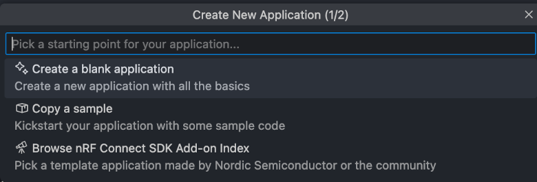
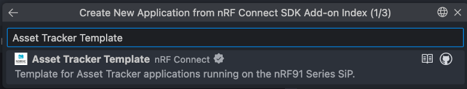

# Getting Started

To get started with Asset tracker template, you need to set up the development environment, build the application, and run it on supported hardware.
You can use any of the following tools, depending on your preferred development environment:

* Using Visual Studio Code and the [nRF Connect for VS Code extension](https://docs.nordicsemi.com/bundle/nrf-connect-vscode/page/index.html)
* Using command line and nRF Util

In nRF Connect for VS Code, the Asset Tracker Template is available as an add-on in the **Create New Application** menu:



Select the **Browse nRF Connect SDK add-on Index** option and search for **Asset Tracker Template**.



Once you have created the project, you can access various development actions through the **Actions** panel in the nRF Connect for VS Code extension. These actions provide quick access to common tasks such as building, flashing, and debugging your application:


For more details on how to use the VS Code extension, refer to the [nRF Connect for VS Code documentation](https://docs.nordicsemi.com/bundle/nrf-connect-vscode/page/index.html).

## Prerequisites

* **The nRF Util command line tool and the SDK manager command**

    1. Install nRF Util by following the instructions in the [nRF Util documentation](https://docs.nordicsemi.com/bundle/nrfutil/page/guides/installing.html).
    1. Install the SDK manager command by following the instructions in the [sdk-manager command](https://docs.nordicsemi.com/bundle/nrfutil/page/nrfutil-sdk-manager/nrfutil-sdk-manager.html) documentation.

* **nRF Connect SDK toolchain v3.0.0 or later**

    - Follow the instructions in the [sdk-manager command](https://docs.nordicsemi.com/bundle/nrfutil/page/nrfutil-sdk-manager/nrfutil-sdk-manager.html) documentation to install v3.0.0 of the nRF Connect SDK toolchain.

## Supported boards

The Asset Tracker Template is continuously verified in CI on the following boards:

- **[Thingy:91 X](https://www.nordicsemi.com/Products/Development-hardware/Nordic-Thingy-91-X)**

    - Build target `thingy91x/nrf9151/ns`

- **[nRF9151 DK](https://www.nordicsemi.com/Products/Development-hardware/nRF9151-DK)**

    - Build target `nrf9151dk/nrf9151/ns`

## Workspace Initialization

Before initializing, start the toolchain environment:

```shell
nrfutil sdk-manager toolchain launch --ncs-version v3.0.0 --shell
```

Alternatively, you can run the command with a specific nRF Connect SDK version. For example, if you are using version 3.0.1, run:

```shell
nrfutil sdk-manager toolchain launch --ncs-version v3.0.0 -- <your command>
```

To run for instance the `west` command with the specified version of toolchain. You can create an alias or shell function for this command to avoid typing it in full every time.

In this document, the `nrfutil toolchain-manager launch --shell` variant is used to launch the toolchain environment in the shell.

To initialize the workspace folder (`asset-tracker-template`) where the firmware project and all nRF Connect SDK modules will be cloned, run the following commands:

```shell
# Initialize asset-tracker-template workspace
west init -m https://github.com/nrfconnect/Asset-Tracker-Template.git --mr main asset-tracker-template

cd asset-tracker-template

# Update nRF Connect SDK modules. This may take a while.
west update
```

The template repository is now cloned into the `asset-tracker-template` folder, the west modules are downloaded, and you are ready to build the project.

## Building and running

Complete the following steps for building and running using command line:

1. Navigate to the application folder:

    ```shell
    # Assuming you are in the asset-tracker-template folder
    cd project/app
    ```

1. To build the application, run the following command:

    ```shell
    west build -p -b thingy91x/nrf9151/ns # Pristine build
    ```

1. When using the serial bootloader on Thingy:91 X, you can update the application using the following command:

    ```shell
    west thingy91x-dfu
    ```

1. When using nRF9151 DK or an external debugger on Thingy:91 X, you can program the device using the following command:

    ```shell
    west flash --erase # The --erase option is optional and will erase the entire flash memory before programming
    ```

The application is now built and flashed to the device. You can open a serial terminal to see the logs from the application. The default baud rate is 115200. It is recommended to use the Serial Terminal app, which you can install from [nRF Connect for Desktop](https://www.nordicsemi.com/Products/Development-tools/nRF-Connect-for-Desktop). You can also use other serial terminal applications like PuTTY, Tera Term, or minicom.

### Building with overlays

You can build the application with different overlays to enable or disable certain features. The following are some examples of how to build the application with different overlays.

Debug build with Memfault:

```shell
west build -p -b thingy91x/nrf9151/ns -- -DEXTRA_CONF_FILE="overlay-memfault.conf;overlay-upload-modem-traces-to-memfault.conf;overlay-etb.conf" -DCONFIG_MEMFAULT_NCS_PROJECT_KEY=\"memfault-project-key\"
```

Build with Memfault, sending modem traces to Memfault and enabling ETB traces:

```shell
west build -p -b thingy91x/nrf9151/ns -- -DEXTRA_CONF_FILE="overlay-memfault.conf;overlay-upload-modem-traces-to-memfault.conf" -DCONFIG_MEMFAULT_NCS_PROJECT_KEY=\"memfault-project-key\"
```

## Provision device to nRF Cloud

To connect to [nRF Cloud](https://nrfcloud.com), the device must be provisioned to your account. You can provision the device using one of the following methods:

* **Manual provisioning**: Follow the detailed steps in the [Provisioning](provisioning.md) documentation.

The provisioning process establishes the necessary credentials and certificates for secure communication between your device and nRF Cloud.

## Testing

To test that everything is working as expected, you can do the following:

1. In a web browser, navigate to [nRF Cloud](https://nrfcloud.com) and log in to your account. Navigate to the **Device management** menu and select **Devices**. You should now see your device listed in the device overview. Click on the device ID to see the device page.

    

1. Connect to the device using the serial terminal and reset the device using either the reset button or the following shell command:

    ```shell
    kernel reboot
    ```

1. In the serial terminal, you will see the device booting up and connecting to the network. The device tries to connect to nRF Cloud using the credentials you provided during provisioning.

    <details>

    <summary>Example log output</summary>

    ```shell

    *** Booting nRF Connect SDK v3.0.0-3bfc46578e42 ***
    *** Using Zephyr OS v4.0.99-a0e545cb437a ***
    Attempting to boot slot 0.
    Attempting to boot from address 0x8200.
    I: Trying to get Firmware version
    I: Verifying signature against key 0.
    I: Hash: 0x3e...f9
    I: Firmware signature verified.
    Firmware version 2
    All pins have been configured as non-secure
    Booting TF-M v2.1.1-ncs4
    [Sec Thread] Secure image initializing!
    TF-M isolation level is: 0x00000001
    TF-M Float ABI: Hard
    Lazy stacking enabled

    [00:00:00.257,324] <inf> spi_nor: GD25LE255E@0: 32 MiBy flash
    [00:00:00.311,828] <inf> wifi_nrf_bus: SPIM spi@b000: freq = 8 MHz
    [00:00:00.311,889] <inf> wifi_nrf_bus: SPIM spi@b000: latency = 0
    ]mJ*** Using nRF Connect SDK v3.0.0-3bfc46578e42 ***
    *** Using Zephyr OS v4.0.99-a0e545cb437a ***
    [00:00:00.520,202] <dbg> main: main: Main has started
    [00:00:00.520,263] <dbg> main: running_entry: running_entry
    [00:00:00.520,294] <dbg> main: idle_entry: idle_entry
    [00:00:00.520,477] <dbg> main: idle_entry: idle_entry
    [00:00:00.520,812] <dbg> cloud: cloud_thread: cloud  module task started
    [00:00:00.520,874] <dbg> cloud: state_running_entry: state_running_entry
    [00:00:00.520,996] <dbg> cloud: state_disconnected_entry: state_disconnected_entry
    [00:00:00.521,514] <dbg> environmental_module: environmental_task: Environmental module task started
    [00:00:00.521,636] <dbg> fota: fota_task: FOTA module task started
    [00:00:00.521,728] <dbg> fota: state_running_entry: state_running_entry
    [00:00:00.522,949] <dbg> location_module: location_module_thread: Location module task started
    [00:00:00.523,010] <dbg> location_module: state_running_entry: state_running_entry
    [00:00:00.523,345] <dbg> network: state_running_entry: state_running_entry
    [00:00:00.523,376] <inf> network: Bringing network interface up and connecting to the network
    [00:00:00.523,803] <dbg> power: power_task: Power module task started
    [00:00:00.550,445] <dbg> location_module: state_running_entry: Location library initialized
    [00:00:00.586,822] <inf> nrf_cloud_fota_common: Saved job: , type: 6, validate: 0, bl: 0x0
    [00:00:00.625,976] <dbg> fota: state_waiting_for_poll_request_entry: state_waiting_for_poll_request_entry
    [00:00:00.859,680] <dbg> network: state_running_entry: Network module started
    [00:00:00.859,710] <dbg> network: state_disconnected_entry: state_disconnected_entry
    [00:00:00.859,741] <dbg> network: state_disconnected_searching_entry: state_disconnected_searching_entry
    [00:00:00.864,227] <inf> wifi_nrf_bus: SPIM spi@b000: freq = 8 MHz
    [00:00:00.864,257] <inf> wifi_nrf_bus: SPIM spi@b000: latency = 0
    [00:00:01.109,924] <dbg> location_module: on_cfun: Modem CFUN mode: 21
    [00:00:03.170,928] <dbg> network: lte_lc_evt_handler: PSM parameters received, TAU: 7200, Active time: 6
    [00:00:03.171,447] <dbg> network: lte_lc_evt_handler: eDRX parameters received, mode: 7, eDRX: 5.12 s, PTW: 1.28 s
    [00:00:03.171,752] <dbg> network: l4_event_handler: Network connectivity established
    [00:00:03.172,821] <dbg> cloud: state_connecting_entry: state_connecting_entry
    [00:00:03.172,851] <dbg> cloud: state_connecting_attempt_entry: state_connecting_attempt_entry
    [00:00:03.174,224] <dbg> network: state_connected_entry: state_connected_entry
    [00:00:03.288,574] <inf> cloud: Connecting to nRF Cloud CoAP with client ID: 23437848-3230-4d7d-80ab-971ac066a8ce
    [00:00:04.818,969] <inf> nrf_cloud_coap_transport: Request authorization with JWT
    [00:00:05.076,232] <inf> nrf_cloud_coap_transport: Authorization result_code: 2.01
    [00:00:05.076,354] <inf> nrf_cloud_coap_transport: Authorized
    [00:00:05.076,568] <inf> nrf_cloud_coap_transport: DTLS CID is active
    [00:00:11.381,195] <dbg> cloud: state_connected_entry: state_connected_entry
    [00:00:11.381,225] <inf> cloud: Connected to Cloud
    [00:00:11.381,317] <dbg> cloud: state_connected_ready_entry: state_connected_ready_entry
    [00:00:11.381,622] <dbg> main: triggering_entry: triggering_entry
    [00:00:11.381,683] <dbg> main: sample_data_entry: sample_data_entry
    [00:00:11.382,415] <dbg> cloud: shadow_get: Requesting device shadow from the device
    [00:00:11.383,666] <dbg> location_module: handle_location_chan: Location search trigger received, getting location
    [00:00:11.628,173] <dbg> cloud: shadow_get: No shadow delta changes available
    [00:00:20.751,007] <dbg> location_module: location_event_handler: Got location: lat: 63.421421, lon: 10.437868, acc: 15.000000, method: Wi-Fi
    [00:00:20.751,953] <dbg> main: wait_for_trigger_entry: wait_for_trigger_entry
    [00:00:20.751,983] <dbg> main: wait_for_trigger_entry: Next trigger in 591 seconds
    [00:00:20.752,685] <dbg> cloud: state_connected_ready_run: Poll shadow trigger received
    [00:00:20.752,777] <dbg> cloud: shadow_get: Requesting device shadow from the device
    [00:00:20.753,997] <dbg> power: state_running_run: Battery percentage sample request received, getting battery data
    [00:00:20.754,089] <dbg> environmental_module: state_running_run: Environmental values sample request received, getting data
    [00:00:20.754,180] <dbg> fota: state_polling_for_update_entry: state_polling_for_update_entry
    [00:00:20.754,211] <inf> nrf_cloud_fota_poll: Checking for FOTA job...
    [00:00:20.760,650] <dbg> environmental_module: sample_sensors: Temperature: 26.86 C, Pressure: 100.92 Pa, Humidity: 33.61 %
    [00:00:20.762,695] <dbg> power: sample: State of charge: 79.000000
    [00:00:20.762,756] <dbg> power: sample: The battery is charging
    [00:00:20.976,806] <dbg> cloud: shadow_get: No shadow delta changes available
    ```

    </details>

1. In the web browser, you will see the device page updating with the latest information from the device, including the location, battery level, and other sensor data.

1. Press **Button 1** on the device to trigger data sampling and sending to nRF Cloud.

    

If you experience issues, check the logs in the serial terminal for any error messages. You can find troubleshooting tips in the [Troubleshooting](tooling_troubleshooting.md) section of the documentation.
You can also open a support ticket on [DevZone](https://devzone.nordicsemi.com) for further assistance.
