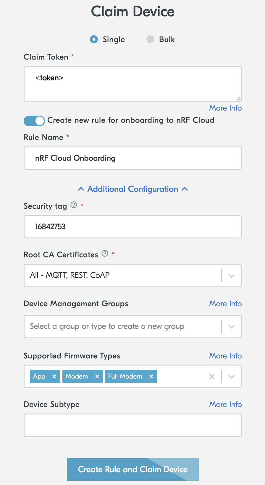

# Provisioning

Device provisioning establishes credentials for secure communication with nRF Cloud CoAP.

<details>
<summary><strong>What happens during provisioning</strong></summary>

The Asset Tracker Template uses the <a href="https://docs.nordicsemi.com/bundle/ncs-latest/page/nrf/libraries/networking/nrf_provisioning.html">nRF Device provisioning</a> library to handle device provisioning automatically. The library provisions the root CA certificate for the provisioning service to the modem during boot if it is not already present. During provisioning, the following steps occur:

<ol>
<li><strong>Secure Connection</strong>: The library establishes a secure DTLS connection to the nRF Cloud CoAP Provisioning Service. The device verifies the server's identity using the root CA certificate.</li>
<li><strong>Device Authentication</strong>: The device authenticates itself using a JSON Web Token (JWT) signed with the modem's factory-provisioned Device Identity private key. This key is securely stored in the modem hardware and cannot be extracted.</li>
<li><strong>Command Retrieval</strong>: After successful authentication, the device requests provisioning commands from the server. These commands typically include cloud access credentials and configuration settings.</li>
<li><strong>Modem Configuration</strong>: To write the received credentials and settings, the library performs the following:<br>

   - Suspends the DTLS session (to maintain the connection state).<br>
   - Temporarily sets the modem offline.<br>
   - Writes the credentials to the modem's secure storage.<br>
</li>
<li><strong>Result Reporting</strong>: After executing the commands, the library resumes or re-establishes the DTLS connection (if needed), authenticates again with JWT, and reports the results back to the server. Successfully executed commands are removed from the server-side queue.</li>
<li><strong>Validation</strong>: The device uses the newly provisioned credentials to connect to nRF Cloud CoAP services.</li>
</ol>

<p>The modem must be offline during credential writing because the modem cannot be connected to the network while data is being written to its storage area (credential writing).
Therefore it is normal that LTE is disconnected or connected multiple times during provisioning.</p>

<p>The attestation token is different from the JWT - it is used during the initial device claiming process to prove device authenticity to nRF Cloud, not during the provisioning protocol itself.</p>

<p>For more details on the provisioning library, see the <a href="https://docs.nordicsemi.com/bundle/ncs-latest/page/nrf/libraries/networking/nrf_provisioning.html">nRF Cloud device provisioning documentation</a>.</p>

</details>

## Manual Provisioning

Provisioning requires actions on both the device and the nRF Cloud portal. First you obtain the attestation token from the device, then you claim the device in nRF Cloud, and finally you wait for the device to complete the provisioning process.

### Step 1: Obtain the device attestation token

The attestation token uniquely identifies your device and proves its authenticity to nRF Cloud. You can obtain it in two ways:

- **Automatic (on first boot)**: When an unprovisioned device boots the Asset Tracker Template firmware for the first time, it prints the attestation token to the serial log. Connect a serial terminal to the device (115200 baud) before powering it on, and look for the token in the output.

- **Manual (via shell command)**: If you missed the token on first boot, or need to retrieve it again, run the following AT command in the device shell through the serial terminal:

    ```bash
    at at%attesttoken
    ```

    The token will be printed as a string starting with `%ATTESTTOKEN:`. Copy the entire token value (excluding the `%ATTESTTOKEN:` prefix).

### Step 2: Claim the device in nRF Cloud

1. Log in to the [nRF Cloud](https://nrfcloud.com/#/) portal.
1. Select **Security Services** in the left sidebar.

    A panel opens to the right.

1. Select **Claimed Devices**.
1. Click **Claim Device**.

    A pop-up opens.

1. Copy and paste the attestation token into the **Claim token** text box.
1. Set rule to nRF Cloud Onboarding and click **Claim Device**.

    <details>
    <summary><strong>If "nRF Cloud Onboarding" rule is not showing:</strong></summary>

    Create a new rule using the following configuration:

    
    </details>

### Step 3: Wait for provisioning to complete

After claiming, the device needs to poll the provisioning service to receive its credentials. This happens automatically, but the device polls at its own interval.

- **Wait**: The device will automatically poll for provisioning commands at its configured interval. This may take a few minutes.
- **Trigger immediately**: If you want to speed up the process, you can either press and hold **Button 1** on the device or reset it to trigger an immediate provisioning poll.

Once the device has received its credentials and connected to nRF Cloud, it will be available under the **Devices** section in the **Device Management** navigation pane on the left.

> **Note:** It is normal for the LTE connection to disconnect and reconnect during provisioning. The modem must go offline temporarily while credentials are written to its secure storage. See the "What happens during provisioning" section at the top of this page for details.

<details>
<summary><strong>What can you do after provisioning</strong></summary>

After your device is provisioned and connected, you can perform the following:

- **Monitor device data**: View real-time data from your device, including location, temperature, battery percentage, and other sensor readings in the [nRF Cloud](https://nrfcloud.com/#/) portal.
- **Retrieve data programmatically**:
    - Use the [Message Routing Service](https://docs.nordicsemi.com/bundle/nrf-cloud/page/Devices/MessagesAndAlerts/MessageRoutingService/ReceivingMessages.html) to automatically forward device messages to your own cloud infrastructure or application endpoints.
    - Query historical device messages using the REST API. For complete endpoint details, see the [REST API documentation](https://api.nrfcloud.com/) and [OpenAPI specification](https://api.nrfcloud.com/v1/openapi.json).

        <details>
        <summary><strong>Retrieve historical messages</strong></summary>

        ```bash
        curl -X GET "https://api.nrfcloud.com/v1/messages?device_id=${DEVICE_ID}&pageLimit=10" \
          -H "Authorization: Bearer ${API_KEY}" \
          -H "Accept: application/json"
        ```
        </details>

- **Perform firmware updates**: Deploy over-the-air firmware updates to your device. See [Firmware Updates (FOTA)](fota.md) for detailed instructions on preparing and deploying firmware updates through nRF Cloud.
</details>

### REST API alternative

You can also use the REST API as an alternative for provisioning by running the following command:

```bash
curl 'https://api.provisioning.nrfcloud.com/v1/claimed-devices' \
-H 'Content-Type: application/json' \
-H 'Authorization: Bearer YOUR_API_TOKEN' \
-d '{"claimToken": "YOUR_DEVICE_ATTESTATION_TOKEN", "tags": ["nrf-cloud-onboarding"]}'
```

## Reprovisioning

To update device credentials:

In an end product it is recommended to reprovision the device at a reasonable interval depending on the application use case for security reasons.

### Manual

1. Log in to the [nRF Cloud](https://nrfcloud.com/#/) portal.
1. Select **Security Services** in the left sidebar.

    A panel opens to the right.

1. Select **Claimed Devices**.
1. Find the device and click **Reset**.
1. Trigger on device:

    - **Shell**: `att_cloud provision`
    - **Cloud**: Update device shadow with `{"desired": {"command": [1, 1]}}`.

For detailed information on sending commands to devices through REST API, including command structure and available command types, see [Sending commands through REST API](configuration.md#sending-commands-through-rest-api) in the configuration documentation.

### REST API alternative

You can also use the REST API as an alternative for reprovisioning by running the following command:

```bash
curl 'https://api.provisioning.nrfcloud.com/v1/claimed-devices/YOUR_DEVICE_ID/provisioning' \
-H 'Content-Type: application/json' \
-H 'Authorization: Bearer YOUR_API_TOKEN' \
-d '{"request": {"cloudAccessKeyGeneration": {"secTag": 16842753}}}'
```

For detailed API documentation, see [nRF Cloud REST API](https://api-docs.nrfcloud.com/).

## Unclaiming a device

To remove a device from your nRF Cloud account:

Unclaim the device if it is already associated with another nRF Cloud account before you can associate it with a different account.

### Manual

1. Log in to the [nRF Cloud](https://nrfcloud.com/#/) portal.
1. Select **Security Services** in the left sidebar.

    A panel opens to the right.

1. Select **Claimed Devices**.
1. Select the device in the list and click **Unclaim Device**.

> [!IMPORTANT]
> Unclaiming a device also deletes it from Device Management. All device data, including historical messages and configuration, will be removed. The device will need to be claimed again and reprovisioned to reconnect to nRF Cloud.

### REST API alternative

You can also use the REST API as an alternative for unclaiming by running the following command:

```bash
curl -X DELETE 'https://api.provisioning.nrfcloud.com/v1/claimed-devices/YOUR_DEVICE_ID' \
-H 'Authorization: Bearer YOUR_API_TOKEN'
```
