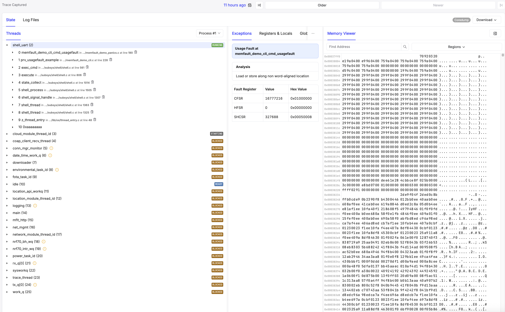

# Tooling and Troubleshooting

General overview of tools used to troubleshoot the template code and/or modem/network behavior.
For more knowledge on debugging and troubleshooting [nRF Connect SDK](https://github.com/nrfconnect/sdk-nrf) based applications in general, refer to these links:

- [Debugging and troubleshooting](https://academy.nordicsemi.com/courses/nrf-connect-sdk-intermediate/lessons/lesson-2-debugging/)
- [Cellular IoT Fundamentals Developer Academy Course](https://academy.nordicsemi.com/courses/cellular-iot-fundamentals/)
- [nRF Connect SDK Debugging Guide](https://docs.nordicsemi.com/bundle/ncs-latest/page/nrf/test_and_optimize/debugging.html)
- [Zephyr Debugging Guide](https://docs.zephyrproject.org/latest/develop/debug/index.html)

<div class="hidden-content">

## Table of Contents

- [Shell Commands](#shell-commands)
  - [Available Commands](#available-commands)
  - [Shell Command Examples](#shell-command-examples)
    - [Cloud Publishing](#cloud-publishing)
    - [Network disconnect](#network-disconnect)
    - [AT Command Execution](#at-command-execution)
- [Debugging Tools](#debugging-tools)
  - [Low Power Profiling](#low-power-profiling)
  - [GDB Debugging](#gdb-debugging)
  - [SEGGER SystemView](#segger-systemview)
    - [Configuration](#configuration)
  - [Thread Analysis](#thread-analysis)
  - [Hardfaults](#hardfaults)
  - [State Inspection Script](#state-inspection-script)
- [Memfault Remote Debugging](#memfault-remote-debugging)
  - [When to Use Memfault](#when-to-use-memfault)
  - [Prerequisites](#prerequisites)
  - [Test shell commands](#test-shell-commands)
- [Modem Tracing](#modem-tracing)
  - [UART Tracing](#uart-tracing)
  - [RTT Tracing](#rtt-tracing)
  - [Dumping modem traces over UART after capture](#dumping-modem-traces-over-uart-after-capture)
  - [Application logs and modem traces over RTT - Parallel capture](#application-logs-and-modem-traces-over-rtt---parallel-capture)
- [Common Issues and Solutions](#common-issues-and-solutions)

</div>

## Shell Commands

The template provides several shell commands for controlling and monitoring device behavior. Connect to the device's UART interface using either:

- [Serial terminal app](https://docs.nordicsemi.com/bundle/nrf-connect-serial-terminal/page/index.html) form nRF Connect for Desktop.
- Your preferred terminal application (for example, `putty`, `minicom`, `terraterm`).

### Available Commands

Run `help` to list all available commands:

```bash
uart:~$ help
Available commands:
  app                          : Application version information commands
  at                           : Execute an AT command
  att_button                   : Asset Tracker Template Button module commands
  att_cloud                    : Asset Tracker Template Cloud module commands
  att_network                  : Asset Tracker Template Network module commands
  att_power                    : Asset Tracker Template Power module commands
  att_storage                  : Asset Tracker Template Storage module commands
  clear                        : Clear screen.
  date                         : Date commands
  device                       : Device commands
  devmem                       : Read/write physical memory
                                 Usage:
                                 Read memory at address with optional width:
                                 devmem <address> [<width>]
                                 Write memory at address with mandatory width
                                 and value:
                                 devmem <address> <width> <value>
  help                         : Prints the help message.
  history                      : Command history.
  kernel                       : Kernel commands
  pm                           : PM commands
  rem                          : Ignore lines beginning with 'rem '
  resize                       : Console gets terminal screen size or assumes
                                 default in case the readout fails. It must be
                                 executed after each terminal width change to
                                 ensure correct text display.
  retval                       : Print return value of most recent command
  shell                        : Useful, not Unix-like shell commands.
```

### Shell Command Examples

#### Cloud Publishing

```bash
uart:~$ att_cloud publish TEMP "24"
Sending on payload channel: {"messageType":"DATA","appId":"TEMP","data":"24","ts":1744359144653} (68 bytes)
```

#### Perform cloud provisioning

```bash
uart:~$ att_cloud provision
[00:00:42.258,361] <dbg> cloud: state_connected_ready_run: Provisioning request received
[00:00:42.258,453] <dbg> cloud: state_connected_exit: state_connected_exit
...
[00:00:45.086,273] <dbg> nrf_provisioning_coap: request_commands: Path: p/cmd?after=&rxMaxSize=4096&txMaxSize=4096&limit=5
[00:00:45.289,215] <dbg> nrf_provisioning_coap: coap_callback: Callback code 69
[00:00:45.289,245] <dbg> nrf_provisioning_coap: coap_callback: Operation successful
[00:00:45.289,245] <dbg> nrf_provisioning_coap: coap_callback: Last packet received
[00:00:45.289,367] <dbg> nrf_provisioning_coap: nrf_provisioning_coap_req: Response code 69
[00:00:45.289,367] <inf> nrf_provisioning_coap: No commands to process on server side
[00:00:45.290,924] <dbg> nrf_provisioning: check_return_code_and_notify: No commands to process
[00:00:45.290,954] <wrn> cloud: No commands from the nRF Provisioning Service to process
[00:00:45.290,954] <wrn> cloud: Treating as provisioning finished
```

When the provisioning command is called, the device will connect to the provisioning endpoint and check if there are any pending commands for the device
and execute them if any. You can use it to reprovision the device for development purposes and when it is desired to swap out the certificates used in the CoAP connection.

#### Network disconnect

```bash
uart:~$ att_network disconnect
[00:00:36.758,758] <dbg> network: state_disconnecting_entry: state_disconnecting_entry
[00:00:37.196,746] <wrn> network: Not registered, check rejection cause
[00:00:37.197,021] <dbg> network: lte_lc_evt_handler: PDN connection network detached
[00:00:37.198,608] <dbg> cloud: state_connected_paused_entry: state_connected_paused_entry
[00:00:37.198,974] <dbg> main: wait_for_trigger_exit: wait_for_trigger_exit
[00:00:37.199,005] <dbg> main: idle_entry: idle_entry
[00:00:37.205,444] <dbg> network: state_disconnected_entry: state_disconnected_entry
```

#### AT Command Execution

```bash
uart:~$ at at+cgsn
+CGSN: "123456789012345"
OK
```

```bash
uart:~$ at at+cpsms?
+CPSMS: 1,,,"00001100","00000011"
OK
```

## Debugging Tools

### Low Power Profiling

To get a rough estimate of the power consumption of the device and what you should expect depending on your network configuration and data transmission, you can use the [Online Power Profiler for LTE](https://devzone.nordicsemi.com/power/w/opp/3/online-power-profiler-for-lte).

For exact measurements, it is recommended to use a Power Analyzer or the [PPK: Power Profiler Kit 2](https://www.nordicsemi.com/Products/Development-hardware/Power-Profiler-Kit-2).

For detailed guidance on how the PPK can be used to profile and measure power, see the [Power Profiler Kit User Guide](https://docs.nordicsemi.com/bundle/ug_ppk2/page/UG/ppk/PPK_user_guide_Intro.html).

### GDB Debugging

Debug the template using GDB via west commands:

```bash
# Attach GDB, skip rebuilding application
west attach --skip-rebuild
```

Common GDB commands:

```bash
(gdb) tui enable
(gdb) monitor reset
(gdb) break main
(gdb) continue
(gdb) backtrace
(gdb) print variable_name
(gdb) next
(gdb) step
```

For more information, see the following documentation:

- [West Debugging Guide](https://docs.zephyrproject.org/latest/develop/west/build-flash-debug.html#debugging-west-debug-west-debugserver)
- [nRF Connect SDK VS Code Debugging](https://academy.nordicsemi.com/courses/nrf-connect-sdk-intermediate/lessons/lesson-2-debugging/topic/debugging-in-vs-code/)
- [GDB Manual](https://man7.org/linux/man-pages/man1/gdb.1.html)

### SEGGER SystemView

Analyze thread execution and scheduling using [SEGGER SystemView](https://www.segger.com/products/development-tools/systemview/).


#### Configuration

Add the following configuration to the `prj.conf` file:

```bash
CONFIG_TRACING=y
CONFIG_SEGGER_SYSTEMVIEW=y
```

And build or flash the template for the respective board.
Or build with the necessary configurations passed in via the west build command:

```bash
west build -p -b <board> -- -DCONFIG_TRACING=y -DCONFIG_SEGGER_SYSTEMVIEW=y
```

Or RTT tracing snippet:

```bash
west build -p -b <board> -- -Dapp_SNIPPET=rtt-tracing
```

### Thread Analysis

Monitor and optimize stack sizes using the Thread Analyzer:

Add to `prj.conf`:

```bash
CONFIG_THREAD_ANALYZER=y
CONFIG_THREAD_ANALYZER_USE_LOG=y
CONFIG_THREAD_ANALYZER_AUTO=y
CONFIG_THREAD_ANALYZER_AUTO_INTERVAL=30
CONFIG_THREAD_ANALYZER_AUTO_STACK_SIZE=1024
CONFIG_THREAD_NAME=y
```

The listed configurations configure the thread analyzer to print thread information every 30 seconds:

```bash
[00:00:30.725,463] <inf> thread_analyzer:  location_api_workq  : STACK: unused 376 usage 3720 / 4096 (90 %); CPU: 0 %
[00:00:30.725,494] <inf> thread_analyzer:                      : Total CPU cycles used: 242
[00:00:30.725,738] <inf> thread_analyzer:  downloader          : STACK: unused 1480 usage 184 / 1664 (11 %); CPU: 0 %
[00:00:30.725,769] <inf> thread_analyzer:                      : Total CPU cycles used: 0
[00:00:30.725,891] <inf> thread_analyzer:  thread_analyzer     : STACK: unused 480 usage 544 / 1024 (53 %); CPU: 0 %
[00:00:30.725,921] <inf> thread_analyzer:                      : Total CPU cycles used: 148
[00:00:30.725,982] <inf> thread_analyzer:  power_task_id       : STACK: unused 168 usage 1176 / 1344 (87 %); CPU: 0 %
[00:00:30.726,013] <inf> thread_analyzer:                      : Total CPU cycles used: 85
[00:00:30.726,104] <inf> thread_analyzer:  network_module_thread_id: STACK: unused 160 usage 1504 / 1664 (90 %); CPU: 0 %
[00:00:30.726,165] <inf> thread_analyzer:                      : Total CPU cycles used: 2011
[00:00:30.726,257] <inf> thread_analyzer:  location_module_thread_id: STACK: unused 216 usage 1000 / 1216 (82 %); CPU: 0 %
[00:00:30.726,287] <inf> thread_analyzer:                      : Total CPU cycles used: 185
[00:00:30.726,440] <inf> thread_analyzer:  fota_task_id        : STACK: unused 968 usage 1536 / 2504 (61 %); CPU: 0 %
[00:00:30.726,470] <inf> thread_analyzer:                      : Total CPU cycles used: 187
[00:00:30.726,562] <inf> thread_analyzer:  environmental_task_id: STACK: unused 168 usage 856 / 1024 (83 %); CPU: 0 %
[00:00:30.726,593] <inf> thread_analyzer:                      : Total CPU cycles used: 37
[00:00:30.726,715] <inf> thread_analyzer:  coap_client_recv_thread: STACK: unused 592 usage 688 / 1280 (53 %); CPU: 0 %
[00:00:30.726,745] <inf> thread_analyzer:                      : Total CPU cycles used: 273
[00:00:30.726,867] <inf> thread_analyzer:  cloud_thread_id: STACK: unused 328 usage 3000 / 3328 (90 %); CPU: 0 %
[00:00:30.726,898] <inf> thread_analyzer:                      : Total CPU cycles used: 1081
[00:00:30.726,959] <inf> thread_analyzer:  date_time_work_q    : STACK: unused 80 usage 368 / 448 (82 %); CPU: 0 %
[00:00:30.726,989] <inf> thread_analyzer:                      : Total CPU cycles used: 11
[00:00:30.727,050] <inf> thread_analyzer:  conn_mgr_monitor    : STACK: unused 72 usage 312 / 384 (81 %); CPU: 0 %
[00:00:30.727,081] <inf> thread_analyzer:                      : Total CPU cycles used: 13
[00:00:30.727,203] <inf> thread_analyzer:  work_q              : STACK: unused 576 usage 192 / 768 (25 %); CPU: 0 %
[00:00:30.727,233] <inf> thread_analyzer:                      : Total CPU cycles used: 3
[00:00:30.727,294] <inf> thread_analyzer:  rx_q[0]             : STACK: unused 24 usage 168 / 192 (87 %); CPU: 0 %
[00:00:30.727,325] <inf> thread_analyzer:                      : Total CPU cycles used: 1
[00:00:30.727,386] <inf> thread_analyzer:  tx_q[0]             : STACK: unused 24 usage 168 / 192 (87 %); CPU: 0 %
[00:00:30.727,416] <inf> thread_analyzer:                      : Total CPU cycles used: 1
[00:00:30.727,539] <inf> thread_analyzer:  net_mgmt            : STACK: unused 504 usage 776 / 1280 (60 %); CPU: 0 %
[00:00:30.727,569] <inf> thread_analyzer:                      : Total CPU cycles used: 124
[00:00:30.727,783] <inf> thread_analyzer:  shell_uart          : STACK: unused 1312 usage 736 / 2048 (35 %); CPU: 0 %
[00:00:30.727,813] <inf> thread_analyzer:                      : Total CPU cycles used: 3971
[00:00:30.727,905] <inf> thread_analyzer:  sysworkq            : STACK: unused 400 usage 880 / 1280 (68 %); CPU: 0 %
[00:00:30.727,935] <inf> thread_analyzer:                      : Total CPU cycles used: 278
[00:00:30.728,027] <inf> thread_analyzer:  nrf70_intr_wq       : STACK: unused 120 usage 712 / 832 (85 %); CPU: 0 %
[00:00:30.728,057] <inf> thread_analyzer:                      : Total CPU cycles used: 806
[00:00:30.728,118] <inf> thread_analyzer:  nrf70_bh_wq         : STACK: unused 112 usage 656 / 768 (85 %); CPU: 0 %
[00:00:30.728,149] <inf> thread_analyzer:                      : Total CPU cycles used: 102
[00:00:30.728,271] <inf> thread_analyzer:  logging             : STACK: unused 448 usage 320 / 768 (41 %); CPU: 0 %
[00:00:30.728,302] <inf> thread_analyzer:                      : Total CPU cycles used: 224
[00:00:30.728,363] <inf> thread_analyzer:  idle                : STACK: unused 256 usage 64 / 320 (20 %); CPU: 98 %
[00:00:30.728,393] <inf> thread_analyzer:                      : Total CPU cycles used: 985191
[00:00:30.728,485] <inf> thread_analyzer:  main                : STACK: unused 208 usage 1648 / 1856 (88 %); CPU: 0 %
[00:00:30.728,515] <inf> thread_analyzer:                      : Total CPU cycles used: 2055
[00:00:30.728,759] <inf> thread_analyzer:  ISR0                : STACK: unused 1736 usage 312 / 2048 (15 %)
```

For more information, see [Zephyr Thread Analyzer](https://docs.zephyrproject.org/latest/services/debugging/thread-analyzer.html).

### Hardfaults

When a hardfault occurs, you can check the [LR and PC](https://stackoverflow.com/questions/8236959/what-are-sp-stack-and-lr-in-arm) registers in order to find the offending instruction.
For example, in this fault frame the PC is `0x00002681`, thread is `main` and type of error is a stack overflow.
So in this case, there is no need to look up the PC or LR to understand the issue.
The main stack size needs to be increased.

For more information on how to debug hardfaults, see [Memfault Cortex Hardfault debug](https://interrupt.memfault.com/blog/cortex-m-hardfault-debug).

```bash
*** Using Zephyr OS v4.0.99-7607c6585566 ***
[00:00:00.756,317] <dbg> main: main: Main has started
[00:00:00.764,770] <err> os: ***** USAGE FAULT *****
[00:00:00.772,552] <err> os:   Stack overflow (context area not valid)
[00:00:00.781,951] <err> os: r0/a1:  0x0000267e  r1/a2:  0x0007b6f7  r2/a3:  0x0000267f
[00:00:00.792,785] <err> os: r3/a4:  0x0007b6f7 r12/ip:  0x00002680 r14/lr:  0x0007b6f7
[00:00:00.803,619] <err> os:  xpsr:  0x0007b600
[00:00:00.811,035] <err> os: s[ 0]:  0x00002682  s[ 1]:  0x0007b6f7  s[ 2]:  0x00002683  s[ 3]:  0x0007b6f7
[00:00:00.823,608] <err> os: s[ 4]:  0x00002684  s[ 5]:  0x0007b6f7  s[ 6]:  0x00002685  s[ 7]:  0x0007b6f7
[00:00:00.836,212] <err> os: s[ 8]:  0x00002686  s[ 9]:  0x0007b6f7  s[10]:  0x00002687  s[11]:  0x0007b6f7
[00:00:00.848,815] <err> os: s[12]:  0x00002688  s[13]:  0x0007b6f7  s[14]:  0x00002689  s[15]:  0x0007b6f7
[00:00:00.861,389] <err> os: fpscr:  0x0000268a
[00:00:00.868,774] <err> os: Faulting instruction address (r15/pc): 0x00002681
[00:00:00.878,845] <err> os: >>> ZEPHYR FATAL ERROR 2: Stack overflow on CPU 0
[00:00:00.888,916] <err> os: Current thread: 0x200132b8 (main)
[00:00:00.897,583] <err> os: Halting system
```

However, if the fault source is more ambiguous it might be needed to use `Address-2-Line` to lookup the offending function.
In this example, the LR address is used to find the function address stored in the LR register.
This function is the parent in the callstack of the address the PC points to.

```bash
<path-to-zephyr-sdk>/arm-zephyr-eabi/bin/arm-zephyr-eabi-addr2line -e build/app/zephyr/zephyr.elf 0x0007b6f7
<path-to-app-dir>/app/src/main.c:771
```

The template is configured to forward logging in TF-M (Secure image) to UART 0 (application log output).
If a secure fault occurs, the fault frame from TF-M will look like this:

```bash
uart:~$ FATAL ERROR: SecureFault
Here is some context for the exception:
    EXC_RETURN (LR): 0xFFFFFFAD
    Exception came from non-secure FW in thread mode.
    xPSR:    0x60000007
    MSP:     0x20000BF8
    PSP:     0x20001CF8
    MSP_NS:  0x2002C580
    PSP_NS:  0x2002CD40
    Exception frame at: 0x2002CD40
        R0:   0x00000000
        R1:   0x00000000
        R2:   0x20013288
        R3:   0x00000000
        R12:  0x00000000
        LR:   0x00044181
        PC:   0x0003D7B6
        xPSR: 0x61000000
    Callee saved register state:        R4:   0x2000D414
        R5:   0x0008A0B8
        R6:   0x00088835
        R7:   0x00000000
        R8:   0x00000000
        R9:   0x00000008
        R10:  0x00048A04
        R11:  0x00048A04
    CFSR:  0x00000000
    BFSR:  0x00000000
    BFAR:  Not Valid
    MMFSR: 0x00000000
    MMFAR: Not Valid
    UFSR:  0x00000000
    HFSR:  0x00000000
    SFSR:  0x00000048
    SFAR: 0x00000000
```

Here we can again lookup the PC and LR in the non-Secure image to find the offending function:

```bash
~/dev/projects/att/Asset-Tracker-Template/app add-sensor-docs *18 !5 ❯ a2l 0x0003D7B6
/dev/projects/att/Asset-Tracker-Template/app/src/main.c:789
```

Secure faults will display:

- Fault frame information.
- Non-secure SP and LR registers.
- Violation details.

For more information, refer the following documentation:

- [TF-M Documentation](https://tf-m-user-guide.trustedfirmware.org/)
- [nRF Connect SDK TF-M Guide](https://docs.nordicsemi.com/bundle/ncs-latest/page/nrf/security/tfm/index.html)

> [!NOTE]
> On hardfault, the fault frame might not be printed due to the device rebooting before the log buffer is flushed.
> To circumvent this issue add the following configurations:
> ```bash
> CONFIG_LOG_MODE_IMMEDIATE=y
> CONFIG_RESET_ON_FATAL_ERROR=n
> ```

When enabling immediate logging, it might be necessary to increase the stack size of certain threads due to logging being executed in context which increases stack usage.

### State Inspection Script

The `inspect_state.py` script allows you to inspect the current state of the application's state machines and internal data structures on a running device.
It connects to the device via J-Link, parses the ELF file to find symbol locations and types, and reads the memory to display the current state.

This is particularly useful for debugging when the application is stuck or behaving unexpectedly, and you want to see the exact state of each module without halting the CPU or adding extensive logging.

**Prerequisites:**

*   Python 3 installed.
*   Required Python packages: `pyelftools` (>=0.30) and `pylink-square`.
    ```bash
    pip install "pyelftools>=0.30" pylink-square
    ```
*   J-Link debug probe connected to the device.
*   The `zephyr.elf` file corresponding to the running firmware.

**Usage:**

Run the script from the `scripts` directory (or adjust the path), providing the path to your ELF file and optionally the J-Link device name:

```bash
python3 Asset-Tracker-Template/scripts/inspect_state.py --elf build/app/zephyr/zephyr.elf
```

**Example Output:**

The script first shows a summary table of all modules and their current state:

```text
Connecting to J-Link (Cortex-M33)...

...

Module          | Current State                                                | Details
----------------------------------------------------------------------------------------------------
Main            | STATE_PASSTHROUGH_CONNECTED_WAITING                          | Ptr: 0x0008C648
Cloud           | STATE_CONNECTED_READY                                        | Ptr: 0x0008C8D0
Location        | STATE_LOCATION_SEARCH_INACTIVE                               | Ptr: 0x0008C808
Network         | STATE_CONNECTED                                              | Ptr: 0x0008C724
FOTA            | STATE_WAITING_FOR_POLL_REQUEST                               | Ptr: 0x0008C974
Env             | STATE_ENVIRONMENTAL_IDLE                                     | Ptr: 0x0008CA68
Power           | STATE_POWER_IDLE                                             | Ptr: 0x0008CAAC
Storage         | STATE_PASSTHROUGH                                            | Ptr: 0x0008CA14

Options:
  q: Quit
  r: Refresh summary
  1: Inspect Main
  2: Inspect Cloud
  3: Inspect Location
  4: Inspect Network
  5: Inspect FOTA
  6: Inspect Env
  7: Inspect Power
  8: Inspect Storage

Select option: 2
```

Selecting a module (for example, `2` for Cloud) reveals the detailed structure of its state variable, including all internal members:

```text
--- Cloud State Details ---
Address: 0x0008C8C0
Type: cloud_state
----------------------------------------
ctx                 : STATE_CONNECTED_READY
chan                : 0x0008BE5C
msg_buf             : Array[584] (too large to display)
network_connected   : 1 (0x1)
provisioning_ongoing: 0 (0x0)
connection_attempts : 2 (0x2)
backoff_time        : 60 (0x3C)
----------------------------------------
```

## Memfault Remote Debugging

The template supports remote debugging using [Memfault](https://memfault.com/).
Remote debugging enables the device to send metrics suchs as LTE, GNSS and memory statistics as well as coredump captures on crashes to analyse problems across single or fleet of devices once they occur.

For more information see the following documenation:

- [Memfault Sample](https://docs.nordicsemi.com/bundle/ncs-latest/page/nrf/samples/debug/memfault/README.html)
- [Memfault Integration](https://docs.nordicsemi.com/bundle/ncs-latest/page/nrf/libraries/debug/memfault_ncs.html)

### When to Use Memfault

Memfault is a device observability platform that complements traditional debugging tools by providing remote diagnostics and fleet-wide insights. It is particularly valuable in the following scenarios:

**Field debugging:**

- Capture crashes and diagnostics from devices deployed in remote locations where physical access is limited or impossible
- Investigate issues that only occur in production environments with real network conditions

**Intermittent issues:**

- Debug problems that occur sporadically and are difficult to reproduce in a development environment
- Collect crash data over time to identify patterns and root causes

**Fleet monitoring:**

- Track device health metrics across multiple deployed units
- Identify systemic issues affecting specific firmware versions, hardware batches, or network configurations
- Monitor LTE connectivity metrics, stack usage, and memory statistics across your device fleet

**Post-mortem analysis:**

- Analyze crashes after they occur without requiring device physical access or live debugging sessions
- Capture full coredumps with register state, stack traces, and memory contents
- Include modem traces for in-depth cellular connectivity analysis

**Use Memfault alongside other debugging tools:**

- **GDB**: Use for interactive development debugging with breakpoints and step-through execution
- **Crash analysis**: Use for immediate crash investigation during development with serial connection
- **Memfault**: Use for remote, asynchronous crash collection, fleet-wide analysis, and field diagnostics

**Symbol file management:**

- Upload symbol files for each firmware version you deploy
- The CI pipeline automatically uploads symbols for release builds
- For local development builds, manually upload using the `memfault` CLI tool
- Symbol files enable Memfault to decode crash addresses into meaningful function names and line numbers

### Prerequisites

1. Register at [Memfault](https://app.memfault.com/register-nordic)
2. Complete the [Remote Debugging with Memfault](https://academy.nordicsemi.com/courses/nrf-connect-sdk-intermediate/lessons/lesson-2-debugging/topic/exercise-4-remote-debugging-with-memfault/) exercise.
3. Memfault project key retrieved during the aforementioned steps.

To build the application with support for Memfault, you need to build with the Memfault overlay `overlay-memfault.conf`. If you want to capture and send modem traces to Memfault on coredumps, you can include the overlay `overlay-publish-modem-traces-to-memfault.conf`.

If you also want to upload the [Embedded Trace Buffer](https://docs.nordicsemi.com/bundle/ncs-latest/page/nrf/libraries/debug/etb_trace.html), you can include the overlay `overlay-etb.conf`.

> [!IMPORTANT]
> Enabling Memfault will increase your device's data usage.
> This is especially true when using the modem trace upload feature, which can send upwards of 1 MB of modem trace data in case of application crashes.
> Consider this when planning your data usage and costs.

For detailed build instructions and how to configure the project key, refer to the [Getting Started Guide](getting_started.md) where build instructions for building with Memfault are given.
To build with all available Memfault functionality:

```bash
west build -p -b <board> -- -DEXTRA_CONF_FILE="overlay-memfault.conf;overlay-upload-modem-traces-to-memfault.conf;overlay-etb.conf" -DCONFIG_MEMFAULT_NCS_PROJECT_KEY=\"<project-key>\"
```

Screen capture from a coredump received in Memfault:



> [!IMPORTANT]
> In order to properly use Memfault and be able to decode metrics and coredumps sent from the device, you need to upload the ELF file located in the build folder of the template once you have built the application.
> This is covered in the [Remote Debugging with Memfault](https://academy.nordicsemi.com/courses/nrf-connect-sdk-intermediate/lessons/lesson-2-debugging/topic/exercise-4-remote-debugging-with-memfault/) developer Academy excersise.

#### Test shell commands

Trigger test faults using shell commands:

```bash
uart:~$ mflt test hardfault
uart:~$ mflt test assert
uart:~$ mflt test usagefault
```

## Modem Tracing

Capture and analyze modem behavior live (AT, LTE, IP) using Wireshark.

### UART Tracing

Build with:

```bash
west build -p -b <board> -- -Dapp_SNIPPET=nrf91-modem-trace-uart
```

Capture traces using [nRF Connect for Desktop](https://www.nordicsemi.com/Products/Development-tools/nRF-Connect-for-Desktop) Cellular Monitor application or manually using nRF Util:

```bash
nrfutil trace lte --input-serialport /dev/tty.usbmodem141405 --output-pcapng trace.pcapng
```

```bash
~/pcap ❯ nrfutil trace lte --input-serialport /dev/tty.usbmodem141405 --output-pcapng trace.pcapng                                                                                                                                    10:25:31
⠒ Saving trace to trace.pcapng (11952 bytes)
```

If not traces are captured it might be needed to reset the device.
After capturing the trace it can be opened in wireshark:

```bash
wireshark trace.pcapng
```

You can also do live tracing by piping the traces to wireshark:

```bash
nrfutil trace lte --input-serialport /dev/tty.usbmodem141405 --output-pcapng trace.pcapng --output-wireshark wireshark
```

### RTT Tracing

Build with:

```bash
west build -p -b <board> -- -Dapp_SNIPPET=nrf91-modem-trace-rtt
```

Capture traces using Segger JLink RTT Logger:

```bash
JLinkRTTLogger -Device NRF9160_XXAA -If SWD -Speed 50000 -RTTChannel 1 modem_trace.bin
```

and then convert the captured modem trace to pcapng using the Cellular Monitor application or nRF Util:

```bash
nrfutil trace lte --input-file modem_trace.bin --output-pcapng rtt-trace.pcapng
```

### Dumping modem traces over UART after capture

You can configure the device to continuously capture modem traces to external flash memory. After capture, you can use a shell command to dump the stored traces over UART using the [Cellular Monitor app](https://docs.nordicsemi.com/bundle/nrf-connect-cellularmonitor/page/index.html) for storage and analysis.

Add to `prj.conf`:

```bash
CONFIG_FCB=y
CONFIG_FLASH_MAP=y
CONFIG_NRF_MODEM_LIB_TRACE=y
CONFIG_NRF_MODEM_LIB_TRACE_LEVEL_LTE_AND_IP=y
CONFIG_NRF_MODEM_LIB_TRACE_BACKEND_FLASH=y
CONFIG_NRF_MODEM_TRACE_FLASH_NOSPACE_ERASE_OLDEST=y
CONFIG_NRF_MODEM_LIB_TRACE_STACK_SIZE=896
CONFIG_NRF_MODEM_LIB_TRACE_FLASH_SECTORS=255
CONFIG_NRF_MODEM_LIB_TRACE_BACKEND_FLASH_PARTITION_SIZE=0xFF000
CONFIG_NRF_MODEM_LIB_SHELL_TRACE=y
```

> [!IMPORTANT]
> **Flash Partition Configuration:**
>
> The flash partition size configuration allocates 255 sectors of 4 kB each (approximately 1 MB) for trace storage.
> Adjust the `CONFIG_NRF_MODEM_LIB_TRACE_FLASH_SECTORS` and `CONFIG_NRF_MODEM_LIB_TRACE_BACKEND_FLASH_PARTITION_SIZE` Kconfig options according to your available flash memory.
>
> **Trace Buffer Limitations:**
>
> Depending on the trace level, network, and IP activity, the trace buffer might get full. Due to a current limitation in Zephyr, the maximum size of the buffer is approximately 1 MB.
>
> **Trace Level Configuration:**
>
> To mitigate buffer overflow issues, the trace level can be adjusted through the `CONFIG_NRF_MODEM_LIB_TRACE_LEVEL` choice symbol:
>
> - **`CONFIG_NRF_MODEM_LIB_TRACE_LEVEL_OFF`**: Disable output
> - **`CONFIG_NRF_MODEM_LIB_TRACE_LEVEL_COREDUMP_ONLY`**: Coredump only
> - **`CONFIG_NRF_MODEM_LIB_TRACE_LEVEL_IP_ONLY`**: IP only
> - **`CONFIG_NRF_MODEM_LIB_TRACE_LEVEL_LTE_AND_IP`**: LTE and IP (recommended for most use cases)
> - **`CONFIG_NRF_MODEM_LIB_TRACE_LEVEL_FULL`**: LTE, IP, GNSS, and coredump (highest data volume)
>
> Adjusting the trace level will set how often the trace buffer is filled up. When the trace buffer gets full, the oldest entry will be overwritten.
> To disable this, disable `CONFIG_NRF_MODEM_TRACE_FLASH_NOSPACE_ERASE_OLDEST`.

The following `modem_trace` shell commands are available:

```bash
modem_trace - Commands for controlling modem trace functionality.
Subcommands:
  start      : Start modem tracing.
  stop       : Stop modem tracing.
  clear      : Clear captured trace data and prepare the backend for capturing
               new traces.
               This operation is only supported with some trace backends.
  size       : Read out the size of stored modem traces.
               This operation is only supported with some trace backends.
  dump_uart  : Dump stored traces to UART.
```

Complete the following to capture traces:

1. Connect to the device using a serial terminal.
1. Start capturing traces using the [Cellular Monitor app](https://docs.nordicsemi.com/bundle/nrf-connect-cellularmonitor/page/index.html) on UART 1 or call the following nRF Util command:

    ```bash
    nrfutil trace lte --input-serialport /dev/tty.usbmodemxxxxxx --output-raw raw-file.bin
    ```

1. Execute the dump command:

    ```bash
    uart:~$ modem_trace stop
    uart:~$ modem_trace dump_uart
    ```

1. When the traces have been captured, they can be converted to PCAP in the Cellular Monitor app for analysis.

### Application logs and modem traces over RTT - Parallel capture

For simultaneous modem traces and application logs over RTT:

Add to `prj.conf`:

```bash
CONFIG_USE_SEGGER_RTT=y
CONFIG_LOG_BACKEND_RTT=y
CONFIG_SHELL_BACKEND_RTT=y
CONFIG_SHELL_BACKEND_RTT_BUFFER=1
```

Capture in separate terminals on different RTT channels:

```bash
# Terminal 1 - Modem traces
JLinkRTTLogger -Device NRF9160_XXAA -If SWD -Speed 50000 -RTTChannel 2 modem_trace.bin

# Terminal 2 - Application logs
JLinkRTTLogger -Device NRF9160_XXAA -If SWD -Speed 50000 -RTTChannel 0 terminal.txt
```

> [!NOTE]
> You may need to adjust the RTT channel numbers depending on your configuration.
> The following is the default channel mapping:
>
> * Terminal: 0
> * Shell: 1
> * Modem trace: 2

For more information, see [nRF Connect SDK Modem Tracing](https://docs.nordicsemi.com/bundle/ncs-latest/page/nrfxlib/nrf_modem/doc/modem_trace.html).

## Common Issues and Solutions

If you are not able to resolve the issue with the tools and instructions given in this documentation, it's recommended to create an issue in the [template repository](https://github.com/nrfconnect/Asset-Tracker-Template/issues) or register a support ticket in [Nordic's support portal](https://devzone.nordicsemi.com/).
