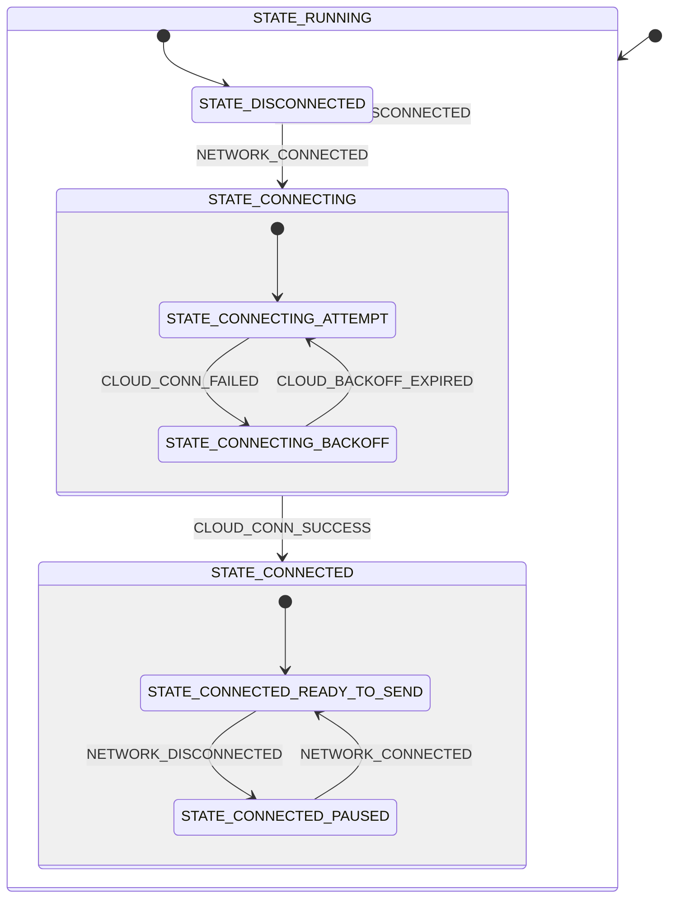

# Cloud module

This module connects and manages communication with [nRF Cloud](https://www.nrfcloud.com/) over CoAP using [nRF Cloud CoAP library](https://docs.nordicsemi.com/bundle/ncs-latest/page/nrf/libraries/networking/nrf_cloud_coap.html) in nRF Connect SDK. It controls the cloud connection, sends data to nRF Cloud, and processes incoming data such as device shadow document. The cloud module uses Zephyr’s state machine framework (SMF) and zbus for messaging with other modules.

The module performs the following tasks:

- Establishing and maintaining a connection to nRF Cloud, using CoAP with DTLS connection ID for secure and low-power communication.
- Managing backoff and retries when connecting to the cloud. See the [Configurations](#configurations) section for more details on how to configure backoff behavior.
- Publishing sensor data (temperature, pressure, connection quality, and so on) to nRF Cloud. The data is received on the `ENVIRONMENTAL_CHAN` channel when the environmental module publishes it.
- Requesting and handling shadow updates. Polling the device shadow is triggered by the main module by sending a `CLOUD_POLL_SHADOW` message.
- Handling network events and transitioning between connection states as described in the [State diagram](#state-diagram) section.

nRF Cloud over CoAP utilizes DTLS connection ID, which allows the device to quickly re-establish a secure connection with the cloud after a network disconnection without the need for a full DTLS handshake. The module uses the nRF Cloud CoAP library to handle the CoAP communication and DTLS connection management.

The following sections cover the module’s main messages, configurations, and state machine. Refer to the source files (`cloud.c`, `cloud.h`, and `Kconfig.cloud`) for implementation details.

## Messages

The cloud module publishes and receives messages over the zbus channel `CLOUD_CHAN`. All module message types are defined in `cloud.h` and used within `cloud.c`.

### Input Messages

- **CLOUD_POLL_SHADOW:**
  Instructs the module to poll the device shadow on nRF Cloud. The device shadow may contain configuration updates for the device.

- **CLOUD_PAYLOAD_JSON:**
  Sends raw JSON data to nRF Cloud.

### Output Messages

- **CLOUD_DISCONNECTED:**
  Indicates that the cloud connection is not established (or has been lost).

- **CLOUD_CONNECTED:**
  Indicates that the module is connected to nRF Cloud and ready to send data.

- **CLOUD_SHADOW_RESPONSE:**
  Returns shadow data or a shadow delta received from nRF Cloud.

The message structure used by the cloud module is defined in `cloud.h`:

```c
struct cloud_msg {
	enum cloud_msg_type type;
	union  {
		struct cloud_payload payload;
		struct cloud_shadow_response response;
	};
};
```

## Configurations

Several Kconfig options in `Kconfig.cloud` control this module’s behavior. The following configuration parameters are associated with this module:

- **CONFIG_APP_CLOUD_SHELL:**
  Enables shell support for cloud operations.

- **CONFIG_APP_CLOUD_PAYLOAD_BUFFER_MAX_SIZE:**
  Defines the maximum size for JSON payloads sent to the cloud.

- **CONFIG_APP_CLOUD_SHADOW_RESPONSE_BUFFER_MAX_SIZE:**
  Sets the maximum buffer size for receiving shadow data.

- **CONFIG_APP_CLOUD_CONFIRMABLE_MESSAGES:**
  Uses confirmable CoAP messages for reliability.

- **CONFIG_APP_CLOUD_BACKOFF_INITIAL_SECONDS:**
  Starting delay (in seconds) before reconnect attempts.

- **CONFIG_APP_CLOUD_BACKOFF_TYPE:**
  Specifies backoff strategy (none, linear, or exponential).

- **CONFIG_APP_CLOUD_BACKOFF_TYPE_EXPONENTIAL:**
  Use exponential backoff time. The backoff time is doubled after each failed attempt until the maximum backoff time is reached.

- **CONFIG_APP_CLOUD_BACKOFF_TYPE_LINEAR:**
  Use linear backoff time. The backoff time is incremented by a fixed amount after each failed attempt until the maximum backoff time is reached.

- **CONFIG_APP_CLOUD_BACKOFF_LINEAR_INCREMENT_SECONDS:**
  If using linear backoff, defines how much time to add after each failed attempt.

- **CONFIG_APP_CLOUD_BACKOFF_MAX_SECONDS:**
  Maximum reconnect backoff limit.

- **CONFIG_APP_CLOUD_THREAD_STACK_SIZE:**
  Stack size for the cloud module’s main thread.

- **CONFIG_APP_CLOUD_MESSAGE_QUEUE_SIZE:**
  Zbus message queue size.

- **CONFIG_APP_CLOUD_WATCHDOG_TIMEOUT_SECONDS:**
  Watchdog timeout for the module’s thread. Must be larger than the message processing timeout.

- **CONFIG_APP_CLOUD_MSG_PROCESSING_TIMEOUT_SECONDS:**
  Maximum time allowed for processing a single incoming message.

For more details on these and other configurations, refer to `Kconfig.cloud`.

## State diagram

The following is a simplified representation of the state machine implemented in `cloud.c`. The module starts in the `STATE_RUNNING` context, which immediately transitions to `STATE_DISCONNECTED` upon initialization. From there, network events and internal conditions drive state transitions.


