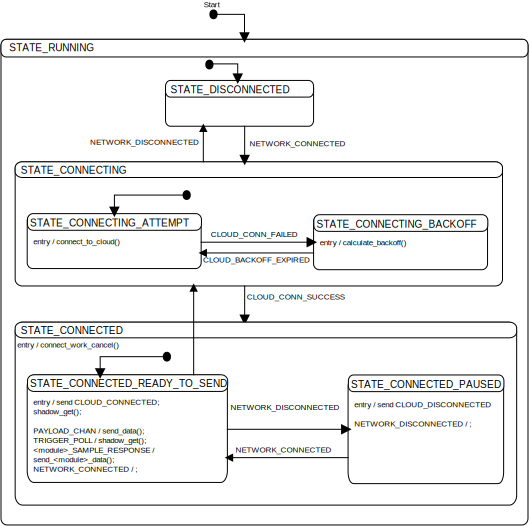

# Cloud module

This module connects and manages communication with [nRF Cloud](https://www.nrfcloud.com/) over CoAP using [nRF Cloud CoAP library](https://docs.nordicsemi.com/bundle/ncs-latest/page/nrf/libraries/networking/nrf_cloud_coap.html) in nRF Connect SDK. It controls the cloud connection, sends data to nRF Cloud, and processes incoming data such as device shadow document. The cloud module uses Zephyr’s state machine framework (SMF) and zbus for messaging with other modules.

The module performs the following tasks:

- Establishing and maintaining a connection to nRF Cloud, using CoAP with DTLS connection ID for secure and low-power communication.
- Managing backoff and retries when connecting to the cloud. See the [Configurations](#configurations) section for more details on how to configure backoff behavior.
- Publishing sensor data (temperature, pressure, battery, location, and so on) to nRF Cloud. Data reaches the cloud module through the [Storage module](storage.md) batch interface on `storage_chan` and `storage_data_chan`.
- Requesting and handling shadow updates. Polling the device shadow is triggered by the main module by sending `CLOUD_SHADOW_GET_DESIRED` or `CLOUD_SHADOW_GET_DELTA` messages.
- Handling network events and transitioning between connection states as described in the [State diagram](#state-diagram) section.

nRF Cloud over CoAP utilizes DTLS connection ID, which allows the device to quickly re-establish a secure connection with the cloud after a network disconnection without the need for a full DTLS handshake. The module uses the nRF Cloud CoAP library to handle the CoAP communication and DTLS connection management.

The following sections cover the module’s main messages, configurations, and state machine. Refer to the source files (`cloud.c`, `cloud.h`, and `Kconfig.cloud`) for implementation details.

## Architecture

### State diagram

The Cloud module implements a state machine with the following states and transitions:



### Integration with storage module

The cloud module subscribes to the `storage_chan` and `storage_data_chan` channels to receive data
from the storage module.
It handles `STORAGE_BATCH_AVAILABLE`, `STORAGE_BATCH_EMPTY`, `STORAGE_BATCH_BUSY`, and
`STORAGE_BATCH_ERROR` messages on the `storage_chan` channel to manage batch data flow.

For each `STORAGE_BATCH_AVAILABLE` event, the cloud module drains the batch by repeatedly
calling `storage_batch_read()` and sending each item to nRF Cloud. Reading an item does not remove it from storage.
Instead, once an item is successfully transmitted, the cloud module publishes `STORAGE_BATCH_CONSUME`, which removes it from the backend and primes the next item.
On a network send error, the session is aborted without consuming the item, so that data is
retained for the next batch attempt. When the batch is drained (or aborted), the cloud
module issues `STORAGE_BATCH_CLOSE` to end the session.

It also handles `STORAGE_DATA` messages on the `storage_data_chan` channel to forward individual data items to nRF Cloud.

## Messages

The cloud module publishes and receives messages over the zbus channel `cloud_chan`. All module message types are defined in `cloud.h` and used within `cloud.c`.

### Input messages

- **CLOUD_SHADOW_GET_DESIRED:**
  Requests the desired section of the device shadow from nRF Cloud.

- **CLOUD_SHADOW_GET_DELTA:**
  Requests the delta section of the device shadow (difference between reported and desired state).

- **CLOUD_SHADOW_SET_REPORTED_CONFIG** / **CLOUD_SHADOW_UPDATE_REPORTED_CONFIG** / **CLOUD_SHADOW_UPDATE_REPORTED_DEVICE:**
  Report configuration, configuration changes, or device info to the shadow's reported section.

- **CLOUD_PAYLOAD_JSON:**
  Sends raw JSON data to nRF Cloud.

- **CLOUD_PROVISIONING_REQUEST:**
  Initiates or re-runs device provisioning through the nRF Cloud provisioning service.

### Output messages

- **CLOUD_DISCONNECTED:**
  Indicates that the cloud connection is not established (or has been lost).

- **CLOUD_CONNECTED:**
  Indicates that the module is connected to nRF Cloud and ready to send data.

- **CLOUD_SHADOW_RESPONSE_DESIRED** / **CLOUD_SHADOW_RESPONSE_DELTA:**
  Return CBOR-encoded shadow data from the desired or delta section.

- **CLOUD_SHADOW_RESPONSE_EMPTY_DESIRED** / **CLOUD_SHADOW_RESPONSE_EMPTY_DELTA:**
  Indicate that the requested shadow section has no data.

- **CLOUD_PROVISIONED:**
  Indicates that provisioning completed and the device is ready to connect.

The message structure used by the cloud module is defined in `cloud.h`:

```c
struct cloud_msg {
	enum cloud_msg_type type;
	union  {
		struct cloud_payload payload;
		struct cloud_shadow_response response;
	};
};
```

## Configurations

Several Kconfig options in `Kconfig.cloud` control this module’s behavior. The following configuration parameters are associated with this module:

- **CONFIG_APP_CLOUD_SHELL:**
  Enables shell support for cloud operations.

- **CONFIG_APP_CLOUD_PAYLOAD_BUFFER_MAX_SIZE:**
  Defines the maximum size for JSON payloads sent to the cloud.

- **CONFIG_APP_CLOUD_SHADOW_RESPONSE_BUFFER_MAX_SIZE:**
  Sets the maximum buffer size for receiving shadow data.

- **CONFIG_APP_CLOUD_CONFIRMABLE_MESSAGES:**
  Uses confirmable CoAP messages for reliability.

- **CONFIG_APP_CLOUD_BACKOFF_INITIAL_SECONDS:**
  Starting delay (in seconds) before reconnect attempts.

- **CONFIG_APP_CLOUD_BACKOFF_TYPE:**
  Specifies backoff strategy (none, linear, or exponential).

- **CONFIG_APP_CLOUD_BACKOFF_TYPE_EXPONENTIAL:**
  Use exponential backoff time. The backoff time is doubled after each failed attempt until the maximum backoff time is reached.

- **CONFIG_APP_CLOUD_BACKOFF_TYPE_LINEAR:**
  Use linear backoff time. The backoff time is incremented by a fixed amount after each failed attempt until the maximum backoff time is reached.

- **CONFIG_APP_CLOUD_BACKOFF_LINEAR_INCREMENT_SECONDS:**
  If using linear backoff, defines how much time to add after each failed attempt.

- **CONFIG_APP_CLOUD_BACKOFF_MAX_SECONDS:**
  Maximum reconnect backoff limit.

- **CONFIG_APP_CLOUD_HANDLE_WRONG_SAMPLE_TIMESTAMPS_DROP:**
  Drops samples with invalid timestamps when sending data to the cloud.

- **CONFIG_APP_CLOUD_HANDLE_WRONG_SAMPLE_TIMESTAMPS_KEEP:**
  Sends samples with invalid timestamps to the cloud without modification.

- **CONFIG_APP_CLOUD_HANDLE_WRONG_SAMPLE_TIMESTAMPS_NOW:**
  Replaces invalid timestamps with the current time before sending to the cloud.

- **CONFIG_APP_CLOUD_HANDLE_WRONG_SAMPLE_TIMESTAMPS_NO_TIMESTAMP:**
  Sends samples with invalid timestamps to the cloud with `NRF_CLOUD_NO_TIMESTAMP`, which makes nRF Cloud assign the timestamp upon reception.

- **CONFIG_APP_CLOUD_THREAD_STACK_SIZE:**
  Stack size for the cloud module’s main thread.

- **CONFIG_APP_CLOUD_MESSAGE_QUEUE_SIZE:**
  Zbus message queue size.

- **CONFIG_APP_CLOUD_WATCHDOG_TIMEOUT_SECONDS:**
  Watchdog timeout for the module’s thread. Must be larger than the message processing timeout.

- **CONFIG_APP_CLOUD_MSG_PROCESSING_TIMEOUT_SECONDS:**
  Maximum time allowed for processing a single incoming message.

For more details on these and other configurations, refer to `Kconfig.cloud`.

### Shell commands

When `CONFIG_APP_CLOUD_SHELL` is enabled:

```bash
att_cloud publish <appid> <data>   # Publish custom data to nRF Cloud
att_cloud provision                # Connect to the nRF Cloud provisioning service
att_cloud poll_shadow_delta        # Poll the device shadow delta for configuration updates
```
