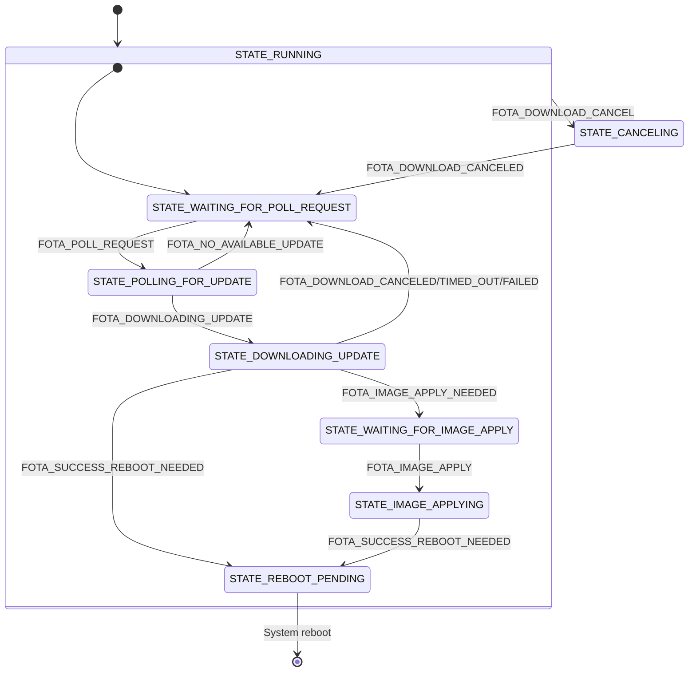

# FOTA module

The FOTA (Firmware Over-The-Air) module manages firmware updates for both the application and, if supported, modem firmware. It interacts with nRF Cloud to check for available updates, coordinates the download of new firmware images, and handles the application or activation of the firmware.

## Messages

The FOTA module communicates via the zbus channel `FOTA_CHAN`, using input and output messages defined in `fota.h`.
All input messages are requests from the application to the FOTA module. The output messages may be responses to input messages or notifications from the FOTA module to the application.

### Input Messages

- **FOTA_POLL_REQUEST**
  Request to check the cloud for pending updates.
- **FOTA_DOWNLOAD_CANCEL**
  Cancel any ongoing FOTA download.
- **FOTA_IMAGE_APPLY**
  Apply the downloaded image (possibly requiring network disconnection).

### Output Messages

- **FOTA_DOWNLOADING_UPDATE**
  Indicates that a firmware image is being downloaded.
- **FOTA_DOWNLOAD_CANCELED**
  Confirms a canceled download.
- **FOTA_DOWNLOAD_FAILED**
  Reports an error during download.
- **FOTA_DOWNLOAD_TIMED_OUT**
  Signals a download that exceeded the allowed time window.
- **FOTA_IMAGE_APPLY_NEEDED**
  Alerts that the downloaded image is ready to be applied (network disconnection may be required).
- **FOTA_SUCCESS_REBOOT_NEEDED**
  Tells the system to reboot after a successful download and image application.

## Configurations

The following Kconfig options can be used to customize the FOTA module’s behavior:

- **CONFIG_APP_FOTA_THREAD_STACK_SIZE**
  Size of the stack for the FOTA module’s thread.
- **CONFIG_APP_FOTA_MSG_PROCESSING_TIMEOUT_SECONDS**
  Maximum time allowed for processing individual FOTA messages.
- **CONFIG_APP_FOTA_WATCHDOG_TIMEOUT_SECONDS**
  Watchdog timeout for the FOTA operation to ensure timely completion.

## State diagram

