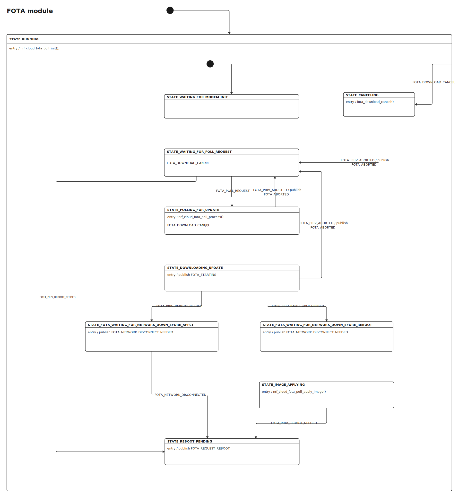

# FOTA module

The FOTA (Firmware Over-The-Air) module manages remote firmware updates for both application and modem firmware. It handles all the stages of the update process:

* Polling nRF Cloud for available updates.
* Downloading firmware images.
* Applying updates.

The update process begins when the module receives a `FOTA_POLL_REQUEST` message, typically triggered by the main application module. When an update is available, the module automatically initiates the download without requiring additional commands.

The module supports three firmware image types:

* **Application**: Updates the main application firmware.
* **Delta Modem**: Incremental modem firmware updates for minor version changes.
* **Full Modem**: Complete modem firmware replacements.

Once a download has started, the module publishes `FOTA_STARTING` so the application can move into its FOTA state. Application and delta modem images are marked ready after the download completes; full modem images require an additional apply step that can only run while the modem is offline.

When the module needs the network to be disconnected (for example, to apply a full modem image or to release modem resources before reboot), it publishes `FOTA_NETWORK_DISCONNECT_NEEDED`. The application must then:

1. Disconnect from the cellular network.
2. Reply with `FOTA_NETWORK_DISCONNECTED` once the network is down.

The FOTA module then continues the sequence and, when the device is ready to reboot with the new image staged, publishes `FOTA_REQUEST_REBOOT`. If the update cannot complete (download failure, timeout, cancellation, rejection, or no update available), the module publishes `FOTA_ABORTED` and the application can resume normal operation.

## Architecture

### State diagram

The FOTA module implements a state machine with the following states and transitions:



## Messages

The FOTA module communicates through the zbus channel `fota_chan`, using input and output messages defined in `fota.h`.
All input messages are requests from the application to the FOTA module. The output messages may be responses to input messages or notifications from the FOTA module to the application.

### Input messages

- **FOTA_POLL_REQUEST:**
  Request to check the cloud for pending updates.

- **FOTA_DOWNLOAD_CANCEL:**
  Cancel any ongoing FOTA download.

- **FOTA_NETWORK_DISCONNECTED:**
  Reply to `FOTA_NETWORK_DISCONNECT_NEEDED` indicating that the application has disconnected the network and the FOTA module may continue.

### Output messages

- **FOTA_MODULE_READY:**
  Indicates that the FOTA module has finished initialization and is ready to accept requests.

- **FOTA_STARTING:**
  A FOTA download has started. The application should move into its FOTA-handling state.

- **FOTA_NETWORK_DISCONNECT_NEEDED:**
  The module needs the network to be disconnected before it can continue. The application is expected to disconnect the network and reply with `FOTA_NETWORK_DISCONNECTED`.

- **FOTA_REQUEST_REBOOT:**
  The FOTA sequence completed successfully, and the update is staged and ready to be applied on reboot. It is the application's responsibility to trigger the reboot.

- **FOTA_ABORTED:**
  The FOTA sequence was aborted. This covers all non-success terminations: download failed, timed out, was canceled or rejected, or no update was available.

## Configuration

The following Kconfig options can be used to customize the FOTA module's behavior:

- **CONFIG_APP_FOTA_THREAD_STACK_SIZE:**
  Size of the stack for the FOTA module's thread.
- **CONFIG_APP_FOTA_MSG_PROCESSING_TIMEOUT_SECONDS:**
  Maximum time allowed for processing individual FOTA messages.
- **CONFIG_APP_FOTA_SHELL:**
  Enables shell support for FOTA operations.
- **CONFIG_APP_FOTA_WATCHDOG_TIMEOUT_SECONDS:**
  Watchdog timeout for the FOTA operation to ensure timely completion.

### Shell commands

When `CONFIG_APP_FOTA_SHELL` is enabled:

```bash
att_fota poll    # Poll nRF Cloud for pending firmware updates
```

The `poll` command publishes a `FOTA_POLL_REQUEST` on `fota_chan`, instructing the FOTA module to check nRF Cloud for available firmware updates. If an update is available, the FOTA module starts the download automatically. See the [Firmware updates (FOTA)](../common/fota.md) guide for more details.
