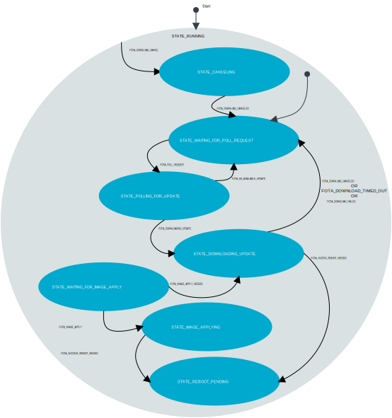

# FOTA module

The FOTA (Firmware Over-The-Air) module manages remote firmware updates for both application and modem firmware. It handles all the stages of the update process:

* Polling nRF Cloud for available updates.
* Downloading firmware images.
* Applying updates.

The update process begins when the module receives a `FOTA_POLL_REQUEST` message, typically triggered by the main application module. When an update is available, the module automatically initiates the download without requiring additional commands.

The module supports three firmware image types:

* **Application**: Updates the main application firmware.
* **Delta Modem**: Incremental modem firmware updates for minor version changes.
* **Full Modem**: Complete modem firmware replacements.

Application and delta modem images are marked ready for their respective bootloaders after download is completed and applied automatically on the next device reboot. When these downloads complete successfully, the module publishes a `FOTA_SUCCESS_REBOOT_NEEDED` message to indicate that a reboot is required to apply the update.

Full modem updates require that the device disconnects from the network before applying the update. For these updates, the module first sends a `FOTA_IMAGE_APPLY_NEEDED` message. The main application must then:

1. Disconnect from the cellular network.
1. Send a `FOTA_IMAGE_APPLY` message to the FOTA module.
1. Wait for the `FOTA_SUCCESS_REBOOT_NEEDED` message that indicates successful application of the new modem firmware.

All update operations feature error handling with appropriate status messages, allowing the application to recover gracefully from download failures or interruptions.

## Messages

The FOTA module communicates through the zbus channel `FOTA_CHAN`, using input and output messages defined in `fota.h`.
All input messages are requests from the application to the FOTA module. The output messages may be responses to input messages or notifications from the FOTA module to the application.

### Input Messages

- **FOTA_POLL_REQUEST:**
  Request to check the cloud for pending updates.

- **FOTA_DOWNLOAD_CANCEL:**
  Cancel any ongoing FOTA download.

- **FOTA_IMAGE_APPLY:**
  Apply the downloaded image (possibly requiring network disconnection).

### Output Messages

- **FOTA_DOWNLOADING_UPDATE:**
  Indicates that a firmware image is being downloaded.

- **FOTA_DOWNLOAD_CANCELED:**
  Confirms a canceled download.

- **FOTA_DOWNLOAD_FAILED:**
  Reports an error during download.

- **FOTA_DOWNLOAD_TIMED_OUT:**
  Signals a download that exceeded the allowed time window.

- **FOTA_IMAGE_APPLY_NEEDED:**
  Alerts that the downloaded image is ready to be applied (network disconnection may be required).

- **FOTA_SUCCESS_REBOOT_NEEDED:**
  Tells the system to reboot after a successful download and image application.

## Configuration

The following Kconfig options can be used to customize the FOTA module's behavior:

- **CONFIG_APP_FOTA_THREAD_STACK_SIZE:**
  Size of the stack for the FOTA module's thread.
- **CONFIG_APP_FOTA_MSG_PROCESSING_TIMEOUT_SECONDS:**
  Maximum time allowed for processing individual FOTA messages.
- **CONFIG_APP_FOTA_WATCHDOG_TIMEOUT_SECONDS:**
  Watchdog timeout for the FOTA operation to ensure timely completion.

## State diagram

The following is a simplified representation of the state machine implemented in the FOTA module:

