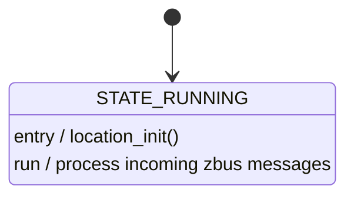

# Location module

This module manages location services using the [Location library](https://docs.nordicsemi.com/bundle/ncs-latest/page/nrf/libraries/modem/location.html) in the nRF Connect SDK. It handles GNSS (Global Navigation Satellite System) initialization, location requests, and processes location events. The module uses Zephyr's state machine framework (SMF) and zbus for messaging with other modules.

The module performs the following tasks:

- Initializing and managing the location library and GNSS functionality.
- Handling location requests and processing location events.
- Managing different location methods (GNSS, cellular, Wi-Fi) and fallback scenarios.
- Updating system time using GNSS time data when available.
- Publishing location status updates to other modules.

The location module works in conjunction with the network module, as GNSS functionality can only be initialized after the modem is initialized and enabled. It uses the Location library's event handler to process various location-related events and publish status updates through the zbus messaging system.

In the following sections, the module's main messages, configurations, and state machine are covered. Refer to the source files (`location.c`, `location.h`, and `Kconfig.location`) for implementation details.

## Messages

The location module publishes and receives messages over the zbus channel `LOCATION_CHAN`. All module message types are defined in `location.h` and used within `location.c`.

### Input Messages

- **LOCATION_SEARCH_TRIGGER**
  Triggers a location search request. The module will attempt to get the current location using configured methods.

### Output Messages

- **LOCATION_SEARCH_STARTED**
  Indicates that a location search has been initiated.

- **LOCATION_SEARCH_DONE**
  Indicates that a location search has completed (successfully or with error/timeout).

- **LOCATION_CLOUD_REQUEST**
  Contains cellular neighbor cell and/or Wi-Fi access point information that should be sent to cloud services for location resolution.

- **LOCATION_AGNSS_REQUEST**
  Indicates that A-GNSS assistance data is needed for GNSS positioning.

The message types used by the location module are defined in `location.h`:

```c
enum location_msg_type {
    LOCATION_SEARCH_STARTED = 0x1,
    LOCATION_SEARCH_DONE,
    LOCATION_SEARCH_TRIGGER,
    LOCATION_CLOUD_REQUEST,
    LOCATION_AGNSS_REQUEST,
};
```

## Configurations

Several Kconfig options in `Kconfig.location` control this module's behavior. The following configuration parameters are associated with this module::

- **CONFIG_APP_LOCATION:**
  Enables the location module. Automatically selected if **CONFIG_LOCATION** is enabled.

- **CONFIG_APP_LOCATION_THREAD_STACK_SIZE:**
  Stack size for the location module's main thread.

- **CONFIG_APP_LOCATION_WATCHDOG_TIMEOUT_SECONDS:**
  Watchdog timeout for the module's thread (default: 120 seconds).
  This covers both:

  - Waiting for an incoming message in zbus_sub_wait_msg()
  - Time spent processing the message, defined by the **CONFIG_APP_LOCATION_MSG_PROCESSING_TIMEOUT_SECONDS** Kconfig option.

  Must be larger than **CONFIG_APP_LOCATION_MSG_PROCESSING_TIMEOUT_SECONDS**.
  A small difference between the two can mean more frequent watchdog feeds, which increases power consumption.

- **CONFIG_APP_LOCATION_MSG_PROCESSING_TIMEOUT_SECONDS:**
  Maximum time allowed for processing a single message (default: 60 seconds).
  Must be smaller than the value set in the **CONFIG_APP_LOCATION_WATCHDOG_TIMEOUT_SECONDS** Kconfig option.

For more details on these configurations, refer to `Kconfig.location`.

## State diagram

The following is a representation of the state machine implemented in `location.c`. The module uses a single state (**STATE_RUNNING**) with an entry function that initializes the location library and a run function that processes incoming messages.


