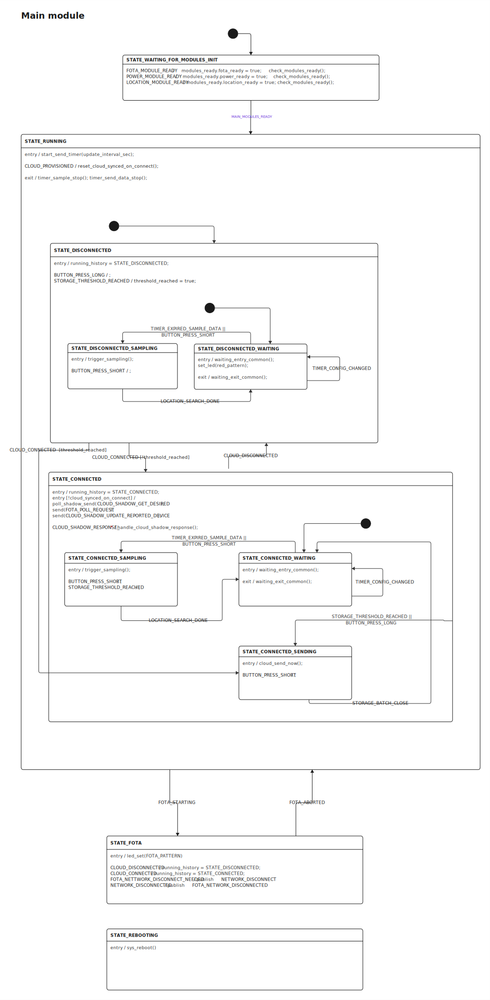

# Main module

The Main module serves as the central control unit of the Asset Tracker Template. It implements a hierarchical state machine that coordinates the activities of all other modules through [zbus](https://docs.nordicsemi.com/bundle/ncs-latest/page/zephyr/services/zbus/index.html) messages.
This module handles the application's business logic, including cloud connectivity, data sampling, firmware updates, configuration updates, and user interactions.

## Architecture

### State diagram

The Main module implements a state machine with the following states and transitions:

### Connection lifecycle

The Main module owns the connection lifecycle. On startup it publishes `NETWORK_CONNECT_TN` to start a terrestrial (TN) search. When the cloud connection is lost, it schedules a new TN search using an exponential back-off, starting at 60 seconds and capped by `CONFIG_APP_RECONNECT_BACKOFF_MAX_SECONDS`.

NTN is a fallback bearer only. A fresh cloud connection (DTLS handshake and JWT authentication) is never established over NTN; NTN is used solely to resume an existing cloud session through the DTLS connection ID. The Main module tracks the session lifetime through the `CLOUD_SESSION_ESTABLISHED` and `CLOUD_SESSION_STOPPED` messages and only falls back to NTN on `NETWORK_TN_SEARCH_FAILED` while a session is alive. Without a session, a failed TN search schedules a TN retry instead.

While connected over NTN, the module periodically returns to TN:

- A recovery timer (`CONFIG_APP_TN_RECOVERY_INTERVAL_SECONDS`) disconnects from NTN, which pauses the cloud session, and searches for TN. If the search fails, the session is resumed over NTN again.
- A sampling cycle started while on NTN triggers the same bounce, because the modem cannot run GNSS or cellular location in NTN system mode. Sensor data is sampled in place, then the bearer is bounced. If TN is found, the location sample is taken there. If not, the NTN reconnect is requested with `.fresh_location` set so the GNSS fix acquired during the attach doubles as the location sample.

## Messages

The main module does not implement messages available to other modules. Instead, it processes messages from other modules to control the application's behavior.
It subscribes to messages on the following zbus channels:

The Main module uses the following zbus channels, both for subscribing to incoming data and publishing outbound requests or status updates:

| Zbus Channels          | Description                                                                                |
|------------------------|--------------------------------------------------------------------------------------------|
| **button_chan**        | Process user button presses to trigger data samples or sending.                            |
| **cloud_chan**         | Receive connectivity status and cloud responses. Trigger device shadow polling.            |
| **storage_chan**       | Control the storage module and receive status responses.                                   |
| **environmental_chan** | Request sensor data from the environmental module.                                         |
| **fota_chan**          | Poll for FOTA updates, manage the FOTA process, and apply updates.                         |
| **led_chan**           | Update LED patterns to indicate system state.                                              |
| **location_chan**      | Request new location data when samples are due.                                            |
| **network_chan**       | Control LTE network connection and track cellular connectivity events.                     |
| **power_chan**         | Request battery status and initiate low-power mode.                                        |
| **timer_chan**         | Handle timer events for sampling.                                                          |

## LED status indicators

The Main module uses LED colors to indicate different device states:

- **Red** (Blinking, 10 repetitions): Device is idle and disconnected from cloud.
- **Blue** (Blinking, 10 repetitions): Device is actively sampling data.
- **Green** (Blinking, 10 repetitions): Device is sending data to cloud.
- **Purple** (Blinking): FOTA download in progress.

## Configuration

The Main module can be configured using the following Kconfig options:

* **CONFIG_APP_LOG_LEVEL:**
  Controls logging level for the main module.

* **CONFIG_APP_SAMPLING_INTERVAL_SECONDS:**
  Default sensor data sampling interval in buffer mode. Triggers sensor sampling and location search.

* **CONFIG_APP_MSG_PROCESSING_TIMEOUT_SECONDS:**
  Maximum time allowed for processing a single message.

* **CONFIG_APP_WATCHDOG_TIMEOUT_SECONDS:**
  Defines the watchdog timeout for the main module.

* **CONFIG_APP_RECONNECT_BACKOFF_MAX_SECONDS:**
  Upper bound for the network reconnect back-off. The delay before the next TN search doubles on each consecutive failure until it reaches this value.

* **CONFIG_APP_TN_RECOVERY_INTERVAL_SECONDS:**
  Interval between attempts to return to TN while connected over NTN.
