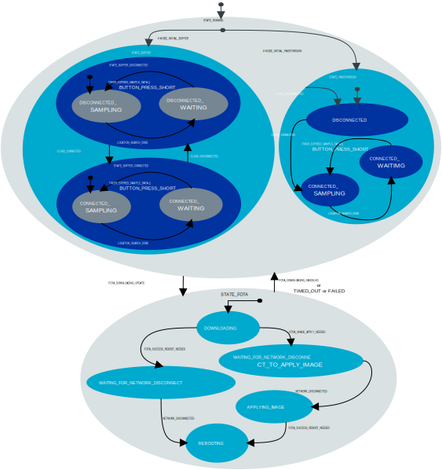

# Main module

The Main module serves as the central control unit of the Asset Tracker Template. It implements a hierarchical state machine that coordinates the activities of all other modules through [zbus](https://docs.nordicsemi.com/bundle/ncs-latest/page/zephyr/services/zbus/index.html) messages.
This module handles the application's business logic, including cloud connectivity, data sampling, firmware updates, configuration updates, and user interactions.

## Messages

The main module does not implement messages available to other modules. Instead, it processes messages from other modules to control the application's behavior.
It subscribes to messages on the following zbus channels:

The Main module uses the following zbus channels, both for subscribing to incoming data and publishing outbound requests or status updates:

| Zbus Channels       | Description                                                                                   |
|---------------------|-----------------------------------------------------------------------------------------------|
| **BUTTON_CHAN**     | Processes user button presses for manually triggering data samples.                           |
| **CLOUD_CHAN**      | Receive connectivity status (connected, disconnected) and cloud response data. Trigger device shadow polling to retrieve configuration updates. |
| **STORAGE_CHAN**    | Control the storage module and receive control or status responses. |
| **ENVIRONMENTAL_CHAN** | Request sensor data from the environmental module.                                           |
| **FOTA_CHAN**       | Poll for FOTA updates and manage the FOTA process. Apply FOTA updates to install the new firmware image. |
| **LED_CHAN**        | Update LED pattern to indicate system state.                                                  |
| **LOCATION_CHAN**   | Requests new location data when a sample is due.                                              |
| **NETWORK_CHAN**    | Control LTE network connection. Track cellular connectivity events. Request network quality samples. |
| **POWER_CHAN**      | Request battery status. Initiate low-power mode.                                              |
| **TIMER_CHAN**      | Handle timer events for sampling.                                                         |

## Configuration

The Main module can be configured using the following Kconfig options:

* **CONFIG_APP_LOG_LEVEL:**
  Controls logging level for the main module.

* **CONFIG_APP_BUFFER_MODE_SAMPLING_INTERVAL_SECONDS:**
  Default sensor data sampling interval in buffer mode. Triggers sensor sampling and location search.

* **CONFIG_APP_CLOUD_UPDATE_INTERVAL_SECONDS:**
  Interval for cloud synchronization activities, including polling and data sending. Triggers cloud shadow and FOTA status polling.
  In passthrough mode, this option also controls how often data is sampled and sent to cloud.

* **CONFIG_APP_REQUEST_NETWORK_QUALITY:**
  When enabled, requests network quality metrics during regular sampling.

* **CONFIG_APP_MSG_PROCESSING_TIMEOUT_SECONDS:**
  Maximum time allowed for processing a single message.

* **CONFIG_APP_WATCHDOG_TIMEOUT_SECONDS:**
  Defines the watchdog timeout for the main module.

## State diagram

The Main module implements a hierarchical state machine with the following states:

