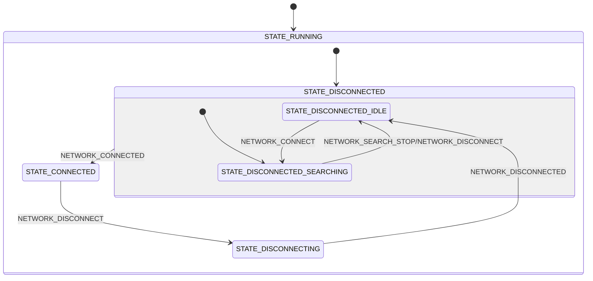

# Network module

The Network module manages the cellular connectivity for applications running on nRF91 Series devices. It handles network connection states, system mode configuration, power saving configurations, and network quality monitoring. It utilizes the Zephyr network management APIs and the [LTE Link Control](https://docs.nordicsemi.com/bundle/ncs-2.9.0/page/nrf/libraries/modem/lte_lc.html) library from the nRF Connect SDK to control the modem and monitor network events. Internally, the module implements a state machine that uses Zephyr's [State Machine Framework](https://docs.zephyrproject.org/latest/services/smf/index.html).

The module is designed to by default search for a suitable network automatically on startup and then maintain the connection for the lifetime of the application.
The library can also be configured to be fully controlled by the application instead, giving closer control over the LTE link and current consumption.
See the [Configurations](#configurations) section for more information.

## Messages

The network module communicates via the zbus channel ``NETWORK_CHAN``.
The messages are defined in `network.h`. A message consists of a type and optional data. Each message is either an input message or an output message.
All input messages are requests from the application to the network module. The output messages may be responses to input messages or notifications from the network module to the application.

The following messages are supported:

### Input Messages

- **NETWORK_CONNECT**: Request to connect to the network.
- **NETWORK_DISCONNECT**: Request to disconnect from the network.
- **NETWORK_SEARCH_STOP**: Stop searching for a network. The module will not attempt to connect to a network until a new `NETWORK_CONNECT` message is received.
- **NETWORK_SYSTEM_MODE_REQUEST**: Request to retrieve the current system mode. The response will be sent as a `NETWORK_SYSTEM_MODE_RESPONSE` message.
- **NETWORK_SYSTEM_MODE_SET_LTEM**: Request to set the system mode to only use LTE-M only.
- **NETWORK_SYSTEM_MODE_SET_NBIOT**: Request to set the system mode to only use NB-IoT only.
- **NETWORK_SYSTEM_MODE_SET_LTEM_NBIOT**: Request to set the system mode to use both LTE-M and NB-IoT.
- **NETWORK_QUALITY_SAMPLE_REQUEST**: Request to sample the current network connection quality. The response will be sent as a `NETWORK_QUALITY_SAMPLE_RESPONSE` message.

### Output Messages

- **NETWORK_DISCONNECTED**: The device is disconnected from the network.
- **NETWORK_CONNECTED**: The device is connected to the network and has an IP address.
- **NETWORK_MODEM_RESET_LOOP**: The modem has detected a reset loop with too many attach requests within a short time.
- **NETWORK_UICC_FAILURE**: The modem has detected an error with the SIM card. Confirm that it is installed correctly.
- **NETWORK_LIGHT_SEARCH_DONE**: The modem has completed a light search based on previous cell history without finding a suitable cell. This message can be used to stop the search to save power.
- **NETWORK_ATTACH_REJECTED**: A network attach request has been rejected by the network.
- **NETWORK_PSM_PARAMS**: PSM parameters have been received (in the `.psm_cfg` field of the message).
- **NETWORK_EDRX_PARAMS**: eDRX parameters have been received (in `.edrx_cfg` field).
- **NETWORK_SYSTEM_MODE_RESPONSE**: Response to a system mode request (`NETWORK_SYSTEM_MODE_REQUEST`) with current mode in `.system_mode` field.
- **NETWORK_QUALITY_SAMPLE_RESPONSE**: Response to a quality sample request (`NETWORK_QUALITY_SAMPLE_REQUEST`) with data in `.conn_eval_params` field.

### Message Structure

The network module uses the `struct network_msg` structure for communication:

```c
struct network_msg {
    enum network_msg_type type;
    union {
        enum lte_lc_system_mode system_mode;
        struct lte_lc_psm_cfg psm_cfg;
        struct lte_lc_edrx_cfg edrx_cfg;
        struct lte_lc_conn_eval_params conn_eval_params;
    };
};
```

## Configurations

The Network module can be configured using the following Kconfig options:

- **CONFIG_APP_NETWORK_THREAD_STACK_SIZE**: Sets the stack size for the network module thread.

- **CONFIG_APP_NETWORK_WATCHDOG_TIMEOUT_SECONDS**: Defines the timeout in seconds for the network module watchdog. This timeout covers both waiting for incoming messages and message processing time.

- **CONFIG_APP_NETWORK_MSG_PROCESSING_TIMEOUT_SECONDS**: Sets the maximum time allowed for processing a single message in the module's state machine. This value must be smaller than the watchdog timeout.

- **CONFIG_APP_NETWORK_SEARCH_NETWORK_ON_STARTUP**: When enabled, the module will automatically search for a network on startup. If disabled, network search must be triggered by a NETWORK_CONNECT message.

- **CONFIG_APP_NETWORK_LOG_LEVEL_***: Controls the logging level for the network module. This follows Zephyr's standard logging configuration pattern.

## State Diagram

The Network module implements a state machine with the following states and transitions:


