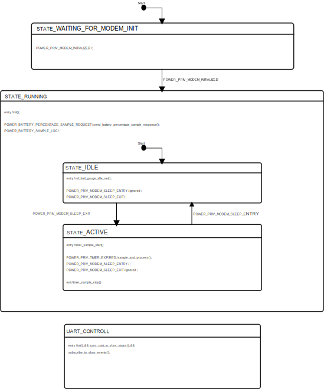

# Power module

The power module manages power-related functionality for devices with nPM1300,
like the Thingy:91 X, including the following:

- Monitoring battery voltage and calculating remaining battery percentage.
- Tracking modem sleep and wake events to adjust fuel gauge behaviour.
- Reading VBUS (USB) status to inform the fuel gauge of the current
  charging state.
- Publishing battery percentage updates via zbus messages.

## Architecture

### State diagram

The Power module implements a hierarchical state machine with the following
states and transitions:



### States

- **STATE_WAITING_FOR_MODEM_INIT:** The initial state, where the system waits for the modem
library to complete initialization before proceeding.
- **STATE_RUNNING:** Parent state entered after modem initialization.
At this level, battery sampling requests are handled regardless of the sub-state.

    - **STATE_ACTIVE:** Default sub-state of `STATE_RUNNING`. In this state, the fuel gauge is sampled periodically based on the timer controlled by
    `CONFIG_APP_POWER_SAMPLE_INTERVAL_MS`. It is entered when the modem wakes up from sleep.
    - **STATE_IDLE:** Sub-state entered when the modem enters sleep. Calls `nrf_fuel_gauge_idle_set()` with the configured idle current
    (`CONFIG_APP_POWER_IDLE_CURRENT_NA`) so the fuel gauge can estimate consumption while sampling is paused.

## Messages

The Power module defines and communicates on the `power_chan` channel.

### Input messages

- **POWER_BATTERY_PERCENTAGE_SAMPLE_REQUEST:**
  Requests a battery percentage sample. The module replies with the most
  recently sampled values in a `POWER_BATTERY_PERCENTAGE_SAMPLE_RESPONSE`
  message.

- **POWER_BATTERY_SAMPLE_LOG:**
  Available only when `CONFIG_APP_POWER_SHELL` is enabled. Requests the
  module to log the latest sampled battery data (voltage, current,
  temperature, percentage, and charging status) to the console.

### Output messages

- **POWER_MODULE_READY:**
  Published when the module has completed initialization and entered
  `STATE_RUNNING`.

- **POWER_BATTERY_PERCENTAGE_SAMPLE_RESPONSE:**
  Contains the latest battery percentage, voltage, charging status and a
  timestamp.

The power message structure is defined in `power.h`:

```c
struct power_msg {
	enum power_msg_type type;

	/** Current charge of the battery in percentage. */
	double percentage;

	/** True if the battery is charging, false otherwise. */
	bool charging;

	/** Voltage in volts. */
	double voltage;

	/** Timestamp when the sample was taken in milliseconds.
	 *  Either Unix time (if the system clock was synchronized) or uptime.
	 *  Only valid for POWER_BATTERY_PERCENTAGE_SAMPLE_RESPONSE messages.
	 */
	int64_t timestamp;
};
```

## Configurations

The following Kconfig options control this module’s behavior:

- **CONFIG_APP_POWER:**
  Enables the Power module.

- **CONFIG_APP_POWER_IDLE_CURRENT_NA:**
  Idle current in nanoamperes used by the fuel gauge for battery life
  estimation when the modem is in sleep and the module is in
  `STATE_IDLE`.

- **CONFIG_APP_POWER_SAMPLE_INTERVAL_MS:**
  Interval in milliseconds between periodic fuel gauge samples while in
  `STATE_ACTIVE`.

- **CONFIG_APP_POWER_THREAD_STACK_SIZE:**
  Size of the Power module’s thread stack.

- **CONFIG_APP_POWER_WATCHDOG_TIMEOUT_SECONDS:**
  Defines the watchdog timeout for the module. Must be larger than the
  message processing timeout.

- **CONFIG_APP_POWER_MSG_PROCESSING_TIMEOUT_SECONDS:**
  Maximum time spent processing a single message.

See the `Kconfig.power` file in the module's directory for more details on the available Kconfig options.

## Kconfig and device tree

- The Power module uses `npm1300_charger` as specified by device tree.
