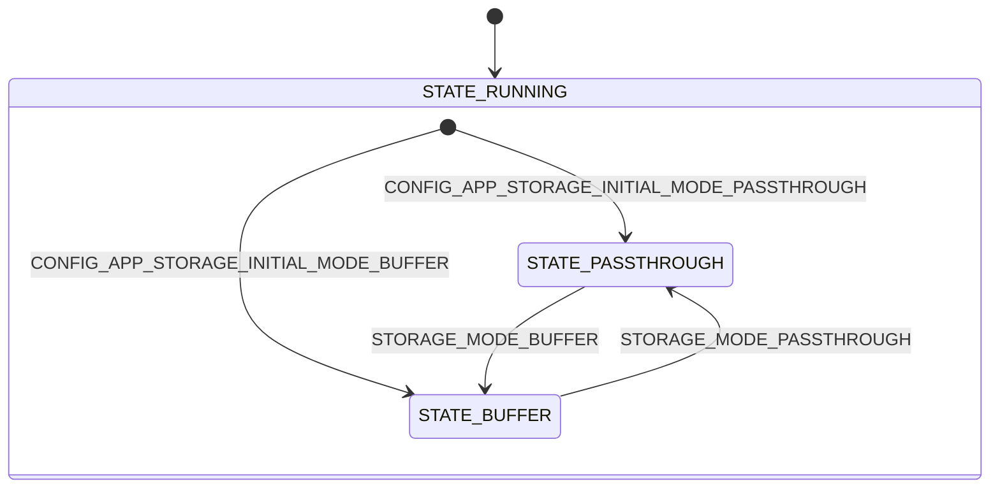
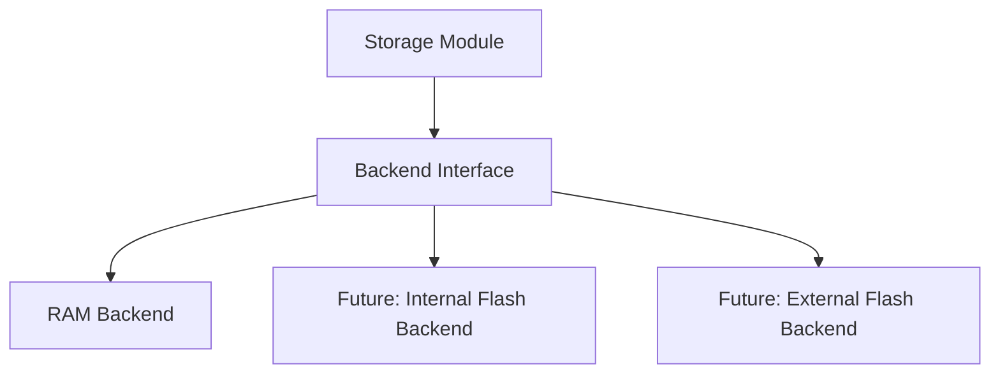
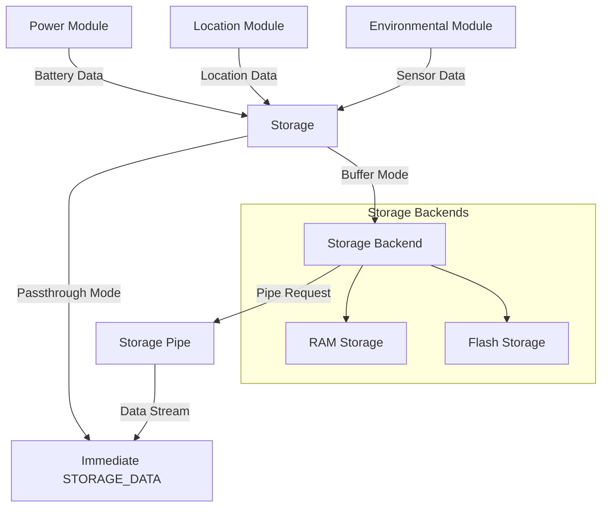

# Storage module

The storage module provides flexible data storage capabilities for the Asset Tracker Template using a state machine-based architecture. It can operate in two primary modes: passthrough mode for real-time data forwarding and buffer mode for persistent data storage with configurable backends.

The module's key responsibilities include:

- **Dual-mode operation**: Passthrough mode for real-time data forwarding, buffer mode for persistent storage
- **Batch-based data access**: Safe, concurrent access to stored data using batch interface
- **Pluggable storage backends**: Support for storage backends with abstraction layer
- **State machine architecture**: Uses Zephyr's State Machine Framework (SMF) for robust state management

The storage module implements a hierarchical state machine with a parent state (RUNNING) and two operational child states (PASSTHROUGH, BUFFER). The system uses a registration mechanism that automatically discovers data types from enabled modules. The parent state handles administrative operations while child states determine data flow behavior: either storage in configurable backends or immediate forwarding.

Below, the module's architecture, messages, configurations, and usage are covered. Refer to the source files (`storage.c`, `storage.h`, `storage_backend.h`, and `Kconfig.storage`) for implementation details.

## Architecture

### State Machine Design

The storage module implements a hierarchical state machine with three states using Zephyr's State Machine Framework (SMF):



As indicated in the diagram, the initial transition is to the PASSTHROUGH state if `CONFIG_APP_STORAGE_INITIAL_MODE_PASSTHROUGH` is enabled, otherwise the initial transition is to the BUFFER state if `CONFIG_APP_STORAGE_INITIAL_MODE_BUFFER` is enabled.

**State Descriptions:**

- **STATE_RUNNING**: Parent state that handles backend initialization and administrative operations (stats, clear, FIFO operations). Automatically transitions to either PASSTHROUGH or BUFFER mode based on configuration.
- **STATE_PASSTHROUGH**: Child state where data is forwarded immediately as `STORAGE_DATA` messages without storage
- **STATE_BUFFER**: Child state where data is stored in the configured backend and can be retrieved on demand

### Storage Backend Architecture

The storage module uses a pluggable backend system that abstracts the underlying storage mechanism:



Each backend implements the same interface defined in `storage_backend.h`, providing operations for:

- Initialize storage
- Store data records
- Retrieve data records
- Count stored records
- Clear all data

### Data Flow Architecture



### Memory management

This module allocates RAM from several places. Understanding these helps you tune it down:

- Built-in batch pipe buffer: `CONFIG_APP_STORAGE_BATCH_BUFFER_SIZE` bytes are reserved at boot.
- Per-type slabs: Each enabled data type declares a `k_mem_slab` with
  `CONFIG_APP_STORAGE_MAX_RECORDS_PER_TYPE` blocks of that type's size.
- RAM backend ring buffers: For each enabled data type, a ring buffer is declared with capacity
  `sizeof(type) * CONFIG_APP_STORAGE_MAX_RECORDS_PER_TYPE`.
- Message buffers: `struct storage_msg` carries a `buffer[STORAGE_MAX_DATA_SIZE]`, where
  `STORAGE_MAX_DATA_SIZE` is the max size of any enabled data type. Enabling large types increases
  this buffer and several temporary buffers.
- Subscriber queue: Size is controlled by system zbus configuration.
- Thread stack: `CONFIG_APP_STORAGE_THREAD_STACK_SIZE`.

#### How to reduce RAM

- Minimize enabled data types
  - Disable modules you do not forward/store (for example `CONFIG_APP_LOCATION=n`), which reduces
    both slabs and RAM backend ring buffers, and shrinks `STORAGE_MAX_DATA_SIZE`.

- Reduce records per type
  - Set `CONFIG_APP_STORAGE_MAX_RECORDS_PER_TYPE=1` when buffering is not needed. This shrinks both
    the per-type slabs and RAM ring buffers to a single record each.

- Shrink batch pipe buffer
  - Lower `CONFIG_APP_STORAGE_BATCH_BUFFER_SIZE` as much as possible. The batch pipe is allocated
    unconditionally, but it is only used in buffer mode. If you never use batch/buffer, pick a
    very small value (for example 64–256 bytes). If you do use batch, ensure it can hold
    `sizeof(header) + max_item_size`.

- Reduce thread and queues
  - Lower `CONFIG_APP_STORAGE_THREAD_STACK_SIZE` (for example from 2048 down to 1024) if your
    application leaves headroom.
  - Reduce relevant zbus queue sizes in system config if traffic allows.

- Remove development features
  - Disable `CONFIG_APP_STORAGE_SHELL` and `CONFIG_APP_STORAGE_SHELL_STATS` to trim RAM/code.

- Prefer passthrough when persistence is not required
  - Keep the module in passthrough mode so the backend store path is not exercised at runtime.

#### Passthrough-only minimal RAM example

If your application will only ever operate in passthrough mode (no buffering, no batch), the
following `prj.conf` excerpt minimizes RAM usage for the storage module while preserving
passthrough forwarding:

```config
# Storage enabled, start and stay in passthrough
CONFIG_APP_STORAGE=y
CONFIG_APP_STORAGE_INITIAL_MODE_PASSTHROUGH=y

# Backend selection
CONFIG_APP_STORAGE_BACKEND_RAM=y

# Keep only a single slot per type (no buffering planned)
CONFIG_APP_STORAGE_MAX_RECORDS_PER_TYPE=1

# Make batch pipe tiny since batch will never be used
CONFIG_APP_STORAGE_BATCH_BUFFER_SIZE=128

# Trim runtime resources
CONFIG_APP_STORAGE_THREAD_STACK_SIZE=1024

# Drop development features
CONFIG_APP_STORAGE_SHELL=n
CONFIG_APP_STORAGE_SHELL_STATS=n

# Optional: Disable heavy data types you do not forward
# CONFIG_APP_LOCATION=n
# CONFIG_APP_ENVIRONMENTAL=n
# CONFIG_APP_NETWORK=n
```

Notes:

- If you later enable buffer/batch, increase `CONFIG_APP_STORAGE_BATCH_BUFFER_SIZE` so that at
  least one header plus the largest item fits.
- The actual RAM consumed by ring buffers and slabs scales with which data types are enabled and
  the value of `CONFIG_APP_STORAGE_MAX_RECORDS_PER_TYPE`.

## Messages

The storage module communicates through two zbus channels: `STORAGE_CHAN` and `STORAGE_DATA_CHAN`. All message types are defined in `storage.h`.

### Input Messages (Commands)

**Mode Control:**

- **`STORAGE_MODE_PASSTHROUGH_REQUEST`**
  Request to switch from buffer mode to passthrough mode. On success, the module replies with
  `STORAGE_MODE_PASSTHROUGH`. If the change is unsafe (for example, batch session active), the
  module replies with `STORAGE_MODE_CHANGE_REJECTED`.

- **`STORAGE_MODE_BUFFER_REQUEST`**
  Request to switch from passthrough mode to buffer mode. On success, the module replies with
  `STORAGE_MODE_BUFFER`. If the change is unsafe, the module replies with
  `STORAGE_MODE_CHANGE_REJECTED`.

**Data Operations (handled by parent RUNNING state):**

- **`STORAGE_FLUSH`**
  Flushes stored data one item at a time as individual `STORAGE_DATA` messages. Data is sent in FIFO order per type. Available in both operational modes.

- **`STORAGE_BATCH_REQUEST`**
  Requests access to stored data via batch interface. Responds with `STORAGE_BATCH_AVAILABLE`, `STORAGE_BATCH_EMPTY`, `STORAGE_BATCH_BUSY`, or `STORAGE_BATCH_ERROR`. Available in both operational modes.

- **`STORAGE_CLEAR`**
  Clears all stored data from the backend. Available in both operational modes.

**Diagnostics (handled by parent RUNNING state):**

- **`STORAGE_STATS`**
  Requests storage statistics (requires `CONFIG_APP_STORAGE_SHELL_STATS`). Statistics are logged to the console. Available in both operational modes.

### Output Messages (Responses)

**Mode confirmation:**

- **`STORAGE_MODE_PASSTHROUGH`**
  Mode change to passthrough confirmed.

- **`STORAGE_MODE_BUFFER`**
  Mode change to buffer confirmed.

- **`STORAGE_MODE_CHANGE_REJECTED`**
  Mode change rejected due to safety constraints. See `reject_reason` in `struct storage_msg`.

**Data Messages:**

- **`STORAGE_DATA`**
  Contains stored data being flushed or forwarded. Includes data type and the actual data payload.

**Batch Status:**

- **`STORAGE_BATCH_AVAILABLE`**
  Batch is ready for reading. Message includes total item count available and session ID.

- **`STORAGE_BATCH_EMPTY`**
  No stored data available; batch is empty.

- **`STORAGE_BATCH_BUSY`**
  Another module is currently using the batch session.

- **`STORAGE_BATCH_ERROR`**
  Error occurred during batch operation.

### Message Structure

The message structure used by the storage module is defined in `storage.h`:

```c
struct storage_msg {
    enum storage_msg_type type;           /* Message type */
    enum storage_data_type data_type;     /* Data type for STORAGE_DATA */
    union {
        uint8_t buffer[STORAGE_MAX_DATA_SIZE];
        uint32_t session_id;              /* Batch session id */
        enum storage_reject_reason reject_reason; /* For MODE_CHANGE_REJECTED */
    };
    uint32_t data_len: 31;                /* Length or count */
    bool     more_data: 1;                /* More data available in batch */
};
```

## Configurations

The storage module is configurable through Kconfig options in `Kconfig.storage`. Key configuration categories include:

### Storage Backend

- **`CONFIG_APP_STORAGE_BACKEND_RAM`** (default and only backend currently provided)
  Uses RAM for storage. Data is lost on power cycle but provides fast access.

### Memory Configuration

- **`CONFIG_APP_STORAGE_MAX_TYPES`** (default: 3)
  Maximum number of different data types that can be registered. Affects RAM usage.

- **`CONFIG_APP_STORAGE_MAX_RECORDS_PER_TYPE`** (default: 32)
  Maximum records stored per data type. Total RAM usage = MAX_TYPES × MAX_RECORDS_PER_TYPE × RECORD_SIZE.


- **`CONFIG_APP_STORAGE_BATCH_BUFFER_SIZE`** (default: 1024)
  Size of the internal buffer for batch data access.

### Message Handling


### Thread Configuration

- **`CONFIG_APP_STORAGE_THREAD_STACK_SIZE`** (default: 2048)
  Stack size for the storage module's main thread.

- **`CONFIG_APP_STORAGE_WATCHDOG_TIMEOUT_SECONDS`** (default: 60)
  Watchdog timeout for detecting stuck operations.

- **`CONFIG_APP_STORAGE_MSG_PROCESSING_TIMEOUT_SECONDS`** (default: 5)
  Maximum time for processing a single message.

### Operational Modes

- **`CONFIG_APP_STORAGE_INITIAL_MODE_PASSTHROUGH`** (default)
  Automatically transition from RUNNING to PASSTHROUGH state on startup for immediate data forwarding.

- **`CONFIG_APP_STORAGE_INITIAL_MODE_BUFFER`**
  Automatically transition from RUNNING to BUFFER state on startup for data storage.

### Flash backend

No flash backend is currently provided.

### Development Features

- **`CONFIG_APP_STORAGE_SHELL`** (default: y)
  Enable shell commands for storage interaction.

- **`CONFIG_APP_STORAGE_SHELL_STATS`**
  Enable statistics commands (increases code size).

For complete configuration details, refer to `Kconfig.storage`.

## API Documentation

### Channels

#### STORAGE_CHAN

Primary zbus channel for controlling the storage module and receiving control/status responses.

**Input Message Types:**

- `STORAGE_MODE_PASSTHROUGH_REQUEST` - Request passthrough mode
- `STORAGE_MODE_BUFFER_REQUEST` - Request buffer mode
- `STORAGE_FLUSH` - Flush stored data as individual messages
- `STORAGE_BATCH_REQUEST` - Request batch access to stored data
- `STORAGE_CLEAR` - Clear all stored data
- `STORAGE_STATS` - Display storage statistics

**Output Message Types:**

- `STORAGE_MODE_PASSTHROUGH` - Mode change confirmed
- `STORAGE_MODE_BUFFER` - Mode change confirmed
- `STORAGE_MODE_CHANGE_REJECTED` - Mode change rejected
- `STORAGE_BATCH_AVAILABLE` - Batch ready with data
- `STORAGE_BATCH_EMPTY` - No data available
- `STORAGE_BATCH_BUSY` - Another session active
- `STORAGE_BATCH_ERROR` - Error accessing data

#### STORAGE_DATA_CHAN

Dedicated channel for `STORAGE_DATA` payload messages to avoid self-flooding and race conditions.
Subscribers interested in data should observe this channel.

**Output Message Types:**

- `STORAGE_DATA` - Contains stored or forwarded data

### Data Type Registration

Data types are automatically registered using the `DATA_SOURCE_LIST` macro in `storage_data_types.h`. The system currently supports:

- **Battery data** (when `CONFIG_APP_POWER` enabled)
- **Location data** (when `CONFIG_APP_LOCATION` enabled)
- **Environmental data** (when `CONFIG_APP_ENVIRONMENTAL` enabled)

Each data type registration includes:

- Source channel to subscribe to
- Message type filtering function
- Data extraction function
- Storage data type identifier

### Backend Interface

Storage backends implement the interface defined in `storage_backend.h`:

```c
struct storage_backend {
    int (*init)(void);
    int (*store)(const struct storage_data *type, void *data, size_t size);
    int (*retrieve)(const struct storage_data *type, void *data, size_t size);
    int (*count)(const struct storage_data *type);
    int (*clear)(void);
};
```

### Storage Data Structure

When using batch operations, data is provided in `storage_data_item` structures:

```c
struct storage_data_item {
    enum storage_data_type type;            /* Data type */
    union storage_data_type_buf data;       /* Actual data */
};
```

### Batch Read Helper Function

The storage module provides ONE convenience function for reading batch data:

```c
int storage_batch_read(struct storage_data_item *out_item, k_timeout_t timeout);
```

This is the ONLY direct API function provided by the storage module. It reads stored data through the batch interface, handling header parsing and data extraction automatically. All other operations (requesting batch access, session management, etc.) go through zbus messages. The `session_id` is carried in the zbus messages and not passed to this function.

**Important**: This function should only be called after receiving a `STORAGE_BATCH_AVAILABLE` message in response to a `STORAGE_BATCH_REQUEST`. When done consuming all items, send `STORAGE_BATCH_CLOSE` with the same session_id.

## Usage

### Switching Storage Modes

**Switch to Passthrough Mode:**

```c
struct storage_msg msg = {
    .type = STORAGE_MODE_PASSTHROUGH_REQUEST,
};

zbus_chan_pub(&STORAGE_CHAN, &msg, K_SECONDS(1));
```

**Switch to Buffer Mode:**

```c
struct storage_msg msg = {
    .type = STORAGE_MODE_BUFFER_REQUEST,
};

zbus_chan_pub(&STORAGE_CHAN, &msg, K_SECONDS(1));
```

Note: Mode transition messages are ignored if the module is already in the requested mode. The initial mode is determined by configuration (`CONFIG_APP_STORAGE_INITIAL_MODE_*`).

### Retrieving Stored Data

**Flush Individual Records:**

In the storage module, the `STORAGE_FLUSH` message is used to flush individual records from the storage backend. This message is sent to the storage module and the storage module will then send a `STORAGE_DATA` message for each record that is flushed.
Note that this may result in a large number of `STORAGE_DATA` messages being sent, which may fill up subscribers' message queues and cause unintended behavior.
Therefore, it is recommended to use `STORAGE_FLUSH` with care, and only when the number of records to flush is within the limits of the subscriber's message queue.

```c
struct storage_msg msg = {
    .type = STORAGE_FLUSH,
};

zbus_chan_pub(&STORAGE_CHAN, &msg, K_SECONDS(1));

/* Process incoming STORAGE_DATA messages on STORAGE_DATA_CHAN */
```

**Use batch for bulk access:**

For larger numbers of records, it is recommended to use the batch mechanism. The batch mechanism is a more efficient way to retrieve data from the storage backend, as it allows for bulk retrieval of data with proper concurrency control.

When using the batch mechanism, the `STORAGE_BATCH_REQUEST` message is used to request access to stored data. The storage module will respond with one of the following:

- `STORAGE_BATCH_AVAILABLE`: Batch is ready, data available for reading
- `STORAGE_BATCH_EMPTY`: No stored data available
- `STORAGE_BATCH_BUSY`: Another module is currently using the batch
- `STORAGE_BATCH_ERROR`: An error occurred

The batch buffer size is configurable through the `CONFIG_APP_STORAGE_BATCH_BUFFER_SIZE` Kconfig option.
When batch access is requested, the storage module automatically populates the buffer with data from the storage backend.
The receiving module processes batch data using the `storage_batch_read()` convenience function.
Sessions should be explicitly closed by the consumer with `STORAGE_BATCH_CLOSE` when done.

The following code snippet shows how to request batch access:

```c
struct storage_msg msg = {
    .type = STORAGE_BATCH_REQUEST,
    .session_id = 0x12345678, /* Pick your own per-session id */
};

zbus_chan_pub(&STORAGE_CHAN, &msg, K_SECONDS(1));
```

To process the batch data, the receiving module can use the following code:

```c
/* Wait for STORAGE_BATCH_AVAILABLE response on STORAGE_CHAN */
if (response.type == STORAGE_BATCH_AVAILABLE) {
    size_t total_items = response.data_len;
    uint32_t session_id = response.session_id;

    /* Process batch data using the convenience function */
    struct storage_data_item item;
    while (storage_batch_read(&item, K_SECONDS(1)) == 0) {
        /* Access data: item.data */
        /* Process based on item.type */
        switch (item.type) {
        case STORAGE_TYPE_BATTERY:
            /* Handle battery data: item.data.BATTERY */
            break;
        case STORAGE_TYPE_ENVIRONMENTAL:
            /* Handle environmental data: item.data.ENVIRONMENTAL */
            break;
        /* ... other types ... */
        }
    }

    /* Explicitly close the session when done */
    struct storage_msg close_msg = {
        .type = STORAGE_BATCH_CLOSE,
        .session_id = session_id,
    };

    zbus_chan_pub(&STORAGE_CHAN, &close_msg, K_SECONDS(1));
}

/* Handle other responses */
if (response.type == STORAGE_BATCH_EMPTY) {
    /* No data available */
}
if (response.type == STORAGE_BATCH_BUSY) {
    /* Another module is using the batch, retry later */
}
```

### Processing Storage Data

When receiving `STORAGE_DATA` messages on `STORAGE_DATA_CHAN`:

```c
void handle_storage_data(const struct storage_msg *msg) {
    switch (msg->data_type) {
    case STORAGE_TYPE_BATTERY:
        double *battery_level = (double *)msg->buffer;
        /* Process battery data */
        break;

    case STORAGE_TYPE_LOCATION:
        enum location_msg_type *location = (enum location_msg_type *)msg->buffer;
        /* Process location data */
        break;

    case STORAGE_TYPE_ENVIRONMENTAL:
        struct environmental_msg *env = (struct environmental_msg *)msg->buffer;
        /* Process environmental data */
        break;
    }
}
```

### Administrative Operations

**Clear All Data:**

```c
struct storage_msg msg = {
    .type = STORAGE_CLEAR,
};

zbus_chan_pub(&STORAGE_CHAN, &msg, K_SECONDS(1));
```

**View Statistics** (requires `CONFIG_APP_STORAGE_SHELL_STATS`):

```c
struct storage_msg msg = {
    .type = STORAGE_STATS,
};

zbus_chan_pub(&STORAGE_CHAN, &msg, K_SECONDS(1));
/* Statistics logged to console */
```

### Shell Commands

When `CONFIG_APP_STORAGE_SHELL` is enabled:

```bash
# Switch modes
storage mode passthrough
storage mode buffer

# Flush data
storage flush

# Clear data
storage clear

# (No fifo_clear command)

# View statistics (if CONFIG_APP_STORAGE_SHELL_STATS enabled)
storage stats
```

## Backend Implementation

To add a new storage backend:

1. **Implement the backend interface:**

```c
static int my_backend_init(void) { /* Initialize */ }
static int my_backend_store(const struct storage_data *type, void *data, size_t size) { /* Store */ }
static int my_backend_retrieve(const struct storage_data *type, void *data, size_t size) { /* Retrieve */ }
static int my_backend_count(const struct storage_data *type) { /* Count records */ }
static int my_backend_clear(void) { /* Clear all */ }

static const struct storage_backend my_backend = {
    .init = my_backend_init,
    .store = my_backend_store,
    .retrieve = my_backend_retrieve,
    .count = my_backend_count,
    .clear = my_backend_clear,
};
```

1. **Register the backend:**

```c
const struct storage_backend *storage_backend_get(void) {
    return &my_backend;
}
```

1. **Add Kconfig option:**

```kconfig
config APP_STORAGE_BACKEND_MY_BACKEND
    bool "My custom storage backend"
    help
      Use my custom storage implementation.
```

## Dependencies

- **Zephyr kernel** - Core OS functionality
- **Zbus messaging system** - Inter-module communication
- **State Machine Framework (SMF)** - State management
- **Task watchdog** - System reliability monitoring
- **Memory slab allocator** - FIFO memory management
- **Selected storage backend** - RAM or flash storage
- **Iterable sections** - Automatic data type discovery
