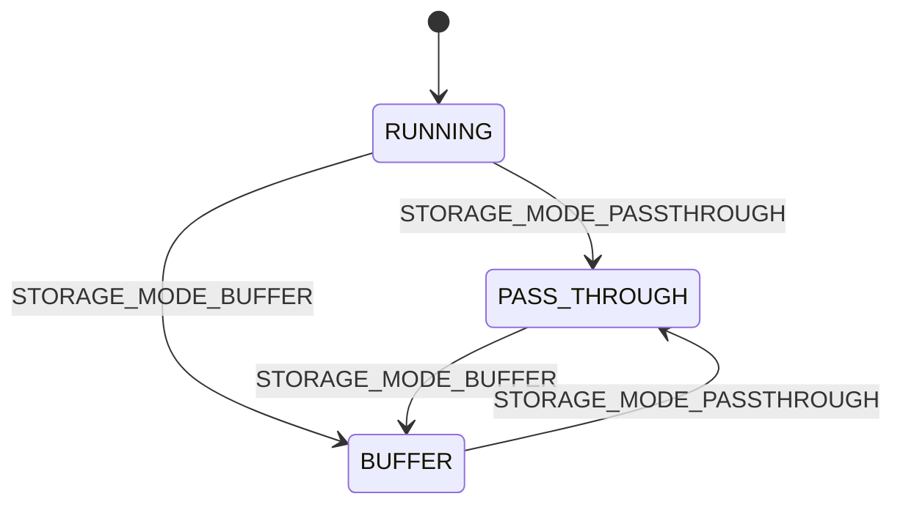
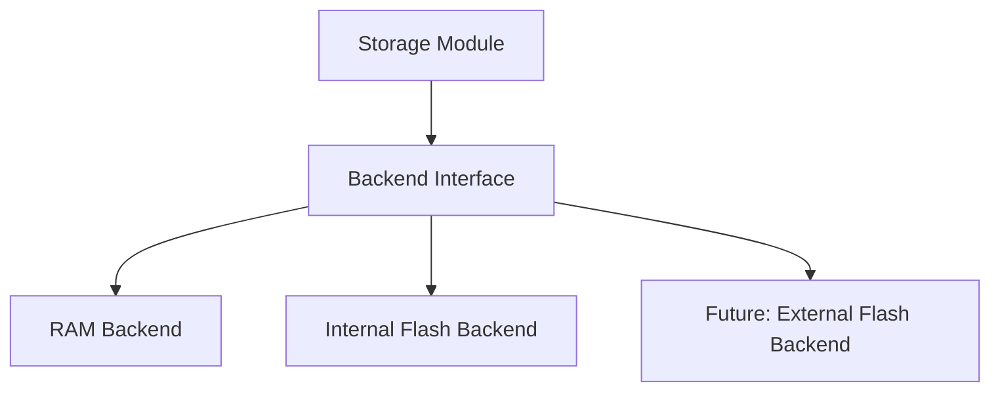
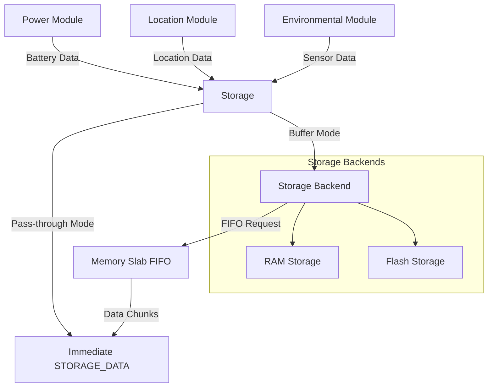

# Storage module

The storage module provides flexible data storage capabilities for the Asset Tracker Template using a state machine-based architecture. It can operate in two primary modes: pass-through mode for real-time data forwarding and buffer mode for persistent data storage with configurable backends.

The module's key responsibilities include:

- **Dual-mode operation**: Pass-through mode for real-time data forwarding, buffer mode for persistent storage
- **Pluggable storage backends**: Support for RAM and internal flash storage with abstraction layer
- **FIFO-based data management**: Memory slab allocation for efficient data handling and transfer
- **State machine architecture**: Uses Zephyr's State Machine Framework (SMF) for robust state management
- **Automatic data type discovery**: Leverages Zephyr's iterable sections for runtime registration
- **Watchdog integration**: Built-in task watchdog for system reliability

The storage module implements a sophisticated state machine with three states (RUNNING, PASS_THROUGH, BUFFER) and uses a registration system that automatically discovers data types from enabled modules. Data can be stored persistently in configurable backends or forwarded immediately depending on the operating mode.

Below, the module's architecture, messages, configurations, and usage are covered. Refer to the source files (`storage.c`, `storage.h`, `storage_backend.h`, and `Kconfig.storage`) for implementation details.

## Architecture

### State Machine Design

The storage module implements a state machine with three states using Zephyr's State Machine Framework (SMF):



**State Descriptions:**

- **RUNNING**: Initial state that handles backend initialization and transitions to operational modes
- **PASS_THROUGH**: Data is forwarded immediately as `STORAGE_DATA` messages without storage
- **BUFFER**: Data is stored in the configured backend and can be retrieved on demand

### Storage Backend Architecture

The storage module uses a pluggable backend system that abstracts the underlying storage mechanism:



Each backend implements the same interface defined in `storage_backend.h`, providing operations for:

- Initialize storage
- Store data records
- Retrieve data records
- Count stored records
- Clear all data

### Data Flow Architecture



### Memory Management

The storage module uses Zephyr's memory slab allocator for FIFO operations:

- Each registered data type gets its own memory slab pool
- FIFO chunks are allocated from type-specific slabs
- Automatic cleanup through callback functions
- Configurable pool sizes per data type

## Messages

The storage module communicates through the zbus channel `STORAGE_CHAN`. All message types are defined in `storage.h`.

### Input Messages (Commands)

**Mode Control:**

- **`STORAGE_MODE_PASSTHROUGH`**
  Switches the module to pass-through mode. Data from registered channels is immediately forwarded as `STORAGE_DATA` messages without any storage.

- **`STORAGE_MODE_BUFFER`**
  Switches the module to buffer mode. Data is stored in the configured backend and can be retrieved later.

**Data Operations:**

- **`STORAGE_FLUSH`**
  Flushes stored data one item at a time as individual `STORAGE_DATA` messages. Data is sent in FIFO order per type.

- **`STORAGE_FLUSH_TO_FIFO`**
  Populates the internal FIFO with stored data. The FIFO provides efficient batch access to stored records.

- **`STORAGE_FIFO_REQUEST`**
  Requests access to stored data via FIFO. Responds with `STORAGE_FIFO_AVAILABLE`, `STORAGE_FIFO_EMPTY`, or `STORAGE_FIFO_NOT_AVAILABLE`.

- **`STORAGE_CLEAR`**
  Clears all stored data from the backend and empties the FIFO.

**Diagnostics:**

- **`STORAGE_STATS`**
  Requests storage statistics (requires `CONFIG_APP_STORAGE_SHELL_STATS`). Statistics are logged to the console.

### Output Messages (Responses)

**Data Messages:**

- **`STORAGE_DATA`**
  Contains stored data being flushed or forwarded. Includes data type and the actual data payload.

**FIFO Status:**

- **`STORAGE_FIFO_AVAILABLE`**
  FIFO is populated with stored data. Message includes pointer to FIFO and item count.

- **`STORAGE_FIFO_EMPTY`**
  No stored data available; FIFO is empty.

- **`STORAGE_FIFO_NOT_AVAILABLE`**
  Error occurred while populating FIFO (e.g., backend failure).

### Message Structure

The message structure used by the storage module is defined in `storage.h`:

```c
struct storage_msg {
    /* Type of message */
    enum storage_msg_type type;

    /* Type of data in buffer/FIFO */
    enum storage_data_type data_type;

    union {
        /* Buffer for data (used with STORAGE_DATA) */
        uint8_t buffer[CONFIG_APP_STORAGE_MSG_BUF_SIZE];

        /* Pointer to FIFO (used with STORAGE_FIFO_AVAILABLE) */
        struct k_fifo *fifo;
    };

    /* Length of data in buffer or number of FIFO items */
    size_t data_len;
};
```

## Configurations

The storage module is highly configurable through Kconfig options in `Kconfig.storage`. Key configuration categories include:

### Storage Backend Selection

- **`CONFIG_APP_STORAGE_BACKEND_RAM`** (default)
  Uses RAM for storage. Data is lost on power cycle but provides fast access.

- **`CONFIG_APP_STORAGE_BACKEND_INTERNAL_FLASH`**
  Uses internal flash for persistent storage. Data survives power cycles.

### Memory Configuration

- **`CONFIG_APP_STORAGE_RECORD_SIZE`** (default: 32)
  Size of a single storage record in bytes. Must accommodate the largest data sample.

- **`CONFIG_APP_STORAGE_MAX_TYPES`** (default: 3)
  Maximum number of different data types that can be registered. Affects RAM usage.

- **`CONFIG_APP_STORAGE_MAX_RECORDS_PER_TYPE`** (default: 32)
  Maximum records stored per data type. Total RAM usage = MAX_TYPES × MAX_RECORDS_PER_TYPE × RECORD_SIZE.

- **`CONFIG_APP_STORAGE_RAM_LIMIT_KB`** (default: 64)
  Maximum RAM usage limit in KB for build-time validation.

- **`CONFIG_APP_STORAGE_FIFO_ITEM_COUNT`** (default: 20)
  Number of memory slabs available for FIFO operations per data type.

### Message Handling

- **`CONFIG_APP_STORAGE_MSG_BUF_SIZE`** (default: 64)
  Size of message buffer for data transfer. Must fit the largest data sample.

- **`CONFIG_APP_STORAGE_MESSAGE_QUEUE_SIZE`** (default: 10)
  Size of the zbus subscriber message queue.

### Thread Configuration

- **`CONFIG_APP_STORAGE_THREAD_STACK_SIZE`** (default: 1024)
  Stack size for the storage module's main thread.

- **`CONFIG_APP_STORAGE_WATCHDOG_TIMEOUT_SECONDS`** (default: 60)
  Watchdog timeout for detecting stuck operations.

- **`CONFIG_APP_STORAGE_MSG_PROCESSING_TIMEOUT_SECONDS`** (default: 5)
  Maximum time for processing a single message.

### Operational Modes

- **`CONFIG_APP_STORAGE_INITIAL_MODE_PASS_THROUGH`** (default)
  Start in pass-through mode for immediate data forwarding.

- **`CONFIG_APP_STORAGE_INITIAL_MODE_BUFFER`**
  Start in buffer mode for data storage.

### Flash Backend Configuration

When using `CONFIG_APP_STORAGE_BACKEND_INTERNAL_FLASH`:

- **`CONFIG_APP_STORAGE_FLASH_PARTITION_LABEL`** (default: "storage")
  Device tree partition label for flash storage area.

- **`CONFIG_APP_STORAGE_FLASH_AREA_SIZE`** (default: 4096)
  Size in bytes of the flash storage area.

### Development Features

- **`CONFIG_APP_STORAGE_SHELL`** (default: y)
  Enable shell commands for storage interaction.

- **`CONFIG_APP_STORAGE_SHELL_STATS`**
  Enable statistics commands (increases code size).

For complete configuration details, refer to `Kconfig.storage`.

## API Documentation

### Channels

#### STORAGE_CHAN

Primary zbus channel for controlling the storage module and receiving data.

**Input Message Types:**

- `STORAGE_MODE_PASSTHROUGH` - Switch to pass-through mode
- `STORAGE_MODE_BUFFER` - Switch to buffer mode
- `STORAGE_FLUSH` - Flush stored data as individual messages
- `STORAGE_FLUSH_TO_FIFO` - Populate FIFO with stored data
- `STORAGE_FIFO_REQUEST` - Request FIFO access to stored data
- `STORAGE_CLEAR` - Clear all stored data
- `STORAGE_STATS` - Display storage statistics

**Output Message Types:**

- `STORAGE_DATA` - Contains stored or forwarded data
- `STORAGE_FIFO_AVAILABLE` - FIFO populated with data
- `STORAGE_FIFO_EMPTY` - No data available
- `STORAGE_FIFO_NOT_AVAILABLE` - Error accessing data

### Data Type Registration

Data types are automatically registered using the `DATA_SOURCE_LIST` macro in `storage_data_types.h`. The system currently supports:

- **Battery data** (when `CONFIG_APP_POWER` enabled)
- **Location data** (when `CONFIG_APP_LOCATION` enabled)
- **Environmental data** (when `CONFIG_APP_ENVIRONMENTAL` enabled)

Each data type registration includes:

- Source channel to monitor
- Message type filtering function
- Data extraction function
- Storage data type identifier

### Backend Interface

Storage backends implement the interface defined in `storage_backend.h`:

```c
struct storage_backend {
    int (*init)(void);
    int (*store)(const struct storage_data *type, void *data, size_t size);
    int (*retrieve)(const struct storage_data *type, void *data, size_t size);
    int (*count)(const struct storage_data *type);
    int (*clear)(void);
};
```

### FIFO Data Structure

When using FIFO operations, data is provided in `storage_data_chunk` structures:

```c
struct storage_data_chunk {
    void *fifo_reserved;                    /* Internal use */
    enum storage_data_type type;            /* Data type */
    void (*finished)(struct storage_data_chunk *chunk);  /* Cleanup callback */
    union storage_data_type_buf data;       /* Actual data */
};
```

## Usage

### Switching Storage Modes

**Switch to Pass-through Mode:**

```c
struct storage_msg msg = {
    .type = STORAGE_MODE_PASSTHROUGH,
};
zbus_chan_pub(&STORAGE_CHAN, &msg, K_SECONDS(1));
```

**Switch to Buffer Mode:**

```c
struct storage_msg msg = {
    .type = STORAGE_MODE_BUFFER,
};
zbus_chan_pub(&STORAGE_CHAN, &msg, K_SECONDS(1));
```

### Retrieving Stored Data

**Flush Individual Records:**

```c
struct storage_msg msg = {
    .type = STORAGE_FLUSH,
};
zbus_chan_pub(&STORAGE_CHAN, &msg, K_SECONDS(1));

/* Process incoming STORAGE_DATA messages */
```

**Use FIFO for Batch Access:**

```c
struct storage_msg msg = {
    .type = STORAGE_FIFO_REQUEST,
};
zbus_chan_pub(&STORAGE_CHAN, &msg, K_SECONDS(1));

/* Wait for STORAGE_FIFO_AVAILABLE response */
if (response.type == STORAGE_FIFO_AVAILABLE) {
    struct k_fifo *data_fifo = response.fifo;
    size_t item_count = response.data_len;

    /* Process FIFO items */
    struct storage_data_chunk *chunk;
    while ((chunk = k_fifo_get(data_fifo, K_NO_WAIT)) != NULL) {
        /* Access data: chunk->data */
        /* Call cleanup when done: chunk->finished(chunk) */
    }
}
```

### Processing Storage Data

When receiving `STORAGE_DATA` messages:

```c
void handle_storage_data(const struct storage_msg *msg) {
    switch (msg->data_type) {
    case STORAGE_TYPE_BATTERY:
        double *battery_level = (double *)msg->buffer;
        /* Process battery data */
        break;

    case STORAGE_TYPE_LOCATION:
        enum location_msg_type *location = (enum location_msg_type *)msg->buffer;
        /* Process location data */
        break;

    case STORAGE_TYPE_ENVIRONMENTAL:
        struct environmental_msg *env = (struct environmental_msg *)msg->buffer;
        /* Process environmental data */
        break;
    }
}
```

### Administrative Operations

**Clear All Data:**

```c
struct storage_msg msg = {
    .type = STORAGE_CLEAR,
};
zbus_chan_pub(&STORAGE_CHAN, &msg, K_SECONDS(1));
```

**View Statistics** (requires `CONFIG_APP_STORAGE_SHELL_STATS`):

```c
struct storage_msg msg = {
    .type = STORAGE_STATS,
};
zbus_chan_pub(&STORAGE_CHAN, &msg, K_SECONDS(1));
/* Statistics logged to console */
```

### Shell Commands

When `CONFIG_APP_STORAGE_SHELL` is enabled:

```bash
# Switch modes
storage mode passthrough
storage mode buffer

# Flush data
storage flush

# Clear data
storage clear

# View statistics (if CONFIG_APP_STORAGE_SHELL_STATS enabled)
storage stats
```

## Dependencies

- **Zephyr kernel** - Core OS functionality
- **Zbus messaging system** - Inter-module communication
- **State Machine Framework (SMF)** - State management
- **Task watchdog** - System reliability monitoring
- **Memory slab allocator** - FIFO memory management
- **Selected storage backend** - RAM or flash storage
- **Iterable sections** - Automatic data type discovery

## Backend Implementation

To add a new storage backend:

1. **Implement the backend interface:**

```c
static int my_backend_init(void) { /* Initialize */ }
static int my_backend_store(const struct storage_data *type, void *data, size_t size) { /* Store */ }
static int my_backend_retrieve(const struct storage_data *type, void *data, size_t size) { /* Retrieve */ }
static int my_backend_count(const struct storage_data *type) { /* Count records */ }
static int my_backend_clear(void) { /* Clear all */ }

static const struct storage_backend my_backend = {
    .init = my_backend_init,
    .store = my_backend_store,
    .retrieve = my_backend_retrieve,
    .count = my_backend_count,
    .clear = my_backend_clear,
};
```

2. **Register the backend:**

```c
const struct storage_backend *storage_backend_get(void) {
    return &my_backend;
}
```

3. **Add Kconfig option:**

```kconfig
config APP_STORAGE_BACKEND_MY_BACKEND
    bool "My custom storage backend"
    help
      Use my custom storage implementation.
```
