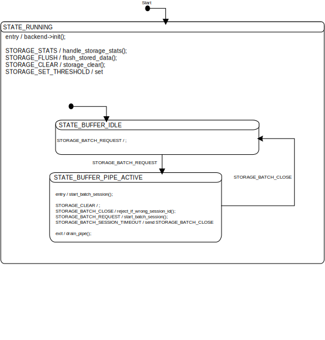

# Storage module

The storage module forwards or stores data from enabled modules.

It is implemented as a small SMF state machine with a parent `RUNNING` state.
Data types are discovered automatically through iterable sections.
See `storage.c`, `storage.h`, and `Kconfig.storage` for details.

## Architecture

### State diagram

The Storage module implements a state machine with the following states and transitions:



- **RUNNING** (parent): Initializes backend, handles admin commands (`STORAGE_CLEAR`, `STORAGE_FLUSH`, `STORAGE_STATS`, `STORAGE_SET_THRESHOLD`)
- **STATE_BUFFER_IDLE**: Storing incoming data, waiting for commands. Transitions to `STATE_BUFFER_PIPE_ACTIVE` on `STORAGE_BATCH_REQUEST`.
- **STATE_BUFFER_PIPE_ACTIVE**: Actively serving batch data through the batch interface. Transitions back to `STATE_BUFFER_IDLE` when batch session ends.

### Backend

Backends implement the API defined in the `app/src/modules/storage/storage_backend.h` file and provide `init`, `store`, `peek`, `retrieve`, `count`, and `clear` functionalities.

The storage module supports two backends:

#### RAM backend (Default)

- **Characteristics**: Fast in-memory storage
- **Data persistence**: Lost on power loss or device reset
- **Use case**: Applications that can tolerate data loss

#### LittleFS flash backend

- **Characteristics**: Persistent flash-based storage using the LittleFS filesystem
- **Data persistence**: Data survives power loss and device resets
- **Use case**: Applications requiring data durability and persistence across power cycles

### Data flow

Data producing modules publish sampled data to their respective zbus channel.
Data is stored and later emitted by flush or streamed over the batch pipe, using the batch interface described in the following section.

### Memory management

This module allocates RAM from the following places, and understanding these helps you tune it down:

- Built-in batch pipe buffer: `CONFIG_APP_STORAGE_BATCH_BUFFER_SIZE` bytes are reserved at boot.
- RAM backend ring buffers: For each enabled data type, a ring buffer is declared with capacity `sizeof(type) * CONFIG_APP_STORAGE_MAX_RECORDS_PER_TYPE`.
- Message buffers: `struct storage_msg` carries a `buffer[STORAGE_MAX_DATA_SIZE]`, where `STORAGE_MAX_DATA_SIZE` is the max size of any enabled data type.
  Enabling large types increases this buffer and several temporary buffers.
- Subscriber queue: Size is controlled by system zbus configuration.
- Thread stack: `CONFIG_APP_STORAGE_THREAD_STACK_SIZE`.

#### How to reduce RAM

- Minimize enabled data types

    - Disable modules that you do not forward or store (for example, `CONFIG_APP_LOCATION=n`), which
      reduces both slabs and RAM backend ring buffers and shrinks `STORAGE_MAX_DATA_SIZE`.

- Reduce records per type

    - Set `CONFIG_APP_STORAGE_MAX_RECORDS_PER_TYPE=1` when buffering is not needed.
      This shrinks both the per-type slabs and RAM ring buffers to a single record each.

- Shrink batch pipe buffer

    - Set the `CONFIG_APP_STORAGE_BATCH_BUFFER_SIZE` Kconfig option to a low value (for example,
      from 64 to 256 bytes), but ensure it can hold at least one item of `sizeof(header) +
      max_item_size` if you use batch mode.

- Reduce thread and queues

    - Set the `CONFIG_APP_STORAGE_THREAD_STACK_SIZE` Kconfig option to a lower value (for example, from 2048 to 1024), if your application leaves headroom.
    - Reduce relevant zbus queue sizes in system config if traffic allows.

- Remove development features

    - Disable the `CONFIG_APP_STORAGE_SHELL` and `CONFIG_APP_STORAGE_SHELL_STATS` Kconfig option to trim RAM and code footprint.

- Prefer LittleFS backend when buffering many records

    - Use the littleFS backend when large value `CONFIG_APP_STORAGE_MAX_RECORDS_PER_TYPE` is needed, since the RAM backend allocates all ring buffers at boot, while the littleFS backend only needs RAM for the currently stored records.

- Ready-made Kconfig fragment

    - Use `overlay-storage-minimal.conf` to apply a minimal storage configuration with reduced RAM usage.

#### Minimal RAM example

If your application will only ever operate with immediate sending (`CONFIG_APP_STORAGE_THRESHOLD=1`) the following `prj.conf` excerpt minimizes RAM usage for the storage module.

```config
# Minimal storage configuration
CONFIG_APP_STORAGE=y
CONFIG_APP_STORAGE_BACKEND_RAM=y

# Keep only a single slot per type (no buffering planned)
CONFIG_APP_STORAGE_MAX_RECORDS_PER_TYPE=1
# Send a message for every sample
CONFIG_APP_STORAGE_INITIAL_THRESHOLD=1

# Drop development features
CONFIG_APP_STORAGE_SHELL=n
CONFIG_APP_STORAGE_SHELL_STATS=n
```

> [!NOTE]
>
> - For RAM backend the actual RAM consumed by ring buffers scales with which data types are enabled and the value of the `CONFIG_APP_STORAGE_MAX_RECORDS_PER_TYPE` Kconfig option.

### Flash management (LittleFS backend)

#### Partition sizing

You must configure the partition size for the LittleFS backend to accommodate the data types in use, their sizes, and the number of records per type. A minimum partition size is required to ensure proper operation.

How to calculate the needed size:

- Per-type block need:

$$\text{blocks per type} = \left\lceil \frac{\text{data size} \times \text{records per type}}{\text{block size}} \right\rceil$$

- Total required blocks:

$$\text{required blocks} = \sum \text{blocks per type} + 3$$

where the `+3` accounts for LittleFS metadata and the CoW block.

- Minimum partition size:

$$\text{flash size} = \text{required blocks} \times \text{block size}$$

Choose a partition size that meets or exceeds `flash_size`. The LittleFS partition size is set by `CONFIG_PM_PARTITION_SIZE_LITTLEFS` (or the corresponding DTS partition definition).

If the requirement is not met, either increase the partition (`CONFIG_PM_PARTITION_SIZE_LITTLEFS` or DTS partition size) or reduce storage pressure (fewer records, smaller data types, or fewer enabled types).

> [!NOTE]
> The data types are stored in separate files, so the minimum amount of flash blocks needed are $\sum \text{data type} + 3$.

#### Target-specific defaults

| **Target** | **Block size** | **Default blocks needed** | **Minimal partition size** |
| - | - | - | - |
| nrf9151 DK (internal flash) | 0x1000 | 5 | 0x5000 |
| nrf9151 DK (external flash, gd25wb256) | 0x10000 | 5 | 0x50000 |
| thingy91x (internal flash) | 0x1000 | 8 | 0x8000 |
| thingy91x (external flash) | 0x1000 | 8 | 0x8000 |

#### LittleFS built-in wear leveling

LittleFS provides inherent wear leveling at the filesystem level:

- LittleFS automatically distributes writes across available flash blocks, avoiding repeated writes to the same physical location.
- Filesystem metadata is spread across the partition, preventing hotspots on metadata blocks.
- Updates are written to new blocks rather than overwriting existing data, naturally distributing erase cycles.
- As blocks become dirty, LittleFS reclaims and redistributes them, ensuring uniform wear across the entire partition.
- The filesystem tracks block usage patterns and preferentially allocates less-worn blocks for new writes.

#### Application-level ring buffer wear leveling

The storage module adds an additional wear leveling layer through its ring buffer architecture.

##### Block-level distribution

- Entries are distributed across files matched to flash blocks.
- Each data type has its own file, preventing cross-type interference.
- Writes cycle through all available record slots before overwriting.
- Rewrites only modify the affected flash blocks, minimizing unnecessary writes.

#### Combined wear protection

The combination of LittleFS wear leveling and the ring buffer architecture provides:

- **Temporal distribution**: Ring buffer spreads writes over time across record slots.
- **Spatial distribution**: LittleFS spreads those writes across physical flash blocks.
- **Type isolation**: Each data type has its own write pattern, preventing interference.
- **Automatic wear balancing**: No configuration needed—works transparently.

#### Minimizing flash wear

To further optimize flash lifespan:

- **Increase partition size**: Larger partitions provide more blocks for write distribution.
- **Increase record count**: Higher `CONFIG_APP_STORAGE_MAX_RECORDS_PER_TYPE` reduces rewrite frequency.
- **Use ram backend when possible**: If data persistence is not critical, use the RAM backend to avoid flash writes entirely.

#### Configuration examples

The following sections showcase various configuration examples.

##### Basic littleFS configuration

To enable persistent flash storage:

```config
CONFIG_APP_STORAGE=y
CONFIG_APP_STORAGE_BACKEND_LITTLEFS=y
CONFIG_APP_STORAGE_INITIAL_MODE_BUFFER=y

# Configure partition size (default is 64 KB)
CONFIG_PM_PARTITION_SIZE_LITTLEFS=0x10000

# Adjust for your needs
CONFIG_APP_STORAGE_MAX_RECORDS_PER_TYPE=16
CONFIG_APP_STORAGE_THREAD_STACK_SIZE=3000
```

##### Optimized for data persistence with minimal flash wear

```config
# Storage enabled with persistent backend
CONFIG_APP_STORAGE=y
CONFIG_APP_STORAGE_BACKEND_LITTLEFS=y
CONFIG_APP_STORAGE_INITIAL_MODE_BUFFER=y

# Larger partition distributes writes across more flash blocks
CONFIG_PM_PARTITION_SIZE_LITTLEFS=0x20000

# Higher record count reduces rewrite frequency
CONFIG_APP_STORAGE_MAX_RECORDS_PER_TYPE=50

```

## Messages

The storage module communicates through two zbus channels: `storage_chan` and `storage_data_chan`.
All message types are defined in the `storage.h` file.

### Input messages (Commands)

**Data operations (handled by parent `RUNNING` state):**

- **STORAGE_SET_THRESHOLD**: Set the threshold for triggering `STORAGE_THRESHOLD_REACHED`.
  If threshold is `1`, every sample triggers a message. Higher values enable buffering until the threshold is reached.
  If threshold is `0`, no threshold events are emitted.

- **STORAGE_FLUSH**: Flushes stored data one item at a time as individual `STORAGE_DATA` messages.
  Data is sent in FIFO order per type. Available in both operational modes.

- **STORAGE_BATCH_REQUEST**: Requests access to stored data through batch interface.
  Responds with `STORAGE_BATCH_AVAILABLE`, `STORAGE_BATCH_EMPTY`, `STORAGE_BATCH_BUSY`, or `STORAGE_BATCH_ERROR`.
  Available in both operational modes.

- **STORAGE_CLEAR**: Clears all stored data from the backend.
  Available in both operational modes.

**Diagnostics (handled by parent RUNNING state):**

- **STORAGE_STATS** : Requests storage statistics (requires `CONFIG_APP_STORAGE_SHELL_STATS`).
  Statistics are logged to the console.
  Available in both operational modes.

### Output messages (Responses)

**Data events:**

- **STORAGE_THRESHOLD_REACHED**: Emitted when the number of stored samples for a type reaches the configured threshold.
  Contains the data type and count that triggered the event.

**Data messages:**

- **STORAGE_DATA**: Contains stored data being flushed or forwarded.
  Includes data type and the actual data payload.

**Batch status:**

- **STORAGE_BATCH_AVAILABLE**: Batch is ready for reading.
  Message includes total item count available and session ID.

- **STORAGE_BATCH_EMPTY**: No stored data available.
  Batch is empty.

- **STORAGE_BATCH_BUSY**: Another module is currently using the batch session.

- **STORAGE_BATCH_ERROR**: Error occurred during batch operation.

### Message structure

The message structure used by the storage module is defined in `storage.h`:

```c
struct storage_msg {
    enum storage_msg_type type;           /* Message type */
    enum storage_data_type data_type;     /* Data type for STORAGE_DATA */
    union {
        uint8_t buffer[STORAGE_MAX_DATA_SIZE];
        uint32_t session_id;              /* Batch session id */
        enum storage_reject_reason reject_reason; /* For MODE_CHANGE_REJECTED */
    };
    uint32_t data_len: 31;                /* Length or count */
    bool     more_data: 1;                /* More data available in batch */
};
```

## Configurations

The storage module is configurable through Kconfig options in `Kconfig.storage`.
The following includes the key configuration categories:

### Storage backend

- **CONFIG_APP_STORAGE_BACKEND_RAM** (default): Uses RAM for storage.
  Data is lost on a power cycle but provides fast access.

- **CONFIG_APP_STORAGE_BACKEND_LITTLEFS** : Uses the LittleFS filesystem for flash storage.
  Data is persistent across power cycles but provides slower access.

> [!NOTE]
> Regardless of the backend used, stored data is automatically cleared when FOTA updates are applied to ensure a clean state after firmware updates. See the [FOTA module documentation](fota_module.md#storage-clearing-on-reboot) for details.

### Memory configuration

- **CONFIG_APP_STORAGE_MAX_TYPES** (default: `3`): Maximum number of different data types that can be registered.
  Affects RAM usage.

- **CONFIG_APP_STORAGE_MAX_RECORDS_PER_TYPE** (default: `8`): Maximum records stored per data type.
  Total RAM usage = `MAX_TYPES` × `MAX_RECORDS_PER_TYPE` × `RECORD_SIZE`.

- **CONFIG_APP_STORAGE_BATCH_BUFFER_SIZE** (default: `1024`): Size of the internal buffer for batch data access.

### Flash configuration (LittleFS backend)

- **CONFIG_PM_PARTITION_SIZE_LITTLEFS**: Size of the flash partition for LittleFS storage.
  Must be large enough to accommodate the stored data and filesystem metadata. See flash management section above for sizing guidance.

- **CONFIG_PM_PARTITION_REGION_LITTLEFS_EXTERNAL** (default: `y`): Use external flash for LittleFS storage (uses internal flash if set to `n`).

### Threshold configuration

- **CONFIG_APP_STORAGE_INITIAL_THRESHOLD** (default: `1`): Initial threshold for triggering `STORAGE_THRESHOLD_REACHED` events.
  A value of 1 means every sample triggers an event, while higher values enable buffering until the threshold is reached.
  A value of 0 disables threshold events. (Threshold can be changed at runtime through `STORAGE_SET_THRESHOLD` messages).

### Thread configuration

- **CONFIG_APP_STORAGE_THREAD_STACK_SIZE** (default: `1536`): Stack size for the storage module's main thread.

- **CONFIG_APP_STORAGE_WATCHDOG_TIMEOUT_SECONDS** (default: `60`): Watchdog timeout for detecting stuck operations.

- **CONFIG_APP_STORAGE_MSG_PROCESSING_TIMEOUT_SECONDS** (default: `5`): Maximum time for processing a single message.

### Development features

- **CONFIG_APP_STORAGE_SHELL** (default: `y`): Enable shell commands for storage interaction.

- **CONFIG_APP_STORAGE_SHELL_STATS**: Enable statistics commands (increases code size).

### Message handling

- **RUNNING state**: Handles `STORAGE_CLEAR`, `STORAGE_FLUSH`, `STORAGE_STATS`, and `STORAGE_SET_THRESHOLD` messages.
- **BUFFER_IDLE**: Handles `STORAGE_BATCH_REQUEST` to transition to `BUFFER_PIPE_ACTIVE`.
- **BUFFER_PIPE_ACTIVE**: Populates pipe with `[header + data]` items, handles session management.

## API documentation

### Channels

#### storage channel

The storage channel is the primary zbus channel for controlling the storage module and receiving control or status responses.

**Input message types:**

- `STORAGE_SET_THRESHOLD` - Set threshold for `STORAGE_THRESHOLD_REACHED` events
- `STORAGE_FLUSH` - Flush stored data as individual messages
- `STORAGE_BATCH_REQUEST` - Request batch access to stored data
- `STORAGE_CLEAR` - Clear all stored data
- `STORAGE_STATS` - Display storage statistics

**Output message types:**

- `STORAGE_THRESHOLD_REACHED` - Threshold reached for a data type
- `STORAGE_BATCH_AVAILABLE` - Batch ready with data
- `STORAGE_BATCH_EMPTY` - No data available
- `STORAGE_BATCH_BUSY` - Another session active
- `STORAGE_BATCH_ERROR` - Error accessing data

#### storage data channel

This is a dedicated channel for `STORAGE_DATA` payload messages to avoid self-flooding and race conditions.
The subscribers interested in data should observe this channel.

**Output message types:**

- `STORAGE_DATA` - Contains stored or forwarded data.

### Data type registration

Data types are automatically registered using the `DATA_SOURCE_LIST` macro in `storage_data_types.h`. The system currently supports:

- **Battery** (`CONFIG_APP_POWER`): Stores `double` from `POWER_BATTERY_PERCENTAGE_SAMPLE_RESPONSE`
- **Location** (`CONFIG_APP_LOCATION`): Stores `struct location_msg` from `LOCATION_GNSS_DATA`/`LOCATION_CLOUD_REQUEST`
- **Environmental** (`CONFIG_APP_ENVIRONMENTAL`): Stores `struct environmental_msg` from `ENVIRONMENTAL_SENSOR_SAMPLE_RESPONSE`

Each data type registration includes:

- Source channel to subscribe to
- Message type filtering function
- Data extraction function
- Storage data type identifier

### Backend interface

Storage backends implement the interface defined in the `app/src/modules/storage/storage_backend.h` file:

```c
struct storage_backend {
    int (*init)(void);
    int (*store)(const struct storage_data *type, void *data, size_t size);
    int (*retrieve)(const struct storage_data *type, void *data, size_t size);
    int (*count)(const struct storage_data *type);
    int (*clear)(void);
};
```

### Batch read helper

The storage module provides a convenience function for reading batch data:

```c
int storage_batch_read(struct storage_data_item *out_item, k_timeout_t timeout);
```

It reads stored data through the batch interface, handling header parsing and data extraction automatically. All other operations (requesting batch access, session management, etc.) go through zbus messages.

> [!IMPORTANT]
> This function should only be called after receiving a `STORAGE_BATCH_AVAILABLE` message in response to a `STORAGE_BATCH_REQUEST`.
> When done consuming all items, send `STORAGE_BATCH_CLOSE` with the same `session_id`.

## Usage

### Data retrieval

**Flush:** `STORAGE_FLUSH` emits individual `STORAGE_DATA` messages. Use for small datasets.

**Batch:** For bulk access, use `STORAGE_BATCH_REQUEST` with unique `session_id`:

```c
struct storage_msg msg = { .type = STORAGE_BATCH_REQUEST, .session_id = 0x12345678 };

err = zbus_chan_pub(&storage_chan, &msg, K_SECONDS(1));

// Wait for STORAGE_BATCH_AVAILABLE, then:
struct storage_data_item item;
while (storage_batch_read(&item, K_SECONDS(1)) == 0) {
    switch (item.type) {
    case STORAGE_TYPE_BATTERY:
        double battery = item.data.BATTERY;
        break;
    // ... handle other types
    }
}

// Close session
struct storage_msg close = { .type = STORAGE_BATCH_CLOSE, .session_id = 0x12345678 };
zbus_chan_pub(&storage_chan, &close, K_SECONDS(1));
```

Responses: `STORAGE_BATCH_AVAILABLE` (success), `STORAGE_BATCH_EMPTY`, `STORAGE_BATCH_BUSY`, `STORAGE_BATCH_ERROR`.

### Processing `STORAGE_DATA`

Subscribe to `storage_data_chan` to receive forwarded/flushed data:

```c
switch (msg->data_type) {
case STORAGE_TYPE_BATTERY:
    double *battery = (double *)msg->buffer;

    break;
case STORAGE_TYPE_LOCATION:
    struct location_msg *loc = (struct location_msg *)msg->buffer;

    break;
/* ... other types */
}
```

### Admin commands

```c
/* Clear all stored data */
struct storage_msg msg = { .type = STORAGE_CLEAR };

err = zbus_chan_pub(&storage_chan, &msg, K_SECONDS(1));

/* Show statistics (requires CONFIG_APP_STORAGE_SHELL_STATS) */
struct storage_msg msg = { .type = STORAGE_STATS };

err = zbus_chan_pub(&storage_chan, &msg, K_SECONDS(1));
```

### Shell commands

When `CONFIG_APP_STORAGE_SHELL` is enabled:

```bash
att_storage flush              # Flush stored data
att_storage clear              # Clear all data
att_storage stats              # Show statistics (if enabled)
```

## Adding backends

1. Implement `struct storage_backend` (see `storage_backend.h`).
1. Provide `storage_backend_get()` function.
1. Add Kconfig option in `Kconfig.storage`.

See `backends/ram_ring_buffer_backend.c` for reference.

## Dependencies

- **Zephyr kernel** - Core OS functionality
- **Zbus messaging system** - Inter-module communication
- **State Machine Framework (SMF)** - State management
- **Task watchdog** - System reliability monitoring
- **Memory slab allocator** - FIFO memory management
- **Selected storage backend** - RAM or flash storage
- **Iterable sections** - Automatic data type discovery
