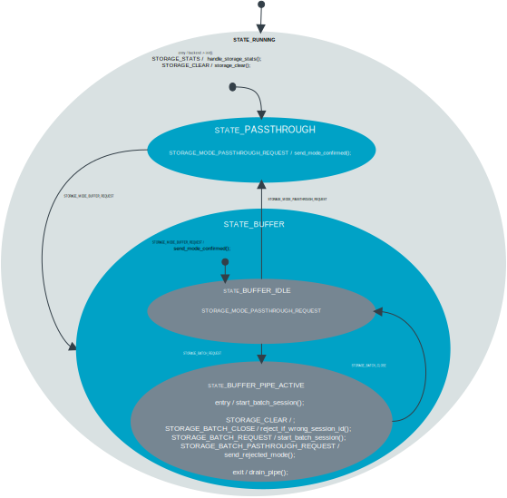

# Storage module

The storage module forwards or stores data from enabled modules.
It has the following two modes:

- Passthrough (default): forward data immediately.
- Buffer: stores data, retrieves through flush or batch.

It is implemented as a small SMF state machine with a parent `RUNNING` state and `PASSTHROUGH/BUFFER` children state.
Data types are discovered automatically through iterable sections.
See `storage.c`, `storage.h`, and `Kconfig.storage` for details.

## Architecture

### State diagram

The Storage module implements a state machine with the following states and transitions:



- **RUNNING** (parent): Initializes backend, handles admin commands (`STORAGE_CLEAR`, `STORAGE_FLUSH`, `STORAGE_STATS`).
- **PASSTHROUGH**: Forwards data immediately as `STORAGE_DATA` on `STORAGE_DATA_CHAN`.
- **BUFFER**: Stores data in backend, serves flush and batch requests. Has sub-states `IDLE` and `PIPE_ACTIVE`.

- Initial state: `PASSTHROUGH` (default) or `BUFFER` (if `CONFIG_APP_STORAGE_INITIAL_MODE_BUFFER=y`).
- Runtime switching: Send `STORAGE_MODE_*_REQUEST` on `STORAGE_CHAN`.

### Backend

Backends implement the API defined in the `app/src/modules/storage/storage_backend.h` file and provide `init`, `store`, `peek`, `retrieve`, `count`, and `clear` functionalities.

The storage module supports two backends:

#### RAM Backend (Default)

- **Characteristics**: Fast in-memory storage
- **Data persistence**: Lost on power loss or device reset
- **Use case**: Applications that can tolerate data loss

#### LittleFS Flash Backend

- **Characteristics**: Persistent flash-based storage using the LittleFS filesystem
- **Data persistence**: Data survives power loss and device resets
- **Use case**: Applications requiring data durability and persistence across power cycles

### Data flow

Data producing modules publish sampled data to their respective zbus channel.
In passthrough mode, data is forwarded as `STORAGE_DATA`.
In buffer mode, data is stored and later emitted by flush or streamed over the batch pipe, using the batch interface described below.

### Memory management

This module allocates RAM from the following places, and understanding these helps you tune it down:

- Built-in batch pipe buffer: `CONFIG_APP_STORAGE_BATCH_BUFFER_SIZE` bytes are reserved at boot.
<!-- - Per-type buffers: Each enabled data type declares a `struct ring_buf` with `CONFIG_APP_STORAGE_MAX_RECORDS_PER_TYPE` slots of that type's size. -->
- RAM backend ring buffers: For each enabled data type, a ring buffer is declared with capacity `sizeof(type) * CONFIG_APP_STORAGE_MAX_RECORDS_PER_TYPE`.
- Message buffers: `struct storage_msg` carries a `buffer[STORAGE_MAX_DATA_SIZE]`, where `STORAGE_MAX_DATA_SIZE` is the max size of any enabled data type.
  Enabling large types increases this buffer and several temporary buffers.
- Subscriber queue: Size is controlled by system zbus configuration.
- Thread stack: `CONFIG_APP_STORAGE_THREAD_STACK_SIZE`.

#### How to reduce RAM

- Minimize enabled data types

    - Disable modules that you do not forward or store (for example, `CONFIG_APP_LOCATION=n`), which reduces both slabs and RAM backend ring buffers, and shrinks `STORAGE_MAX_DATA_SIZE`.

- Reduce records per type

    - Set `CONFIG_APP_STORAGE_MAX_RECORDS_PER_TYPE=1` when buffering is not needed.
      This shrinks both the per-type slabs and RAM ring buffers to a single record each.

- Shrink batch pipe buffer

    - Set the `CONFIG_APP_STORAGE_BATCH_BUFFER_SIZE` Kconfig option to a low value.
      The batch pipe is allocated unconditionally, but it is only used in the buffer mode.
      If you never use the batch or buffer mode, pick a very small value (for example, from 64 to 256 bytes).
      If you do use batch, ensure it can hold at least one item of `sizeof(header) + max_item_size`.

- Reduce thread and queues

    - Set the `CONFIG_APP_STORAGE_THREAD_STACK_SIZE` Kconfig option to a lower value (for example, from 2048 to 1024), if your application leaves headroom.
    - Reduce relevant zbus queue sizes in system config if traffic allows.

- Remove development features

    - Disable the `CONFIG_APP_STORAGE_SHELL` and `CONFIG_APP_STORAGE_SHELL_STATS` Kconfig option to trim RAM and code footprint.

- Prefer passthrough when persistence is not required

    - Keep the module in passthrough mode, so the backend store path is not exercised at runtime.

- Ready-made Kconfig fragment

    - Use `overlay-storage-minimal.conf` to apply a minimal, passthrough-only storage configuration with reduced RAM usage.

#### Passthrough-only minimal RAM example

If your application will only ever operate in passthrough mode (no buffering, no batch), the following `prj.conf` excerpt minimizes RAM usage for the storage module while preserving
passthrough forwarding:

```config
# Storage enabled, start and stay in passthrough
CONFIG_APP_STORAGE=y
CONFIG_APP_STORAGE_INITIAL_MODE_PASSTHROUGH=y

# Backend selection
CONFIG_APP_STORAGE_BACKEND_RAM=y

# Keep only a single slot per type (no buffering planned)
CONFIG_APP_STORAGE_MAX_RECORDS_PER_TYPE=1

# Make batch pipe tiny since batch will never be used
CONFIG_APP_STORAGE_BATCH_BUFFER_SIZE=128

# Trim runtime resources
CONFIG_APP_STORAGE_THREAD_STACK_SIZE=1024

# Drop development features
CONFIG_APP_STORAGE_SHELL=n
CONFIG_APP_STORAGE_SHELL_STATS=n

# Optional: Disable heavy data types you do not forward
# CONFIG_APP_LOCATION=n
# CONFIG_APP_ENVIRONMENTAL=n
# CONFIG_APP_NETWORK=n
```

> [!NOTE]
>
> * If you later enable buffer or batch, increase the value of the `CONFIG_APP_STORAGE_BATCH_BUFFER_SIZE` Kconfig option, so that at least one header plus the largest item fits.
> * For RAM backend the actual RAM consumed by ring buffers scales with which data types are enabled and the value of the `CONFIG_APP_STORAGE_MAX_RECORDS_PER_TYPE` Kconfig option.

### Flash management (LittleFS backend)

#### Partition Sizing

The partition size for the LittleFS backend must be configured to accommodate the data types in use, their sizes, and the number of records per type. A minimum partition size is required to ensure proper operation.

How to calculate the needed size:

1) Per-type block need

$$\text{blocks per type} = \left\lceil \frac{\text{data size} \times \text{records per type}}{\text{block size}} \right\rceil$$

2) Total required blocks

$$\text{required blocks} = \sum \text{blocks per type} + 3$$

where the `+3` accounts for LittleFS metadata and the CoW block.

3) Minimum partition size

 $$\text{flash size} = \text{required blocks} \times \text{block size}$$

Choose a partition size that meets or exceeds `flash_size`. The LittleFS partition size is set by `CONFIG_PM_PARTITION_SIZE_LITTLEFS` (or the corresponding DTS partition definition).

If the requirement is not met, either increase the partition (`CONFIG_PM_PARTITION_SIZE_LITTLEFS` or DTS partition size) or reduce storage pressure (fewer records, smaller data types, or fewer enabled types).

> [!NOTE]
> The data types are stored in separate files, so the minimum amount of flash blocks needed are $\sum \text{data type} + 3$,

#### Target-specific defaults

| **Target** | **Block size** | **Default blocks needed** | **Minimal partition size** |
| - | - | - | - |
| nrf9151 DK (internal flash) | 0x1000 | 5 | 0x5000 |
| nrf9151 DK (external flash, gd25wb256) | 0x10000 | 5 | 0x50000 |
| thingy91x (internal flash) | 0x1000 | 8 | 0x8000 |
| thingy91x (external flash) | 0x1000 | 8 | 0x8000 |

#### LittleFS Built-in Wear Leveling

LittleFS provides inherent wear leveling at the filesystem level:

- LittleFS automatically distributes writes across available flash blocks, avoiding repeated writes to the same physical location
- Filesystem metadata is spread across the partition, preventing hotspots on metadata blocks
- Updates are written to new blocks rather than overwriting existing data, naturally distributing erase cycles
- As blocks become dirty, LittleFS reclaims and redistributes them, ensuring uniform wear across the entire partition
- The filesystem tracks block usage patterns and preferentially allocates less-worn blocks for new writes

#### Application-Level Ring Buffer Wear Leveling

The storage module adds an additional wear leveling layer through its ring buffer architecture:

##### Block-Level Distribution

- Entries are distributed across files matched to flash blocks
- Each data type has its own file, preventing cross-type interference
- Writes cycle through all available record slots before overwriting
- Rewrites only modify the affected flash blocks, minimizing unnecessary writes

#### Combined Wear Protection

The combination of LittleFS wear leveling and the ring buffer architecture provides:

1. **Temporal distribution**: Ring buffer spreads writes over time across record slots
2. **Spatial distribution**: LittleFS spreads those writes across physical flash blocks
3. **Type isolation**: Each data type has its own write pattern, preventing interference
4. **Automatic wear balancing**: No configuration needed—works transparently

#### Minimizing Flash Wear

To further optimize flash lifespan:

1. **Increase partition size**: Larger partitions provide more blocks for write distribution
2. **Increase record count**: Higher `CONFIG_APP_STORAGE_MAX_RECORDS_PER_TYPE` reduces rewrite frequency
3. **Use ram backend when possible**: If data persistence is not critical, use the RAM backend to avoid flash writes entirely

#### Configuration Examples

##### Basic LittleFS Configuration

To enable persistent flash storage:

```config
CONFIG_APP_STORAGE=y
CONFIG_APP_STORAGE_BACKEND_LITTLEFS=y
CONFIG_APP_STORAGE_INITIAL_MODE_BUFFER=y

# Configure partition size (default is 64 KB)
CONFIG_PM_PARTITION_SIZE_LITTLEFS=0x10000

# Adjust for your needs
CONFIG_APP_STORAGE_MAX_RECORDS_PER_TYPE=16
CONFIG_APP_STORAGE_THREAD_STACK_SIZE=3000
```

#### Optimized for Data Persistence with Minimal Flash Wear

```config
# Storage enabled with persistent backend
CONFIG_APP_STORAGE=y
CONFIG_APP_STORAGE_BACKEND_LITTLEFS=y
CONFIG_APP_STORAGE_INITIAL_MODE_BUFFER=y

# Larger partition distributes writes across more flash blocks
CONFIG_PM_PARTITION_SIZE_LITTLEFS=0x20000

# Higher record count reduces rewrite frequency
CONFIG_APP_STORAGE_MAX_RECORDS_PER_TYPE=50

```

## Messages

The storage module communicates through two zbus channels: `STORAGE_CHAN` and `STORAGE_DATA_CHAN`.
All message types are defined in the `storage.h` file.

### Input Messages (Commands)

**Mode Control:**

- **`STORAGE_MODE_PASSTHROUGH_REQUEST`**: Request to switch from `buffer` mode to `passthrough` mode.
  On success, the module replies with `STORAGE_MODE_PASSTHROUGH`.
  If the change is declined (for example, batch session active), the module replies with `STORAGE_MODE_CHANGE_REJECTED`.

- **`STORAGE_MODE_BUFFER_REQUEST`**: Request to switch from passthrough mode to buffer mode.
  On success, the module replies with `STORAGE_MODE_BUFFER`.
  If the change is unsafe, the module replies with `STORAGE_MODE_CHANGE_REJECTED`.

**Data Operations (handled by parent RUNNING state):**

- **`STORAGE_FLUSH`**: Flushes stored data one item at a time as individual `STORAGE_DATA` messages.
  Data is sent in FIFO order per type. Available in both operational modes.

- **`STORAGE_BATCH_REQUEST`**: Requests access to stored data through batch interface.
  Responds with `STORAGE_BATCH_AVAILABLE`, `STORAGE_BATCH_EMPTY`, `STORAGE_BATCH_BUSY`, or `STORAGE_BATCH_ERROR`.
  Available in both operational modes.

- **`STORAGE_CLEAR`**: Clears all stored data from the backend.
  Available in both operational modes.

**Diagnostics (handled by parent RUNNING state):**

- **`STORAGE_STATS`** : Requests storage statistics (requires `CONFIG_APP_STORAGE_SHELL_STATS`).
  Statistics are logged to the console.
  Available in both operational modes.

### Output Messages (Responses)

**Mode confirmation:**

- **`STORAGE_MODE_PASSTHROUGH`**: Mode change to passthrough confirmed.

- **`STORAGE_MODE_BUFFER`**: Mode change to buffer confirmed.

- **`STORAGE_MODE_CHANGE_REJECTED`**: Mode change rejected.
  See `reject_reason` in `struct storage_msg`.

**Data Messages:**

- **`STORAGE_DATA`**: Contains stored data being flushed or forwarded.
  Includes data type and the actual data payload.

**Batch Status:**

- **`STORAGE_BATCH_AVAILABLE`**: Batch is ready for reading.
  Message includes total item count available and session ID.

- **`STORAGE_BATCH_EMPTY`**: No stored data available.
  Batch is empty.

- **`STORAGE_BATCH_BUSY`**: Another module is currently using the batch session.

- **`STORAGE_BATCH_ERROR`**: Error occurred during batch operation.

### Message Structure

The message structure used by the storage module is defined in `storage.h`:

```c
struct storage_msg {
    enum storage_msg_type type;           /* Message type */
    enum storage_data_type data_type;     /* Data type for STORAGE_DATA */
    union {
        uint8_t buffer[STORAGE_MAX_DATA_SIZE];
        uint32_t session_id;              /* Batch session id */
        enum storage_reject_reason reject_reason; /* For MODE_CHANGE_REJECTED */
    };
    uint32_t data_len: 31;                /* Length or count */
    bool     more_data: 1;                /* More data available in batch */
};
```

## Configurations

The storage module is configurable through Kconfig options in `Kconfig.storage`.
The following includes the key configuration categories:

### Storage Backend

- **`CONFIG_APP_STORAGE_BACKEND_RAM`** (default): Uses RAM for storage.
  Data is lost on power cycle but provides fast access.

- **`CONFIG_APP_STORAGE_BACKEND_LITTLEFS`** : Uses the LittleFS filesystem for flash storage.
  Data is persistent across power cycles, but provides slower access.

> [!NOTE]
> Regardless of the backend used, stored data is automatically cleared when FOTA updates are applied to ensure a clean state after firmware updates. See the [FOTA module documentation](fota_module.md#storage-clearing-on-reboot) for details.

### Memory Configuration

- **`CONFIG_APP_STORAGE_MAX_TYPES`** (default: 4): Maximum number of different data types that can be registered.
  Affects RAM usage.

- **`CONFIG_APP_STORAGE_MAX_RECORDS_PER_TYPE`** (default: 8): Maximum records stored per data type.
  Total RAM usage = `MAX_TYPES` × `MAX_RECORDS_PER_TYPE` × `RECORD_SIZE`.

- **`CONFIG_APP_STORAGE_BATCH_BUFFER_SIZE`** (default: 256): Size of the internal buffer for batch data access.

### Thread Configuration

- **`CONFIG_APP_STORAGE_THREAD_STACK_SIZE`** (default: 1536): Stack size for the storage module's main thread.

- **`CONFIG_APP_STORAGE_WATCHDOG_TIMEOUT_SECONDS`** (default: 60): Watchdog timeout for detecting stuck operations.

- **`CONFIG_APP_STORAGE_MSG_PROCESSING_TIMEOUT_SECONDS`** (default: 5): Maximum time for processing a single message.

### Operational Modes

- **`CONFIG_APP_STORAGE_INITIAL_MODE_PASSTHROUGH`** (default): Automatically transition from `RUNNING` to `PASSTHROUGH` state on startup for immediate data forwarding.

- **`CONFIG_APP_STORAGE_INITIAL_MODE_BUFFER`**: Automatically transition from `RUNNING` to `BUFFER` state on startup for data storage.

### Development Features

- **`CONFIG_APP_STORAGE_SHELL`** (default: `y`): Enable shell commands for storage interaction.

- **`CONFIG_APP_STORAGE_SHELL_STATS`**: Enable statistics commands (increases code size).

### Message Handling

- **RUNNING state**: Handles `STORAGE_CLEAR`, `STORAGE_FLUSH`, `STORAGE_STATS` regardless of mode.
- **PASSTHROUGH**: Forwards data immediately, rejects batch requests with `STORAGE_BATCH_ERROR`.
- **BUFFER**: Stores data, serves batch through pipe, transitions to `PIPE_ACTIVE` for batch sessions.
- **BUFFER_PIPE_ACTIVE**: Populates pipe with `[header + data]` items, handles session management.

## API Documentation

### Channels

#### STORAGE_CHAN

The storage channel is the primary zbus channel for controlling the storage module and receiving control or status responses.

**Input Message Types:**

- `STORAGE_MODE_PASSTHROUGH_REQUEST` - Request passthrough mode
- `STORAGE_MODE_BUFFER_REQUEST` - Request buffer mode
- `STORAGE_FLUSH` - Flush stored data as individual messages
- `STORAGE_BATCH_REQUEST` - Request batch access to stored data
- `STORAGE_CLEAR` - Clear all stored data
- `STORAGE_STATS` - Display storage statistics

**Output Message Types:**

- `STORAGE_MODE_PASSTHROUGH` - Mode change confirmed
- `STORAGE_MODE_BUFFER` - Mode change confirmed
- `STORAGE_MODE_CHANGE_REJECTED` - Mode change rejected
- `STORAGE_BATCH_AVAILABLE` - Batch ready with data
- `STORAGE_BATCH_EMPTY` - No data available
- `STORAGE_BATCH_BUSY` - Another session active
- `STORAGE_BATCH_ERROR` - Error accessing data

#### STORAGE_DATA_CHAN

This is a dedicated channel for `STORAGE_DATA` payload messages to avoid self-flooding and race conditions.
The subscribers interested in data should observe this channel.

**Output Message Types:**

- `STORAGE_DATA` - Contains stored or forwarded data.

### Data Type Registration

Data types are automatically registered using the `DATA_SOURCE_LIST` macro in `storage_data_types.h`. The system currently supports:

- **Network**: Stores `struct network_msg` from `NETWORK_QUALITY_SAMPLE_RESPONSE`
- **Battery** (`CONFIG_APP_POWER`): Stores `double` from `POWER_BATTERY_PERCENTAGE_SAMPLE_RESPONSE`
- **Location** (`CONFIG_APP_LOCATION`): Stores `struct location_msg` from `LOCATION_GNSS_DATA`/`LOCATION_CLOUD_REQUEST`
- **Environmental** (`CONFIG_APP_ENVIRONMENTAL`): Stores `struct environmental_msg` from `ENVIRONMENTAL_SENSOR_SAMPLE_RESPONSE`

Each data type registration includes:

- Source channel to subscribe to
- Message type filtering function
- Data extraction function
- Storage data type identifier

### Backend Interface

Storage backends implement the interface defined in the `app/src/modules/storage/storage_backend.h` file:

```c
struct storage_backend {
    int (*init)(void);
    int (*store)(const struct storage_data *type, void *data, size_t size);
    int (*retrieve)(const struct storage_data *type, void *data, size_t size);
    int (*count)(const struct storage_data *type);
    int (*clear)(void);
};
```

### Batch Read Helper

The storage module provides a convenience function for reading batch data:

```c
int storage_batch_read(struct storage_data_item *out_item, k_timeout_t timeout);
```

It reads stored data through the batch interface, handling header parsing and data extraction automatically. All other operations (requesting batch access, session management, etc.) go through zbus messages.

> [!IMPORTANT]
> This function should only be called after receiving a `STORAGE_BATCH_AVAILABLE` message in response to a `STORAGE_BATCH_REQUEST`.
> When done consuming all items, send `STORAGE_BATCH_CLOSE` with the same `session_id`.

## Usage

### Mode Switching

```c
struct storage_msg msg = { .type = STORAGE_MODE_PASSTHROUGH_REQUEST };

err = zbus_chan_pub(&STORAGE_CHAN, &msg, K_SECONDS(1));

struct storage_msg msg = { .type = STORAGE_MODE_BUFFER_REQUEST };

err = zbus_chan_pub(&STORAGE_CHAN, &msg, K_SECONDS(1));
```

Responses: `STORAGE_MODE_PASSTHROUGH`/`STORAGE_MODE_BUFFER` (success) or `STORAGE_MODE_CHANGE_REJECTED` (for example, batch active).

### Data Retrieval

**Flush:** `STORAGE_FLUSH` emits individual `STORAGE_DATA` messages. Use for small datasets.

**Batch:** For bulk access, use `STORAGE_BATCH_REQUEST` with unique `session_id`:

```c
struct storage_msg msg = { .type = STORAGE_BATCH_REQUEST, .session_id = 0x12345678 };

err = zbus_chan_pub(&STORAGE_CHAN, &msg, K_SECONDS(1));

// Wait for STORAGE_BATCH_AVAILABLE, then:
struct storage_data_item item;
while (storage_batch_read(&item, K_SECONDS(1)) == 0) {
    switch (item.type) {
    case STORAGE_TYPE_BATTERY:
        double battery = item.data.BATTERY;
        break;
    // ... handle other types
    }
}

// Close session
struct storage_msg close = { .type = STORAGE_BATCH_CLOSE, .session_id = 0x12345678 };
zbus_chan_pub(&STORAGE_CHAN, &close, K_SECONDS(1));
```

Responses: `STORAGE_BATCH_AVAILABLE` (success), `STORAGE_BATCH_EMPTY`, `STORAGE_BATCH_BUSY`, `STORAGE_BATCH_ERROR`.

### Processing STORAGE_DATA

Subscribe to `STORAGE_DATA_CHAN` to receive forwarded/flushed data:

```c
switch (msg->data_type) {
case STORAGE_TYPE_BATTERY:
    double *battery = (double *)msg->buffer;

    break;
case STORAGE_TYPE_LOCATION:
    struct location_msg *loc = (struct location_msg *)msg->buffer;

    break;
/* ... other types */
}
```

### Admin Commands

```c
/* Clear all stored data */
struct storage_msg msg = { .type = STORAGE_CLEAR };

err = zbus_chan_pub(&STORAGE_CHAN, &msg, K_SECONDS(1));

/* Show statistics (requires CONFIG_APP_STORAGE_SHELL_STATS) */
struct storage_msg msg = { .type = STORAGE_STATS };

err = zbus_chan_pub(&STORAGE_CHAN, &msg, K_SECONDS(1));
```

### Shell Commands

When `CONFIG_APP_STORAGE_SHELL` is enabled:

```bash
att_storage mode passthrough   # Switch to passthrough
att_storage mode buffer        # Switch to buffer
att_storage flush              # Flush stored data
att_storage clear              # Clear all data
att_storage stats              # Show statistics (if enabled)
```

## Adding Backends

1. Implement `struct storage_backend` (see `storage_backend.h`).
1. Provide `storage_backend_get()` function.
1. Add Kconfig option in `Kconfig.storage`.

See `backends/ram_ring_buffer_backend.c` for reference.

## Dependencies

- **Zephyr kernel** - Core OS functionality
- **Zbus messaging system** - Inter-module communication
- **State Machine Framework (SMF)** - State management
- **Task watchdog** - System reliability monitoring
- **Memory slab allocator** - FIFO memory management
- **Selected storage backend** - RAM or flash storage
- **Iterable sections** - Automatic data type discovery
